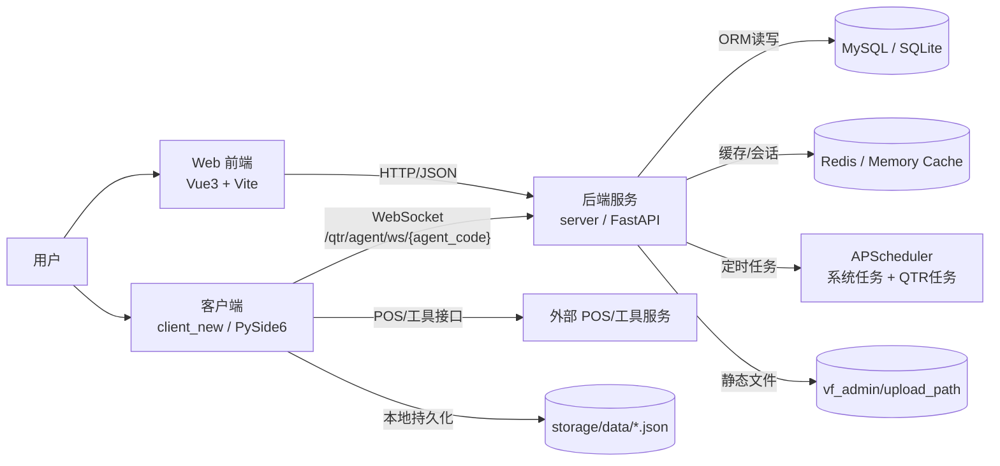
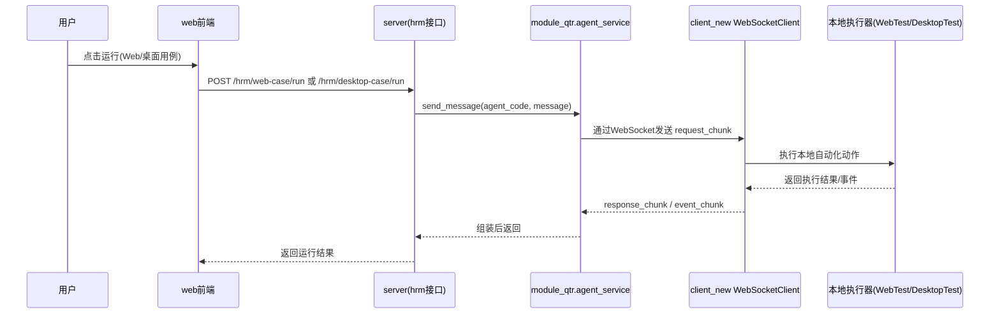
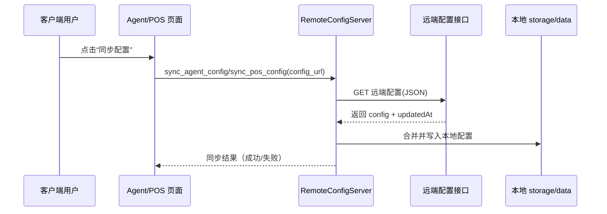
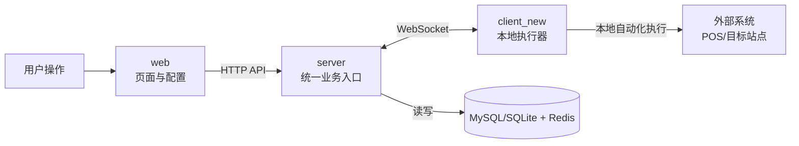

# api-test-platform 架构说明（client_new / server / web）

> 说明：本文仅基于当前仓库中的 `client_new`、`server`、`web` 目录进行架构梳理，便于快速理解系统边界与调用关系。

## 1. 系统总体架构图



## 2. 三端目录职责

| 目录 | 主要入口 | 核心职责 |
| --- | --- | --- |
| `web` | `web/src/main.js` | 管理台前端：登录、权限路由、系统管理、HRM/QTR 页面交互 |
| `server` | `server/app.py` + `server/server.py` | FastAPI API 层、业务服务层、数据访问层、调度、Agent WebSocket 管理 |
| `client_new` | `client_new/main.py` | 桌面客户端：Agent 通道、POS 工具、mitmproxy、本地 Web/桌面自动化执行 |

## 3. 后端（server）分层架构图

```mermaid
flowchart TB
    A[app.py<br/>uvicorn.run(app='server:app')] --> B[server.py<br/>FastAPI app + lifespan]

    B --> C[Controller 层<br/>module_admin / module_hrm / module_qtr]
    C --> D[Service 层]
    D --> E[DAO 层]
    E --> F[(MySQL / SQLite)]

    B --> G[中间件与异常处理<br/>middlewares/* + exceptions/*]
    B --> H[缓存初始化<br/>config/get_redis.py]
    B --> I[调度初始化<br/>config/get_scheduler.py + get_qtr_scheduler.py]
    I --> J[module_task 任务注册与执行]

    B --> K[Agent通信入口<br/>module_qtr/controller/agent_controller.py]
    K <--> L[client_new Agent WebSocket]
```

### 后端关键点（基于现有代码）

- 生命周期启动时会初始化数据库、Redis/Memory 缓存、系统与 QTR 调度器，并启动 Agent 心跳后台任务。
- API 主要由三大模块组成：`module_admin`（系统管理）、`module_hrm`（测试业务）、`module_qtr`（Agent 通道与配置）。
- Agent 链路通过 `/qtr/agent/ws/{agent_code}` 维护长连接，服务端和客户端均采用分片消息组装（`request_chunk/response_chunk/event_chunk`）。

## 4. 前端（web）架构图

```mermaid
flowchart TB
    A[main.js<br/>应用初始化] --> B[router/index.js]
    A --> C[store/* (Pinia)]
    A --> D[api/*]
    D --> E[utils/request.js<br/>Axios拦截器]
    E --> F[后端接口]

    B --> G[permission.js 路由守卫]
    G --> H[store/modules/permission.js]
    H --> I[/getRouters 动态菜单路由]
```

### 前端关键点（基于现有代码）

- API 请求由 `utils/request.js` 统一封装，自动附带 `Bearer Token`（Cookie 中的 `Admin-Token`）。
- 动态菜单路由来自后端 `/getRouters`，前端在登录后按权限注入路由。
- 本地开发默认走 Vite 代理：`/dev-api -> http://localhost:9099`。

## 5. 客户端（client_new）架构图

```mermaid
flowchart TB
    A[main.py<br/>QApplication] --> B[ui/main_window.py]
    B --> P1[Agent 页面]
    B --> P2[POS 页面]
    B --> P3[mitmproxy 页面]
    B --> P4[SQLite/日志/关于]

    P1 --> C1[controller/agent_controller.py]
    C1 --> S1[services/agent_client_service.py]
    S1 --> WS[server/agent_server.py<br/>WebSocketClient]
    WS <--> QTR[/qtr/agent/ws/{mac}]
    C1 --> RC1[server/remote_config_server.py<br/>拉取Agent配置]

    P2 --> C2[controller/pos_controller.py]
    C2 --> S2[services/pos_service.py]
    C2 --> RC2[server/remote_config_server.py<br/>拉取POS配置]
    C2 --> PC[server/pos_config_server.py]
    C2 --> PT[server/pos_tool_config_server.py]
    PC --> NET[utils/pos_network.py<br/>外部POS接口调用]

    P3 --> C3[controller/mitm_controller.py]
    C3 --> HP[mitm helper 子进程]
    HP --> MP[services/mitmproxy_service/*]

    C1 --> LC[(do/config.py -> storage/data/*.json)]
    C2 --> LC
    C3 --> LC
```

### 客户端关键点（基于现有代码）

- UI 与业务通过 Controller 解耦：页面只发信号，Controller 负责状态与线程任务调度。
- Agent 通道核心在 `server/agent_server.py`：接收服务端分片请求后，分派到本地 HTTP/WS/WebUI/DesktopUI 执行器。
- 本地配置统一落盘到 `storage/data`（POS、Agent、mitmproxy、搜索配置等）。

## 6. 关键时序图

### 6.1 Web 发起自动化执行（经 Agent）



### 6.2 client_new 配置同步链路



## 7. 当前架构结论（简版）

- 该项目是“三端协作”架构：`web` 负责管理与编排，`server` 负责业务、权限、调度与 Agent 通道，`client_new` 负责本地能力执行。
- 自动化执行链路的核心是 `server(module_qtr)` 与 `client_new(server/agent_server.py)` 之间的 WebSocket 双向通信。
- `server` 同时承载传统管理后台能力（用户、菜单、任务）与测试域能力（API/Web/桌面用例），属于集中式后端。

## 8. 新同学入门版（超简化）

### 8.1 一张图看懂主链路



### 8.2 入门只记 3 句话

- `web`：负责“发请求 + 展示结果”，主要是管理台和测试配置入口。
- `server`：负责“权限/业务/数据/调度”，是系统中枢。
- `client_new`：负责“落地执行”（浏览器自动化、桌面自动化、POS 工具能力），并通过 WebSocket 与后端实时通信。

### 8.3 建议的新同学阅读顺序

1. 从 `web/src/main.js -> web/src/utils/request.js` 看前端如何调后端。
2. 从 `server/server.py` 看后端如何挂路由与启动核心能力。
3. 从 `client_new/main.py -> client_new/server/agent_server.py` 看 Agent 如何接收并执行任务。
