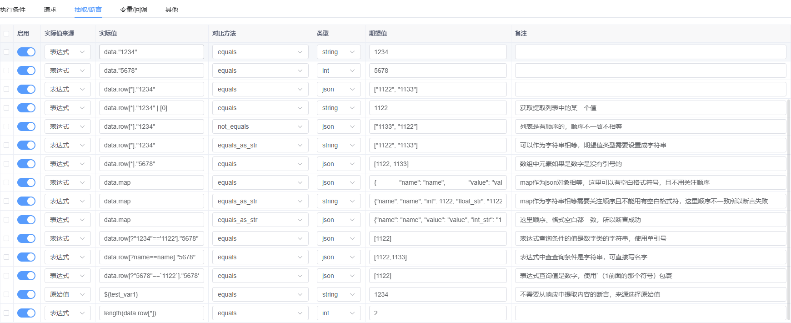

### 关于断言

断言数据提取使用的jmespath  
[jmespath官网](https://jmespath.org/)  
[jmespath官网使用说明](https://jmespath.org/tutorial.html)

可以提取值的内容：json、text、content、body、re、headers、cookies

json： 数据是使用text的内容`json.loads(text)`  
text: http请求是响应实例response的text字段，websocket是多条响应原始数据的列表然后json.dumps  
content： http请求是响应实例response的content字段， websocket就是响应的原始内容  
body： 默认不会有值，作用是为了在回调中修改响应值但不想覆盖原内容时，可以将修改后的内容赋值给body  
re： 使用正则匹配text中的内容  
headers: 请求头的字典  
cookies： cookies字典

##### 使用示例：

###### 假如响应数据是：
```json
{
  "status_code": 200,
  "data": {
    "a": 1,
    "b": "2",
    "c": "test"
  }
}

```
```python

json.data.a  # 1
text  # {"status_code":200,"data":{"a":1,"b":"2","c":"test"}}
content  # b'{"status_code":200,"data":{"a":1,"b":"2","c":"test"}}'
body  # 
data.c  # test， 不给类型这里默认走的json 
re.*  # 匹配text中的任意内容，re.后面直接跟正则表达式
```

> 计入有如下返回数据，图片中有各种情况的使用介绍
> 类型选json，表示期望数据会使用json.loads处理

```json
{
    "code": 200,
    "msg": "操作成功",
    "cookies": {},
    "body": {},
    "queryParams": {
        "A": "1",
        "B1": "1",
        "B2": "2",
        "D": "jmespathvalue",
        "C": "999999999999",
        "E": "London"
    },
    "pathParams": {},
    "data": {
        "1234": "1234",
        "5678": 5678,
        "name": "name",
        "value": "value",
        "map": {
            "name": "name",
            "value": "value",
            "int_str": "1122",
            "int": 1122,
            "float_str": "1122.01",
            "float": 1122.01
        },
        "row": [
            {
                "1234": "1122",
                "5678": 1122,
                "name": "name",
                "value": "value"
            },
            {
                "1234": "1133",
                "5678": 1133,
                "name": "name",
                "value": "value"
            }
        ]
    },
    "success": true,
    "time": "2024-11-21T15:00:04.272606"
}
```

