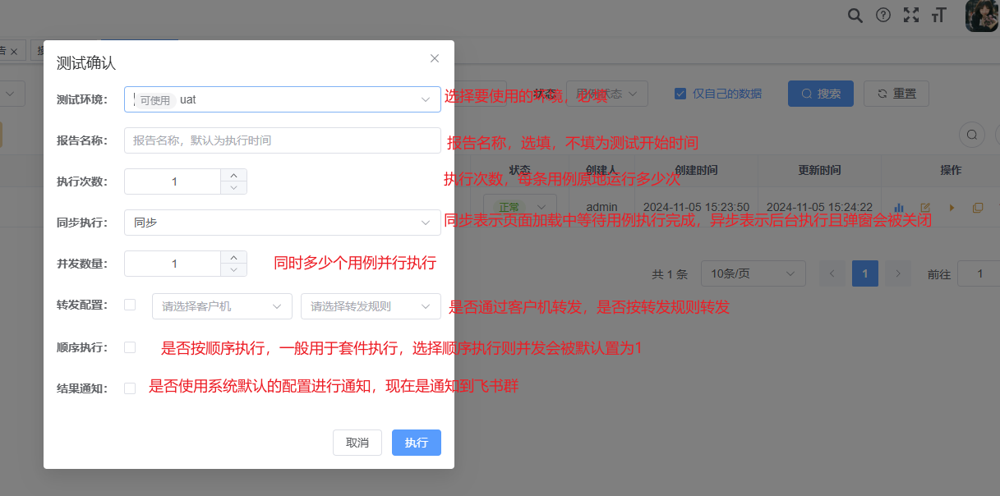

## 执行相关

#### 测试执行过程

<table>
    <capital>用例执行过程及变量池更新使用逻辑</capital>
    <tr>
        <th>完整测试过程</th>
        <th>用例执行过程</th>
        <th>执行过程名</th>
        <th>用例变量池</th>
        <th>全局变量池</th>
    </tr>
    <tr>
        <td rowspan="22">测试过程</td>
        <td></td>
        <td>获取当前选择的环境</td>
        <td>为环境变量</td>
        <td>为空</td>
    </tr>
    <tr>
        <td></td>
        <td>获取要执行的用例</td>
        <td></td>
        <td></td>
    </tr>
<tr>
        <td></td>
        <td>加载debugtalk</td>
        <td></td>
        <td></td>
    </tr>
<tr>
        <td></td>
        <td>执行项目及回调	</td>
        <td></td>
        <td></td>
    </tr>
<tr>
        <td></td>
        <td>执行模块级回调	</td>
        <td></td>
        <td></td>
    </tr>
<tr>
        <td rowspan="12">用例执行过程 每个用例循环此过程</td>
        <td>组装用例数据</td>
        <td>复制一份环境变量，再使用全局变量池更新</td>
        <td></td>
    </tr>
<tr>
        <td>执行用例开始前系统默认回调</td>
        <td></td>
        <td></td>
    </tr>
<tr>
        <td>执行用例开始前自定义回调</td>
        <td></td>
        <td></td>
    </tr>
<tr>
        <td>测试数据使用用例变量池匹配更新为真实值</td>
        <td>使用步骤变量更新</td>
        <td></td>
    </tr>
<tr>
        <td>执行用步骤开始前系统默认回调</td>
        <td></td>
        <td></td>
    </tr>
<tr>
        <td>执行用步骤开始前自定义回调</td>
        <td></td>
        <td></td>
    </tr>
<tr>
        <td>执行用例步骤或者转发</td>
        <td></td>
        <td></td>
    </tr>
<tr>
        <td>执行步骤结束后系统默认回调</td>
        <td></td>
        <td></td>
    </tr>
<tr>
        <td>执行步骤结束后自定义回调</td>
        <td></td>
        <td></td>
    </tr>
<tr>
        <td>抽取变量	</td>
        <td>使用抽取值更新	</td>
        <td>使用抽取值更新</td>
    </tr>
<tr>
        <td>执行用例结束后系统默认回调</td>
        <td></td>
        <td></td>
    </tr>
<tr>
        <td>执行用例结束后自定义回调</td>
        <td></td>
        <td></td>
    </tr><tr>
        <td></td>
        <td>执行模块结束后系统默认回调</td>
        <td></td>
        <td></td>
    </tr>
<tr>
        <td></td>
        <td>执行模块结束后自定义回调</td>
        <td></td>
        <td></td>
    </tr>
<tr>
        <td></td>
        <td>执行项目结束后系统默认回调</td>
        <td></td>
        <td></td>
    </tr>
<tr>
        <td></td>
        <td>执行项目结束后自定义回调</td>
        <td></td>
        <td></td>
    </tr>
<tr>
        <td></td>
        <td>卸载debugtalk</td>
        <td></td>
        <td></td>
    </tr>
</table>

#### 页面执行用例

