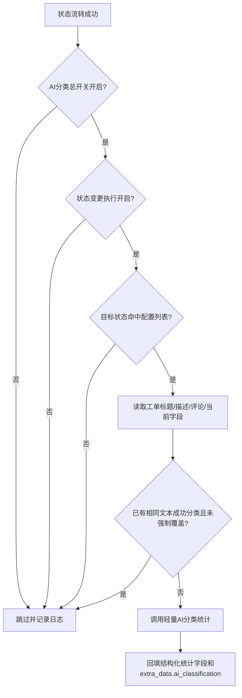

# 工单 AI 分类状态触发配置说明（2026-06-28）

## 背景

工单 AI 分类统计原先支持外部同步入库、远端拉取入库、手动创建入库和批量重归类。状态流转后可能补充根因、解决方案、关闭结果和评论上下文，但不会自动重新归类，导致关闭类、已解决类工单的统计字段可能停留在早期判断。

## 本次调整

1. `ticket.sync.automation.aiClassification` 新增状态变更触发配置：
   - `runOnStatusChange`：状态变更后是否允许执行 AI 分类统计。
   - `statusChangeTriggerStatuses`：目标状态白名单，支持配置多个状态编码。
   - `statusChangeForceReclassify`：状态变更触发时是否强制覆盖已有分类结果。
2. 工单状态流转成功提交后，服务端读取上述配置；只有总开关开启、状态变更开关开启、目标状态命中白名单时才执行 AI 分类统计。
3. 入库自动分类继续走原有场景开关：
   - `runOnExternalSync`
   - `runOnRemotePull`
   - `runOnManualCreate`
4. 已有 `category_name`、`issue_type_*`、`is_problem`、`root_cause_type`、`solution_type` 或 `resolution_*` 等分类统计字段的工单，非强制场景下不会重复调用 AI。
5. 已经基于相同标题、描述和评论成功分类过的工单，默认不会重复调用 AI；状态变更场景只有开启 `statusChangeForceReclassify` 时才覆盖防重逻辑。
6. 同步配置页“自动分类管理”支持输入指定工单 ID，复用批量重归类接口只处理目标工单。

## 处理流程

## 配置位置

- 页面：工单管理 -> 工单同步配置 -> AI 分类统计配置。
- 系统参数：`ticket.sync.automation.aiClassification`。
- 手动指定工单归类：工单管理 -> 工单同步配置 -> 自动分类管理 -> 指定工单ID。
- 提示词正文：系统管理 -> AI 提示词管理，默认编码 `ticket_stat_classify_default`。
- Provider：系统管理 -> AI Provider 管理；若同步配置未填写 Provider，会回退 `ticket.ai.category.classify.provider.code`。

## 日志排查

关键日志会记录：

- 状态变更触发未开启。
- 未配置触发状态。
- 目标状态未命中配置。
- 工单已有分类统计字段且未强制重归类。
- 已有相同文本成功 AI 分类结果。
- Provider/Prompt 未配置。
- AI 分类统计回填完成或失败。

日志只输出工单 ID、工单号、状态编码、配置编码和执行结果，不输出完整描述正文。
