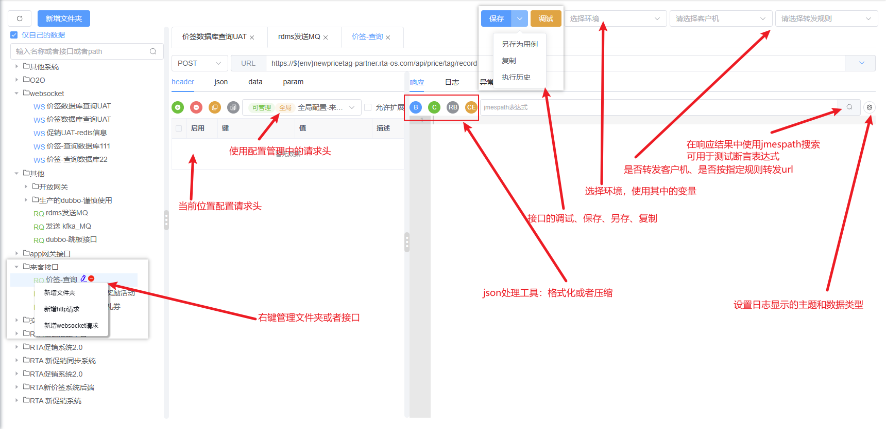

## 使用介绍

### 使用步骤
    1. 创建环境（测试管理->环境管理->环境管理），管理执行过程需要的全局变量
    2. 创建项目（测试管理->项目管理->项目列表），会自动创建项目对应的debugtalk
    3. 创建模块（测试管理->模块管理）：类似于文件夹的概念，用例归类
    4. 创建配置（可选）（测试管理->配置管理），某类用例需要的特殊配置，直接在用例中引用
    5. 创建用例（测试管理->用例管理）
    6. 创建套件（可选）（测试管理->测试计划->测试套件）：用例按批次执行指定用例，实现用例按指定顺序执行
    7. 执行用例： 可执行用例的位置：项目、模块、用例、套件
    8. 查看执行结果（测试管理->报告管理） 
    9. 接口管理： 用于接口调试和管理


#### 项目管理
    项目的创建、修改、删除、按项目执行

#### debugtalk
    项目维度自定义python脚本管理，用于系统回调、自定义方法、其他回调实现
    全局debugtalk：整个系统中只会存在一个
    项目维度debugtalk：每个项目对应一个
    取用逻辑：优先取项目维度的，再取全局的
    关于日志：在开头导入`from loguru import logger`，只是为了当你使用了logger初始化时不报错（debugtalk代码中没有使用logger则不用导入）
        使用时会覆盖为系统中对应的logger
        只有当并发是1的时候debugtalk的日志才会回会先到web前端，不然只会记录到后台服务中

#### 模块管理
    项目的创建、修改、删除、按模块执行

#### 配置管理
    创建配置时如果没有设置项目和模块则所有用例可用，设置了项目和模块则只能对应模块的用例可以使用
    配置作用：配置归类管理
    可配置项：请求头、变量、请求默认配置（超时时间、思考时间、重试次数）  
    例如：很多用例的请求头是一样的，或者有公共的参数，可以在配置中配置对应的公共请求头，然后在用例中引用配置就行
        引用配置后也可以在用例中再设置头，配置中没有的值会被扩展，有的字段值会被用例中单独配置的值覆盖

####  用例管理
    用例的创建、修改、删除、执行、调试、查看用例的调试和测试记录
    用例状态：用例执行时只会从数据库选择非停用的用例，选择出来的用例只有正常状态的用例会被真正执行，其余的只是标记为对应的状态

#### 报告管理
    查看测试执行结果：
        查看执行过程的日志和数据
        重新执行（使用上次执行的数据）

#### 环境管理
    管理执行过程中需要的全局变量
    环境地址：如果用例配置的不是合法的请求地址（例如只配置了路径）则会将环境中的地址拼接到请求地址前面
    变量可以分组管理：分组功能只是页面视觉分组，执行时还是放在一起使用的
    不能有相同名字的变量，执行时只会保留一个

#### 接口管理
    管理和调试接口，可另存为用例，可查看执行历史
    可以按文件夹归类管理接口，可以拖动来移动接口位置



#### 可能需要的相关工具使用说明

> 抽取、断言、自定义脚本，可能需要使用的数据提取工具
[jmespath官网](https://jmespath.org/)  
[jmespath官网使用说明](https://jmespath.org/tutorial.html)

> 自定义脚本可能用到的数据提取工具

[jsonpath在线验证及使用说明](https://www.jsonpath.cn/)
[jsonpath的npm地址](https://www.npmjs.com/package/jsonpath)

#### 关于变量的方法的引用

1. 变量的使用
```
假如有一个变量varName

使用
1. ${varName}
2. ${varName}othercontent
3. $varName
3. $varNameothercontent  # 这种无法识别

```

2. 方法的使用
> 方式引用必须使用大括号，参数一定不鞥使用大括号
```
假如有方法funcName(arg1, arg2)，变量：varName

使用
1. ${funcName(123, 345)}
2. ${funcName($varName, 345)}
3. $funcName($varName, 345)  # 这种无法正常识别

```
