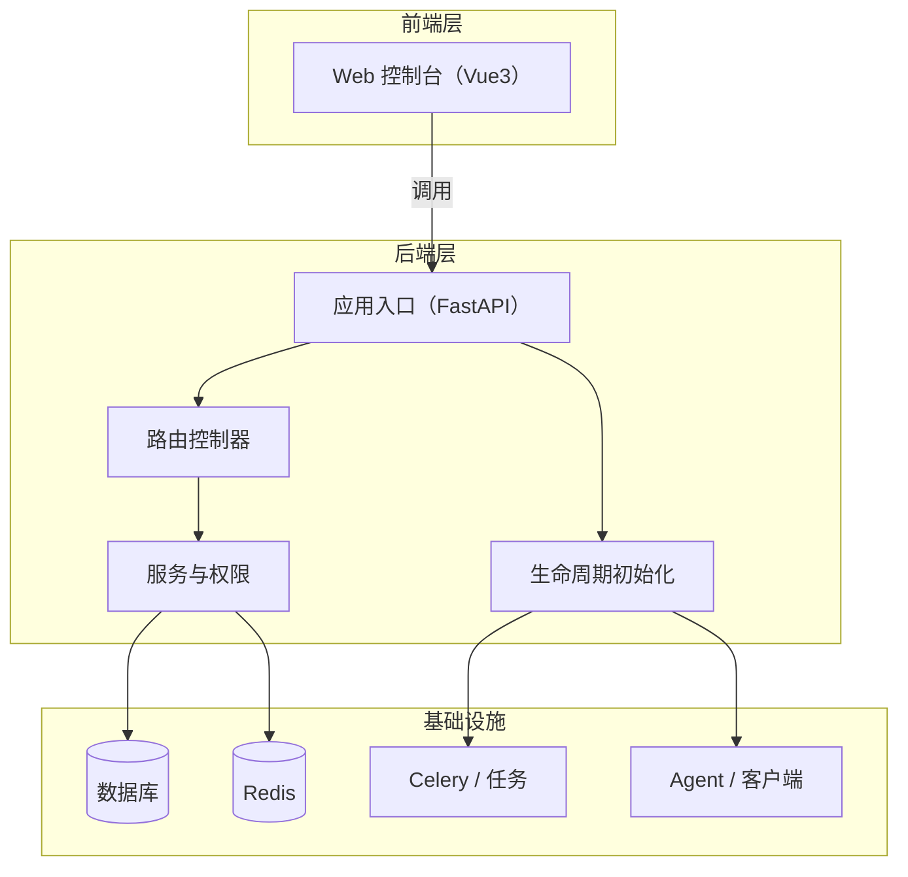

# 架构总览

系统采用前后端分离架构，后端负责业务编排与状态管理，前端负责交互和页面渲染。入口链路围绕 `FastAPI`、路由聚合、环境配置、Redis、数据库和客户端执行能力展开。

## 核心判断

- `server/server.py` 是后端组合点，负责生命周期、路由注册和中间件注入。
- `server/config/env.py` 是配置入口，决定运行环境、端口、数据库、Redis 和 JWT 参数。
- `web/src/main.js` 是前端挂载入口，负责应用初始化与全局依赖注入。

## 关联页面

- [后端应用服务](../entities/services/backend-application.md)
- [前端启动骨架](../entities/components/frontend-bootstrap.md)
- [HTTP API 入口流程](../flows/http-api-entrypoint.md)

## 被引用

- [项目总览](../overview.md)
- [项目目的](../purpose.md)
