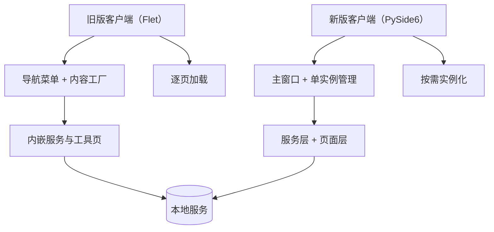

# 双客户端架构

项目同时保留旧版 Flet 客户端和新版 PySide6 客户端，两者覆盖相似的测试辅助能力，但在 UI 框架、进程模型和模块拆分上采用不同实现。

## 核心区别

- 旧版客户端以 Flet 为 UI 框架，采用导航栏 + 内容工厂的方式切换功能页。
- 新版客户端以 PySide6 为 UI 框架，采用 `QMainWindow`、`QStackedWidget` 和对话框拆分页面。
- 新版客户端把 POS、mitmproxy、Agent、SQLite 查询等能力拆成更清晰的 service / ui / worker / infra 分层。

## 设计取舍

- 旧版客户端偏快速集成，适合承载已有能力和历史功能。
- 新版客户端偏工程化，强调单实例、异常兜底、主题管理和后台任务隔离。
- 两者并存说明客户端迁移仍在进行中，知识库需要分别维护，不能用一套页面混写。

## 参见

- [旧版 Flet 客户端](../entities/services/legacy-flet-client.md)
- [新版 PySide6 客户端](../entities/services/new-pyside-client.md)
- [旧版客户端启动壳](../entities/components/legacy-client-bootstrap.md)
- [新版客户端启动壳](../entities/components/new-client-bootstrap.md)

## 被引用

- [项目总览](../overview.md)
- [项目目的](../purpose.md)
