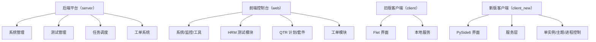

# 模块全景图

仓库不是单体模块，而是围绕后端平台、前端控制台、旧版客户端和新版客户端四条主线组织。知识库需要按这些主线分层归档，避免只记录入口而漏掉实际业务模块。

## 关键分层

- `server/` 是业务与数据中心。
- `web/` 是浏览器端控制台。
- `client/` 是历史桌面端，保留 Flet 方案。
- `client_new/` 是新版桌面端，采用 PySide6 重构。

## 参见

- [项目总览](../overview.md)
- [双客户端架构](desktop-client-architecture.md)
- [后端应用服务](../entities/services/backend-application.md)
- [后端基础设施层](../entities/components/server-infrastructure.md)
- [系统管理域](../entities/services/admin-domain.md)
- [HRM 测试管理域](../entities/services/hrm-domain.md)
- [QTR 执行域](../entities/services/qtr-domain.md)
- [任务调度域](../entities/services/task-scheduler-domain.md)
- [工单域](../entities/services/ticket-domain.md)
- [Web 控制台壳层](../entities/components/web-shell.md)
- [Web 功能模块](../entities/services/web-feature-domains.md)
- [旧版 Flet 客户端](../entities/services/legacy-flet-client.md)
- [旧版客户端壳层](../entities/components/legacy-client-shell.md)
- [旧版客户端运行时](../entities/components/legacy-client-runtime.md)
- [旧版客户端功能模块](../entities/services/legacy-client-features.md)
- [新版 PySide6 客户端](../entities/services/new-pyside-client.md)
- [新版客户端壳层](../entities/components/new-client-shell.md)
- [新版客户端运行时](../entities/components/new-client-runtime.md)
- [新版客户端服务模块](../entities/services/new-client-services.md)

## 被引用

- [项目总览](../overview.md)
- [双客户端架构](desktop-client-architecture.md)
