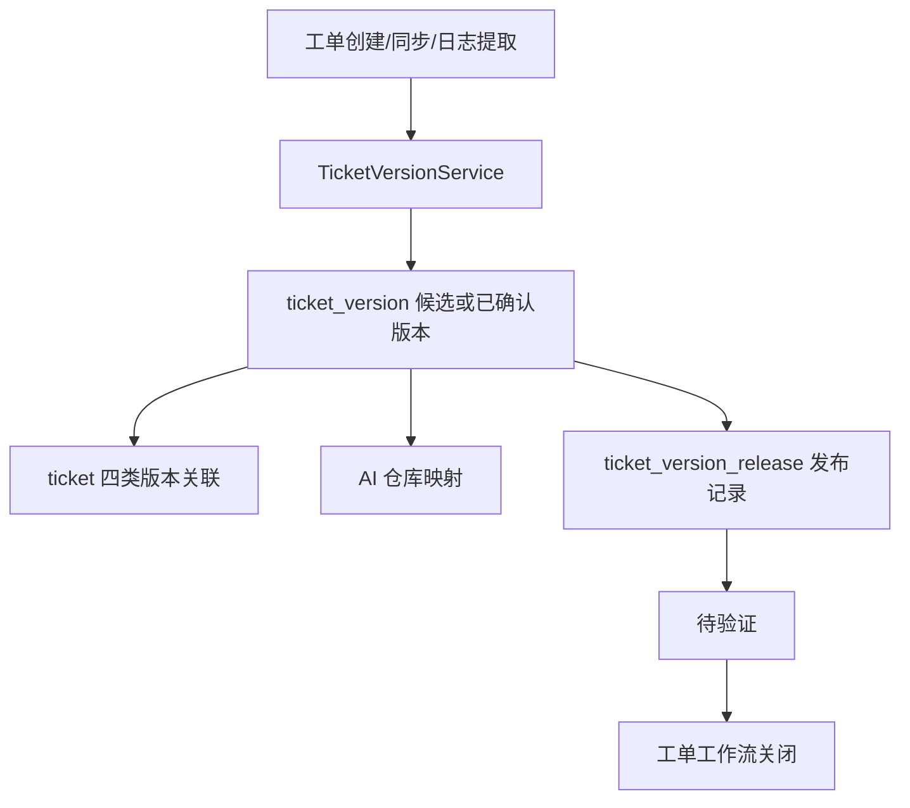

# 工单项目版本中心

项目版本中心为工单、发布事实和 AI 仓库映射提供统一版本来源。版本主数据与发布记录分离，避免以单张工单或代码分支替代真实发布事实。

## 规则

- 同一项目内 `version_key` 唯一；候选版本状态为 `discovered`，由管理员确认后转为 `confirmed`。
- 自动发现不会创建仓库映射或发布记录，避免把日志文本误判为可分析代码分支或已上线版本。
- 发布记录按版本、环境和批次保存；已发布不等于已验证，发布动作不会自动关闭工单。
- 工单、AI 仓库映射和 AI 分析任务只保存版本中心 ID；版本名称和标识由版本中心反查展示，不再保留文本关联字段。
- 外部同步、Excel 和日志中的版本文本只在输入边界用于解析或创建候选版本，不能写入工单主表或 `extra_data`。
- 版本 DAO 查询在业务编排前保持 ORM 实体；版本列表使用 `TicketVersionListItem` dataclass 组合发布记录，HTTP 输入输出由 Pydantic 模型校验和序列化。
- AI 仓库映射 DAO 查询同样保持 ORM 实体；列表使用 `TicketAiRepoMappingListItem` dataclass 组合版本中心记录后再响应。
- 版本中心 ID 对外统一以字符串序列化，避免迁移生成的大整数在浏览器中丢失精度；请求进入后端后仍由 Pydantic 解析为整数。

## 参见

- [工单核心数据模型](../entities/data-models/ticket-core-models.md)
- [工单域](../entities/services/ticket-domain.md)
- [工单流转路由流程](../flows/ticket-workflow-routing.md)

## 被引用

- [内容目录](../index.md)
- [工单核心数据模型](../entities/data-models/ticket-core-models.md)
- [工单域](../entities/services/ticket-domain.md)
