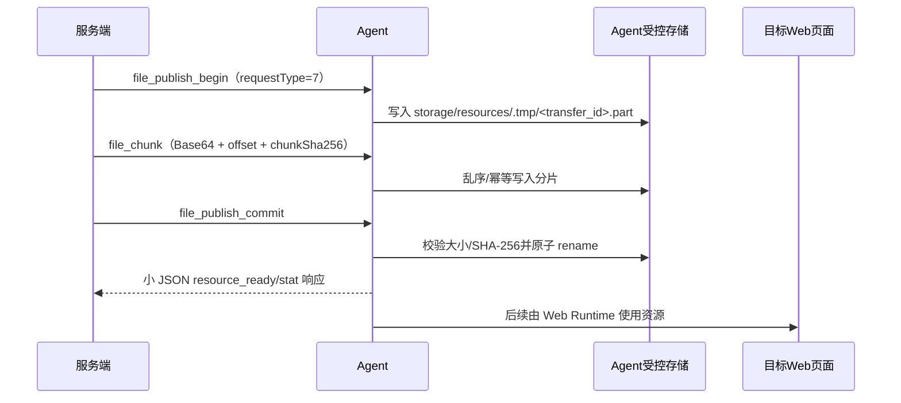

# 配置任务文件协议

本页定义门店配置任务所需的文件资源协议。当前 Agent 已提供独立的本地资源 manifest 与分片发布控制面；服务端已补齐资源 begin/chunk/commit 编排、SFTP 输入资源和资源状态联动。运行证据支持 metadata-only 产物元数据登记，但不代表服务端持有截图正文；运行产物 preview/download、evidence package 和生产级 Token 认证仍未在本切片实现。



## 设计原则

1. **服务端生成资源身份**：服务端生成不可猜测的 `resource_id`，Agent 不自行决定最终资源 ID。
2. **路径不作为业务契约**：服务端不能向 Agent 下发任意 Windows/Linux 绝对路径；Agent 只使用资源 ID、服务端授权的内部 locator 或受控相对路径。
3. **Agent 是首期真实存储位置**：输入文件可以只保存在执行 Agent 的 `storage_root`；服务端记录资源元数据、Agent 归属和状态，不要求服务端能直接打开该文件。
4. **传输与控制分离**：任务状态和控制命令可以复用现有 WebSocket request/event 分片；文件数据需要独立的传输标识、大小限制、校验和恢复语义。
5. **完成后才可使用**：资源只有完成传输、校验大小和 SHA-256 后才进入 `READY`，任务不能使用 `PENDING` 或 `UPLOADING` 资源。
6. **幂等优先**：重复命令、重复分片和 Agent 重连不能造成重复文件、状态倒退或数据库重复资源。

## Agent 本地实现（当前切片）

实现位置：`client_new/services/agent_resource_storage.py` 与 `client_new/services/agent_file_service.py`。

- 稳定应用根目录下使用 `storage/data/resource_manifest.json` 保存资源索引，使用 `storage/resources/` 保存已完成文件，使用 `storage/resources/.tmp/` 保存 `.part` 临时文件；测试可注入根目录。
- manifest 每项保存 `resource_id`、受控相对 `locator`、原始文件名、MIME、大小、SHA-256、版本、创建/过期/最近使用时间；manifest 通过同目录临时文件、flush、fsync 和 `os.replace` 原子写入。
- 资源命令使用 `requestType=7`，命令响应沿用普通小 JSON response 分片；文件正文不会放入普通 response。也可按 `command` 字段识别，便于协议演进。
- `file_publish_begin` 创建传输和 `.part`；`file_chunk` 使用 Base64，校验 index、offset、单块大小、单文件大小与 chunk SHA-256，支持乱序和同 hash 重复块幂等，拒绝重叠或不同 hash；`file_publish_commit` 校验完整大小和最终 SHA-256 后原子 rename 并写 manifest；`file_stat` 只返回元数据，`file_cleanup` 只清理服务自己登记的过期传输/资源。
- locator 只允许 `resources/<resource_id>`，拒绝绝对路径、`..`、反斜杠、符号链接、目录和资源根外路径；对外错误不包含绝对路径。
- 默认限制为单块 512 KiB、单文件 100 MiB、并发传输 4 个、未完成传输 TTL 30 分钟、资源 TTL 24 小时；服务构造器可注入测试限制。

当前切片已实现服务端资源传输编排、Agent 本地协议、Web `upload_file` 最小子集，以及配置任务运行的截图/日志产物元数据登记。运行证据支持显式 `capture_screenshot` 的契约字段、证据类型/阶段策略元数据、稳定 `stepId` 和 metadata-only 事件；旧 `stepIndex` 与 Base64 正文事件继续兼容。当前不实现任意文件读取、目录浏览、下载授权、运行产物 preview/download、evidence package 或 AI workspace 改造；SFTP 输入资源下载属于资源 Provider 的既有能力，不等同于运行产物下载。


服务端资源记录至少包括：

```json
{
  "resourceId": "res_01J...",
  "providerType": "agent_local",
  "agentCode": "agent-gray04",
  "logicalName": "price_tag",
  "fileName": "price-tag.xlsx",
  "mimeType": "application/vnd.openxmlformats-officedocument.spreadsheetml.sheet",
  "size": 18342,
  "sha256": "...",
  "status": "READY",
  "expiresAt": "..."
}
```

Agent 本地维护受控 manifest，建议包含：

- `resource_id`；
- 内部 locator 或 storage_root 下的相对路径；
- 文件名、大小、MIME 和 SHA-256；
- 创建时间和过期时间；
- 最近使用时间；
- 可选的任务运行引用。

manifest 不是业务数据库的替代品。服务端仍是资源授权、版本和生命周期的事实来源；Agent 只负责本地对象定位和文件读写。

Agent 的 `storage_root` 和 `temp_root` 应使用安装目录或稳定应用数据目录计算出的绝对路径，不依赖当前工作目录。路径解析后必须确认最终路径位于根目录内，拒绝绝对路径、`..`、符号链接逃逸和 Windows 盘符绕过。

## 最小协议语义

### 1. 发布 Agent 本地已有文件

适用于用户在 Agent 本地准备了商家文件、或 Agent 产生了需要纳入任务资产的文件。

```text
file_publish_begin
  -> file_chunk (0..n)
  -> file_publish_commit
  -> resource_ready / file_error
```

`file_publish_begin` 由服务端发起或由已授权的任务运行发起，包含：

- `resource_id`；
- `transfer_id`；
- `agent_code`（由连接身份核对，不能信任请求体自报）；
- `logical_name` 和展示文件名；
- 预期总字节数、MIME 和 SHA-256（如果调用方已知）；
- 过期时间、单文件大小上限和权限范围。

Agent 将文件复制或分片写入临时 `.part` 文件，完成后计算实际大小和 SHA-256，只有通过校验才执行原子 rename，并回传 `resource_ready`。

### 2. 读取 Agent 本地文件

适用于配置任务执行前将资源准备到 Agent，或 Agent 向服务端/任务编排器提供文件内容。

```text
file_download / file_get
  -> file_meta
  -> file_chunk (0..n)
  -> file_done / file_error
```

请求至少包含：

- `resource_id`；
- `transfer_id`；
- `offset` 和可选 `length`；
- 期望的 SHA-256/ETag；
- 本次传输的短期授权 token 或服务端签名上下文。

Agent 只能通过 manifest 找到资源；找不到、已过期或归属不匹配时返回明确错误，不允许回退为读取请求中传入的任意路径。

### 3. 将服务端文件放入 Agent

如果后续服务端或 SFTP Provider需要把文件放入 Agent，使用独立语义：

```text
file_put_begin
  -> file_chunk (0..n)
  -> file_put_commit
  -> resource_ready / file_error
```

文件先写入 Agent 的临时目录，校验通过后再进入 `storage_root`。不能直接覆盖已被其他任务引用的资源；替换应生成新资源版本。

## 分片消息字段

首期可以使用 JSON + Base64 作为兼容传输，但必须限制大小。建议控制帧与数据帧至少包含：

```json
{
  "type": "file_chunk",
  "transferId": "transfer_01J...",
  "resourceId": "res_01J...",
  "index": 0,
  "offset": 0,
  "totalBytes": 18342,
  "chunkBytes": 524288,
  "chunkSha256": "...",
  "data": "<base64>",
  "finished": false
}
```

完成消息：

```json
{
  "type": "file_done",
  "transferId": "transfer_01J...",
  "resourceId": "res_01J...",
  "receivedBytes": 18342,
  "sha256": "..."
}
```

失败消息：

```json
{
  "type": "file_error",
  "transferId": "transfer_01J...",
  "resourceId": "res_01J...",
  "code": "CHECKSUM_MISMATCH",
  "message": "文件校验失败"
}
```

服务端和 Agent 双方都必须校验：

- `index` 不超过最大块数；
- `offset` 非负且不溢出；
- `chunkBytes` 与实际解码字节数一致；
- `totalBytes` 不超过单文件上限；
- 重复块不重复追加；
- 乱序块按 offset 写入或明确拒绝；
- 完成时实际总长度和 SHA-256 一致；
- 单个 Agent、单个运行和全局传输并发不超过配额。

后续可演进为 JSON 控制帧 + WebSocket binary frame，避免 Base64 放大和对已压缩二进制再次 gzip。首期不能把无界文件内容塞入普通 `response_chunk` 聚合 Future。

## 断线恢复和幂等

`transfer_id` 是传输幂等键，服务端需要持久化或可恢复地保存：

- 资源 ID和 Agent 编码；
- 传输状态；
- 已确认的连续 offset 或分片集合；
- 最后活动时间；
- 重试次数和最近错误；
- 预期大小、实际大小和校验和。

重连后先查询传输状态，再从 `next_offset` 或缺失分片继续。不能只依赖服务端进程内 Future，也不能把 WebSocket 断开当作资源一定失败。

资源和传输都应设置 TTL。过期的 `.part` 文件、未完成 transfer 和没有数据库引用的对象由后台清理任务回收。完成事件重复到达时，服务端按 `resource_id + checksum + version` 幂等处理，不得把 READY 回退到 UPLOADING。

## `upload_file` 与 Web Runtime

配置任务模板只声明文件 Key：

```json
{
  "stepKey": "import_price_tag",
  "actionType": "upload_file",
  "params": {
    "fileKey": "price_tag"
  }
}
```

运行时通过输入快照把 `fileKey` 解析为 `resource_id`，再由 Agent 获取或定位到本地临时路径，最终调用 Playwright 的 `set_input_files`。模板不保存：

- Agent 绝对路径；
- 当前用户桌面路径；
- 服务端本地路径；
- 明文账号、密码或 SFTP 密钥。

`upload_file` 是共享 Web 动作执行器的扩展，不是配置任务把文件直接注入普通 Web 用例 `params_json` 的理由。

## SFTP Provider 契约

SFTP 必须作为独立 Provider 实现，不能把项目中名为 `sftp_server.py` 的 FTP Server 或 `ftplib.FTP` 客户端误当成 SFTP。Provider 统一能力建议包括：

- `put`；
- `read_range` 或 `open_stream`；
- `stat`；
- `exists`；
- `delete`；
- `health_check`。

SFTP 配置至少区分：

- host、port、username；
- 密码凭证引用或 private key/私钥凭证引用；
- `known_hosts` 和严格 host key 校验策略；
- base directory、连接/读写超时；
- 有限重试和临时对象命名规则。

写入使用：

```text
本地/Agent临时文件
  -> 远端 .part 对象
  -> 大小/校验确认
  -> 远端原子 rename
  -> READY
```

SFTP 的 `object_key` 是远端 POSIX key，不能交给服务端 `Path()` 当成本地文件。若 SFTP 是平台集中存储，则由服务端 Provider 访问；若 SFTP 只对 Agent 可见，则由 Agent 执行访问，服务端只记录 Provider 类型、资源 ID和 locator 摘要。两种形态必须在资源记录中明确 `provider_execution_side`。

## 鉴权、审计和安全

- 资源读取同时校验当前用户业务权限、资源引用、Agent 身份和短期 transfer 授权；
- WebSocket URL 中的 Agent 编码不是文件授权凭证；
- 禁止跨 Agent 读取、删除或覆盖；
- 原始文件名只作为展示字段，存储 key 使用资源 ID或安全哈希；
- 文件下载、发布、删除和失败清理写审计；
- 文件大小、扩展名、MIME 和内容校验在服务端与 Agent 双侧执行；
- 压缩包后处理必须有文件数量、解压总字节和路径穿越保护；
- 日志中只记录资源 ID、传输 ID、大小和校验结果，不记录密钥或完整路径。

## 与现有能力的关系

- `/common/upload` 是服务端本地上传能力，不能直接当作 Agent 存储；
- `desktop_asset_storage.py` 的 local/FTP/SFTP 逻辑可作为 Provider 实现参考，但图片 Base64 读写不适合通用大文件；
- 现有 WebSocket request/response/event 分片可复用控制面模式，但文件传输要增加独立状态、限额和恢复；
- Agent 当前 `storage/data/agent_config.json` 是客户端配置，不是资源 manifest，后续应新增受控资源配置或资源索引边界。

## 参见

- [配置任务资源与运行数据模型](../entities/data-models/configuration-task-resource-models.md)
- [门店配置文件存储流程](../flows/configuration-task-file-storage.md)
- [门店配置任务域设计](../entities/services/configuration-task-domain.md)
- [QTR 执行域](../entities/services/qtr-domain.md)

## 被引用

- [内容目录](../index.md)
- [门店配置任务域设计](../entities/services/configuration-task-domain.md)
- [配置任务文件存储流程](../flows/configuration-task-file-storage.md)
