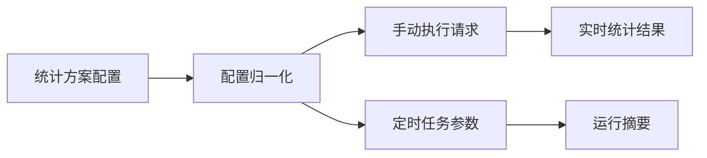

# 工单自定义统计接口与配置契约

该契约覆盖同步自动化配置中的统计方案，以及手动执行和字段定义接口。统计结果不属于持久化数据模型。

## 契约范围

配置持久化边界是 `ticket.sync.automation.customStatisticsProfiles`；执行边界是手动 HTTP 请求或调度任务。响应中的分组结果只在本次调用中有效。

## HTTP 接口

| 方法 | 路径 | 权限 | 说明 |
|---|---|---|---|
| `GET` | `/ticket/sync/custom-statistics/definitions` | `ticket:sync:config:list` | 返回允许配置的字段、时间字段和操作符。 |
| `POST` | `/ticket/sync/custom-statistics/run` | `ticket:sync:config:edit` | 执行方案，支持仅预览。 |

## 手动执行请求

| 字段 | 类型 | 默认值 | 约束 |
|---|---|---|---|
| `profileCodes` | string[] | 空 | 方案编码列表；空值执行全部启用方案。 |
| `startTime` | datetime | 空 | 与 `endTime` 成对传入。 |
| `endTime` | datetime | 空 | 必须晚于 `startTime`。 |
| `send` | boolean | `true` | `false` 时仅返回预览结果。 |

## 统计方案配置

| 字段 | 说明 | 约束 |
|---|---|---|
| `profileCode` | 方案唯一编码 | 仅英文、数字、下划线和中划线，最长 64。 |
| `timeField` | 统计时间字段 | 仅白名单时间字段。 |
| `timeRange` | 相对或固定时间范围 | 模式为今天、昨天、最近 N 天、本周、上周或固定范围。 |
| `scope` | 项目、模块、模块编码、类型等过滤 | 仅接受规范化 ID 或文本数组。 |
| `grouping` | 字段分组或规则分组 | 条件字段和操作符均使用白名单。 |
| `notification` | 渠道、模板、明细数量 | 明细数量为 1 至 20，飞书凭证可继承统一凭证。 |

## 返回结果

| 字段 | 说明 |
|---|---|
| `profileCode/profileLabel` | 本次执行的方案。 |
| `startTime/endTime/timeFieldLabel` | 实际生效的统计口径。 |
| `totalCount/unmatchedCount/groups` | 内存聚合得到的统计结果。 |
| `topTickets` | 仅在方案允许时返回的有限工单明细。 |
| `notification` | 渠道发送成功数量或跳过原因。 |

## 定时任务参数

| 参数 | 说明 |
|---|---|
| `profileCodes` | 方案编码数组或逗号分隔文本，留空执行全部启用方案。 |
| `startTime/endTime` | 可选统一时间覆盖，必须成对出现。 |

## 参见

- [工单自定义实时统计服务](../entities/services/ticket-custom-statistics.md)
- [工单自定义统计通知流程](../flows/ticket-custom-statistics-notification.md)
- [工单域](../entities/services/ticket-domain.md)

## 被引用

- [内容目录](../index.md)
- [工单自定义实时统计服务](../entities/services/ticket-custom-statistics.md)
- [工单自定义统计通知流程](../flows/ticket-custom-statistics-notification.md)
