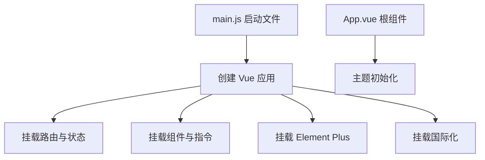

# 前端启动骨架

前端启动骨架由 `web/src/main.js` 和 `web/src/App.vue` 组成，负责应用实例创建、全局插件挂载、UI 组件注册、权限守卫与页面渲染入口。

## 职责

- 初始化全局 API 地址与页面运行环境。
- 注册通用组件、权限指令和工具方法。
- 挂载路由、状态管理、国际化和 UI 库。
- 在根组件中恢复主题样式。

## 依赖关系

| 依赖 | 作用 |
|---|---|
| `web/src/router` | 负责页面路由。 |
| `web/src/store` | 负责全局状态。 |
| `web/src/permission.js` | 负责页面权限守卫。 |
| `web/vite.config.js` | 提供开发代理和构建配置。 |

## 参见

- [架构总览](../../concepts/architecture-overview.md)
- [HTTP API 入口流程](../../flows/http-api-entrypoint.md)
- [模块全景图](../../concepts/module-landscape.md)

## 被引用

- [项目总览](../../overview.md)
- [架构总览](../../concepts/architecture-overview.md)
- [HTTP API 入口流程](../../flows/http-api-entrypoint.md)
- [Wiki 约定](../../schema.md)
