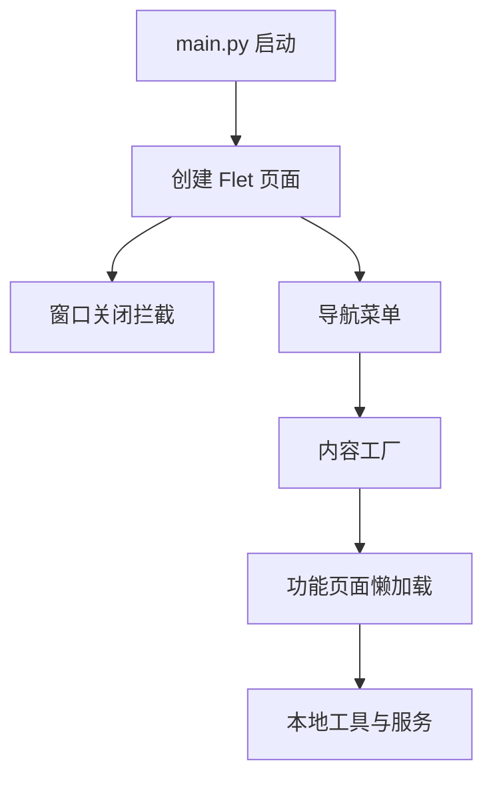

# 旧版客户端启动壳

旧版客户端启动壳负责 Flet 页面启动、导航布局、状态栏刷新和异常展示，是旧版桌面入口的 UI 组装层。

## 输入输出

| 输入 | 输出 |
|---|---|
| Flet `Page`、配置文件、运行状态 | 可交互桌面窗口 |
| 导航索引 | 对应功能页实例 |

## 关键职责

- 拦截关闭事件并弹出确认对话框。
- 通过 `NavigationMenu` 切换内容区域。
- 维护底部系统信息与异常对话框。

## 参见

- [旧版 Flet 客户端](../services/legacy-flet-client.md)
- [双客户端架构](../../concepts/desktop-client-architecture.md)

## 被引用

- [项目总览](../../overview.md)
- [旧版 Flet 客户端](../services/legacy-flet-client.md)
