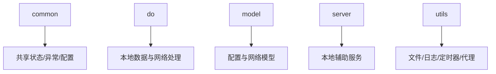

# 旧版客户端运行时

旧版客户端运行时负责本地服务、配置、模型、工具函数和后台线程，是 Flet 壳层之下的支撑层。

## 参见

- [旧版客户端壳层](legacy-client-shell.md)
- [旧版 Flet 客户端](../services/legacy-flet-client.md)
- [旧版客户端功能模块](../services/legacy-client-features.md)
- [模块全景图](../../concepts/module-landscape.md)

## 被引用

- [项目总览](../../overview.md)
- [双客户端架构](../../concepts/desktop-client-architecture.md)
