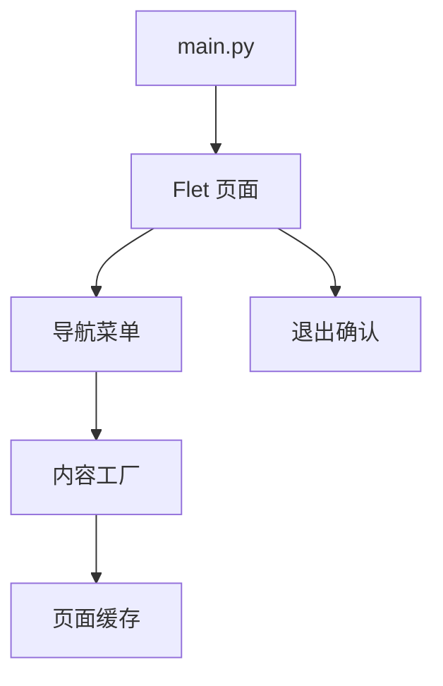

# 旧版客户端壳层

旧版客户端壳层负责 Flet 应用启动、菜单导航、内容切换和退出确认，是历史桌面端的 UI 宿主。

## 参见

- [旧版 Flet 客户端](../services/legacy-flet-client.md)
- [旧版客户端运行时](legacy-client-runtime.md)
- [旧版客户端功能模块](../services/legacy-client-features.md)
- [模块全景图](../../concepts/module-landscape.md)

## 被引用

- [项目总览](../../overview.md)
- [双客户端架构](../../concepts/desktop-client-architecture.md)
