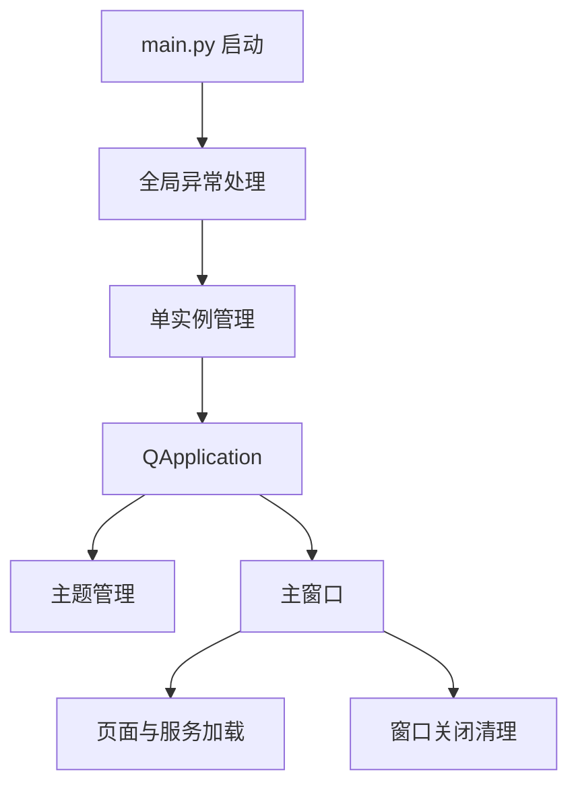

# 新版客户端启动壳

新版客户端启动壳负责 PySide6 应用初始化、单实例控制、全局异常处理、主题应用和主窗口展示。

## 输入输出

| 输入 | 输出 |
|---|---|
| 命令行参数、系统主题、窗口标题 | 可运行的桌面主窗口 |
| 单实例激活请求 | 将已存在窗口置前 |

## 关键职责

- 防止重复启动并支持已有窗口唤醒。
- 安装 Qt 消息过滤器和 Python 异常处理。
- 初始化主题、图标、 overlay 和窗口可见性。

## 参见

- [新版 PySide6 客户端](../services/new-pyside-client.md)
- [双客户端架构](../../concepts/desktop-client-architecture.md)

## 被引用

- [项目总览](../../overview.md)
- [新版 PySide6 客户端](../services/new-pyside-client.md)
