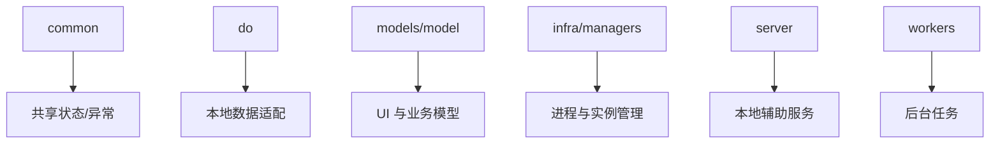

# 新版客户端运行时

新版客户端运行时包含状态管理、进程管理、发射器、模型定义、本地服务、工具函数和后台 worker，是 PySide6 UI 之下的支撑层。

## 参见

- [新版客户端壳层](new-client-shell.md)
- [新版 PySide6 客户端](../services/new-pyside-client.md)
- [新版客户端服务模块](../services/new-client-services.md)
- [模块全景图](../../concepts/module-landscape.md)

## 被引用

- [项目总览](../../overview.md)
- [双客户端架构](../../concepts/desktop-client-architecture.md)
