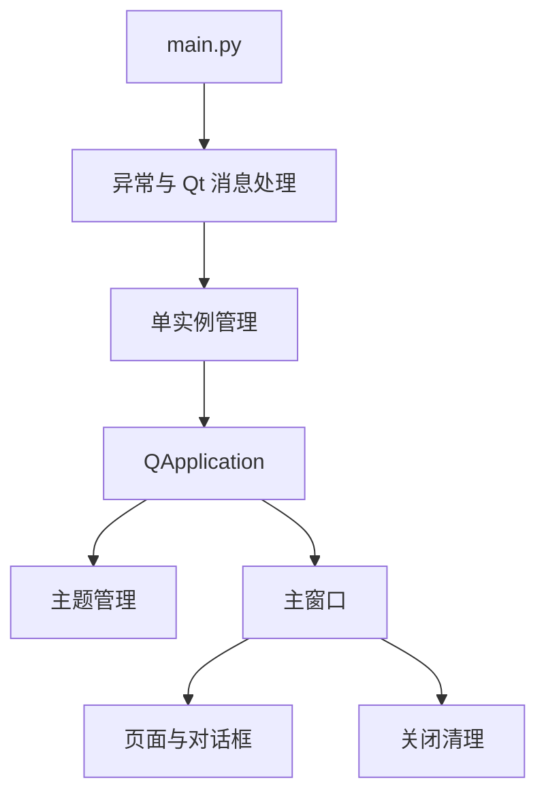

# 新版客户端壳层

新版客户端壳层负责 PySide6 启动、单实例、主窗口、主题、图标和窗口生命周期管理。

## 参见

- [新版 PySide6 客户端](../services/new-pyside-client.md)
- [新版客户端运行时](new-client-runtime.md)
- [新版客户端服务模块](../services/new-client-services.md)
- [模块全景图](../../concepts/module-landscape.md)

## 被引用

- [项目总览](../../overview.md)
- [双客户端架构](../../concepts/desktop-client-architecture.md)
