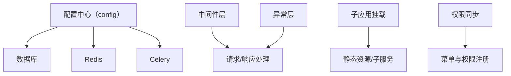

# 后端基础设施层

后端基础设施层负责配置、数据库、Redis、Celery、中间件、异常处理和子应用挂载，是 `server/server.py` 的运行底座。

## 职责

- 统一加载环境变量与运行配置。
- 维护数据库连接、ORM 类型和缓存连接。
- 注入中间件、异常处理和子应用。
- 支持权限菜单同步与启动期初始化。

## 参见

- [后端应用服务](../../entities/services/backend-application.md)
- [模块全景图](../../concepts/module-landscape.md)

## 被引用

- [项目总览](../../overview.md)
- [模块全景图](../../concepts/module-landscape.md)
