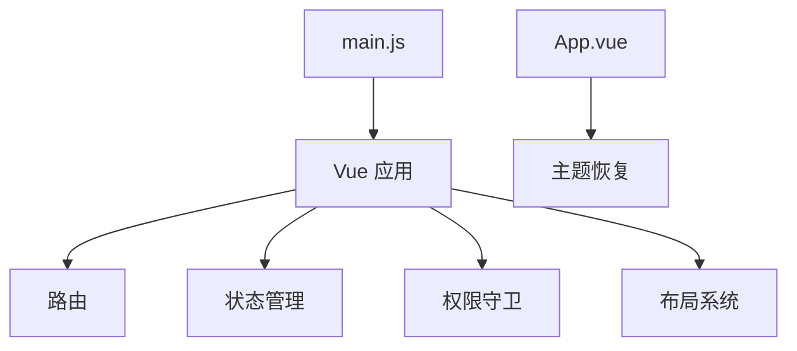

# Web 控制台壳层

Web 控制台壳层负责 Vue 应用启动、路由挂载、全局状态、权限守卫、布局和主题初始化。

## 主要职责

- 挂载路由、Store、国际化、指令和 UI 库。
- 控制登录态、权限和页面布局。
- 作为所有业务视图的统一宿主。
- 顶层业务详情路由可绕过 `Layout` 直接由 `App.vue` 的根 `router-view` 承载；当前 `TicketDetail` 使用该模式，避免相似工单跳转后出现侧边栏、顶部导航或标签栏。

## 参见

- [模块全景图](../../concepts/module-landscape.md)
- [Web 功能模块](../services/web-feature-domains.md)

## 被引用

- [项目总览](../../overview.md)
- [模块全景图](../../concepts/module-landscape.md)
