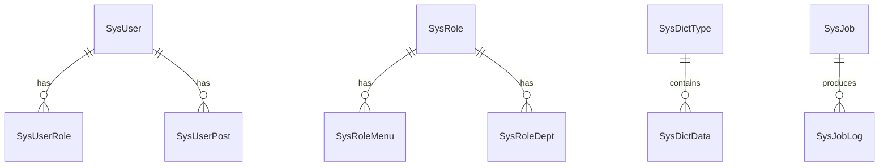

# 系统管理核心数据模型

该数据模型簇覆盖用户、角色、菜单、部门、岗位、字典、配置、公告、日志、任务和 API Key。

## 主要实体

- `SysUser`、`SysRole`、`SysMenu`、`SysDept`、`SysPost`
- `SysDictType`、`SysDictData`、`SysConfig`、`SysNotice`
- `SysLogininfor`、`SysOperLog`、`SysJob`、`SysJobLog`、`SysApiKey`

## 参见

- [系统管理域](../services/admin-domain.md)
- [模块全景图](../../concepts/module-landscape.md)

## 被引用

- [项目总览](../../overview.md)
- [系统管理域](../services/admin-domain.md)
