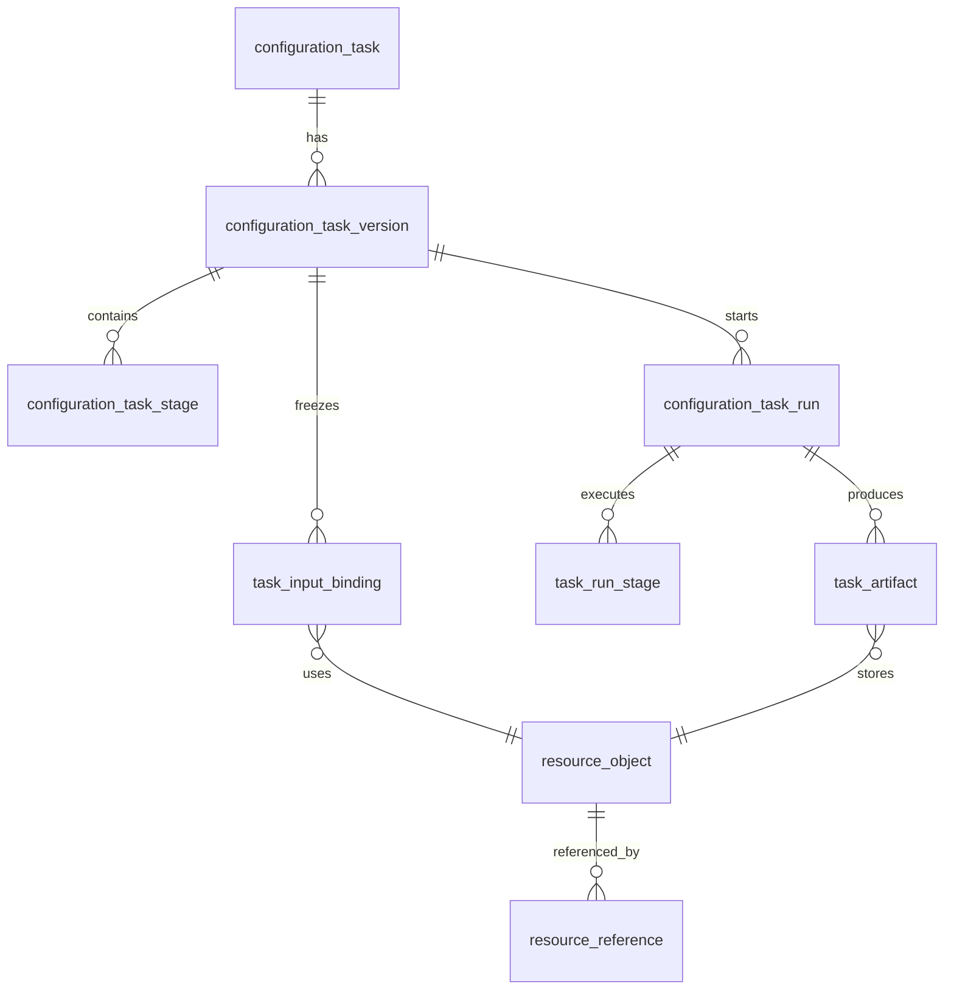
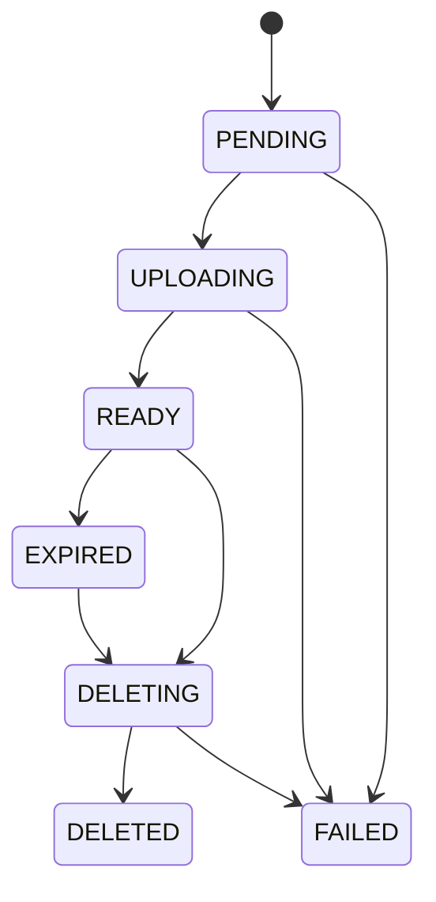

# 配置任务资源与运行数据模型

本页定义门店配置任务的任务版本、运行阶段、输入文件和截图产物模型。它是后续实现的设计契约，当前不代表数据库表已经创建。



## 任务和运行对象

### `configuration_task`

表达长期存在的任务定义：名称、商家、门店范围、负责人、项目归属、权限和当前发布版本。它不保存某次运行的动态状态。

### `configuration_task_version`

表达一次可执行的不可变快照，至少包括：

- `task_version_id`、`task_id`、版本号；
- 阶段列表和操作模板版本；
- 商家、门店、环境和地区参数；
- `credential_binding_id` 及凭证 revision 引用；
- 输入资源绑定；
- 审批、截图和重试策略；
- 创建人、发布时间和废弃时间。

发布后禁止原地修改。修改任务必须创建新版本，避免长任务执行过程中读取到半修改配置。

### `configuration_task_run`

表达一次实际执行，创建时固定：

- `task_version_id`；
- 执行 Agent 编码；
- 触发方式和操作人；
- 凭证绑定及 revision；
- 输入资源快照；
- 运行参数摘要（不含密钥和完整文件路径）；
- 幂等键、开始时间和超时策略。

运行状态建议为：`PENDING`、`WAITING_APPROVAL`、`RUNNING`、`VERIFYING`、`SUCCESS`、`PARTIAL_SUCCESS`、`FAILED`、`CANCELLED`、`RECOVERY_PENDING`。

### `configuration_task_stage` / `task_run_stage`

任务版本中的 `configuration_task_stage` 保存阶段定义；运行时复制成 `task_run_stage`，保存实际状态、开始结束时间、重试次数、错误码、业务摘要和关联产物。

阶段必须能单独查询和重试，不能把全部执行过程无限追加到一个 `result_json`。

## 资源对象

### `resource_object`

资源对象是输入文件、截图、日志、导出文件或最终报告的统一身份。建议字段：

| 字段 | 说明 |
|---|---|
| `resource_id` | 服务端生成的全局资源 ID；对外 JSON 序列化为字符串 |
| `provider_type` | `agent_local`、`sftp` 或未来其他 Provider |
| `provider_execution_side` | `agent` 或 `server`，明确由哪一侧访问 Provider |
| `agent_code` | Agent 本地资源的归属；非 Agent 资源可为空 |
| `object_key` | Provider 内部定位键，不是用户可提交的绝对路径 |
| `original_file_name` | 用户展示名，不参与路径拼接 |
| `mime_type` | 服务端归一化的媒体类型 |
| `file_size` | 实际字节数 |
| `checksum_algorithm` / `checksum` | 首期使用 SHA-256 |
| `version` | 同一逻辑文件的版本号或 ETag |
| `status` | 资源生命周期状态 |
| `created_by` / `created_at` | 创建审计 |
| `expires_at` / `deleted_at` | 保留和删除时间 |
| `error_code` / `error_message` | 最近一次失败摘要，禁止写入密钥 |

服务端保存的是资源身份、元数据和 Provider locator 快照，不保存 Agent 本地绝对路径作为业务契约。Agent 侧可以维护 `resource_id -> 受控相对路径` 的 manifest。

### `resource_reference`

资源引用表将资源与任务、运行、阶段或其他业务对象关联，至少包括：

- `resource_id`；
- `business_type`、`business_id`；
- `relation_type`（输入、截图、日志、报告等）；
- 所属项目、部门或租户范围；
- 创建人和创建时间。

有引用的资源不能直接物理删除；删除应先进入 `DELETING`，确认没有有效引用后再由 Provider 执行。

### `task_input_binding`

任务版本绑定逻辑文件 Key 和资源版本，例如 `price_tag`、`promotion`、`goods`。运行创建时把绑定复制为输入快照，记录实际使用的 `resource_id`、版本、大小和 SHA-256。

任务模板只引用 `fileKey` 或资源 ID，不引用 Agent 本地绝对路径。替换新文件会创建新版本，不改变历史运行的输入快照。

### `task_artifact`

运行产物只保存资源引用和证据元数据：

- `artifact_id`、`task_run_id`、`stage_id`；
- `artifact_type`：`step_screenshot`、`before_screenshot`、`after_screenshot`、`failure_screenshot`、`execution_log`、`report` 等；
- `resource_id`、文件名、类型、大小和校验和；
- 关联 `step_key`、证据阶段和页面 URL 摘要；
- 访问范围、保留期限和创建时间。

截图、日志和报告与输入文件共享资源抽象，但应有独立权限、数量上限和生命周期策略。

## 资源状态机



状态语义：

- `PENDING`：已生成资源 ID，尚未开始或尚未确认传输；
- `UPLOADING`：正在 Agent 或 SFTP Provider 写入；
- `READY`：大小和校验和已确认，可被任务使用；
- `FAILED`：传输、校验或登记失败，可按幂等规则重试；
- `EXPIRED`：超过保留期，不再允许新任务引用；
- `DELETING`：等待引用检查和物理删除；
- `DELETED`：元数据保留审计，物理对象已删除。

数据库事务和物理文件写入不是一个原子事务。必须通过状态机、完成确认、失败补偿和孤儿文件扫描处理不一致：数据库提交失败时清理已写入对象，Provider 写入成功但数据库未更新时按 transfer/resource ID 扫描并回收。

## ID 与权限规则

- 可能使用 Snowflake BIGINT 的内部 ID，对外响应统一按字符串序列化；前端禁止 `Number(resourceId)`；
- 资源 ID 不是授权凭证，下载、读取、删除和覆盖必须重新校验用户、项目/部门范围、业务引用、Agent 归属和短期 transfer token；
- Agent 只能访问服务端授权给自身 `agent_code` 的资源；
- 运行上下文保存凭证绑定 ID 和 revision，不复制密文；
- 资源错误和调试信息脱敏，不记录密码、Cookie、Token、私钥或完整 storageState。

## Provider 约束

首期 Provider：

- `AgentLocalProvider`：文件实际保存在 Agent 受控 `storage_root`，服务端只保存资源元数据和 ID；Web 上传动作在 Agent 本地解析资源并传给目标页面；
- `SftpProvider`：文件实际保存在 SFTP 远端，`object_key` 是远端 POSIX key。由 Agent 或服务端访问哪一侧，必须由 `provider_execution_side` 明确，不能把远端 key 当本地 `Path`。

现有桌面图片实体和 `desktop_asset_storage.py` 可以作为兼容实现参考，但不应把图片专用字段或 Base64 响应直接扩展为通用文件模型。

## 报告边界

Word 或飞书报告只读取：

```text
task_run -> task_run_stage -> task_artifact -> resource_object
```

报告不读取 Agent 路径，不从运行 JSON 猜测文件位置，也不把图片或文件 Base64 嵌入任务定义。

## 参见

- [门店配置任务域设计](../services/configuration-task-domain.md)
- [配置任务文件协议](../../contracts/configuration-task-file-protocol.md)
- [门店配置文件存储流程](../../flows/configuration-task-file-storage.md)
- [桌面测试资源存储参考](../../entities/services/hrm-domain.md)

## 被引用

- [内容目录](../../index.md)
- [门店配置任务域设计](../services/configuration-task-domain.md)
- [配置任务文件协议](../../contracts/configuration-task-file-protocol.md)
