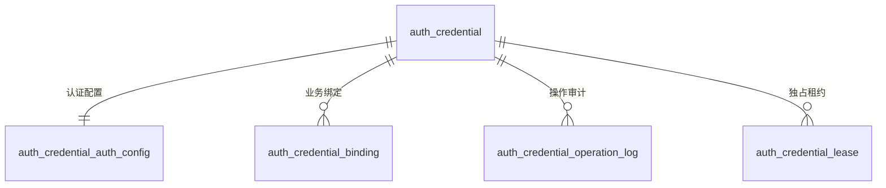

# 统一凭证数据模型

统一凭证以密文快照为唯一事实源，业务只关联绑定记录。

| 表 | 用途 |
|---|---|
| auth_credential | 加密保存 Cookie、Token、API Key 或 storageState，并维护版本和刷新状态 |
| auth_credential_binding | 定义 Web、日志拉取、远端同步如何投影凭证，并声明是否允许回写 |
| auth_credential_auth_config | HTTP/浏览器登录与刷新参数，以及登录、刷新各自的业务成功断言 |
| auth_credential_operation_log | 刷新、写回、冲突审计 |
| auth_credential_lease | 独占使用和刷新租约 |

Web 用例浏览器状态不再关联旧 Session/Profile 配置。`web_case` 绑定使用 `playwright_storage` 投影，运行过程仅读取凭证快照；需要保留手工登录结果时，由录制完成后的显式保存创建新凭证和绑定。

`writeback_enabled` 默认关闭。开启后仍需客户端明确声明本地缓存已启用，并通过 `expectedRevision` 进行乐观锁校验；版本冲突不会覆盖服务端较新状态。

已执行首版表结构的环境需额外执行 `server/sql/20260806_credential_binding_writeback.sql` 补充该字段。

已部署凭证管理表但尚未包含成功断言字段的环境，还需执行 `server/sql/20260808_credential_response_success_assertions.sql`，新增 `login_success_assertions` 和 `refresh_success_assertions` 两个 JSON 列。旧记录的 `NULL` 在接口读取时归一为空列表。

需要支持多步认证链（如账号密码 -> TOTP -> Set-Cookie）的环境，还需执行 `server/sql/20260917_credential_login_steps.sql`，为 `auth_credential_auth_config` 新增 `login_steps`、`refresh_steps` 两个 JSON 列。两列为 `NULL` 时继续走原有单步登录/刷新模板逻辑，存量凭证行为不变。步骤结构定义见 `modules/credential/entity/vo/credential_vo.py` 的 `CredentialLoginStepModel`（含语义化步骤 id 与 `when` 条件步骤）。

参见：[凭证刷新流程](../../flows/credential-refresh.md)、[凭证接口契约](../../contracts/credential-api.md)。

被引用：凭证刷新流程、凭证接口契约。
