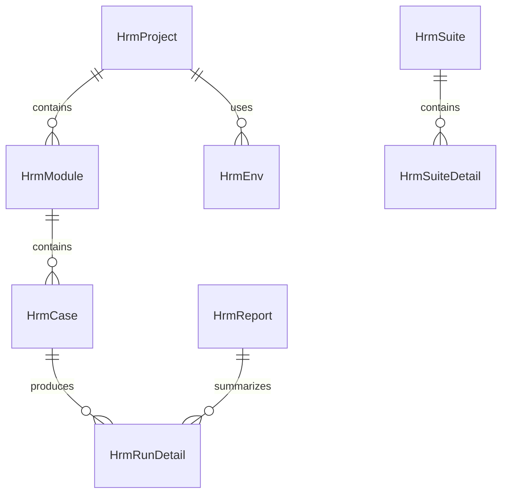

# HRM 核心数据模型

HRM 核心数据模型覆盖项目、模块、配置、用例、套件、报告、执行记录、环境、接口、Mock、转发规则、Agent、桌面测试和 Web 测试。

## 主要实体

- `HrmProject`、`HrmModule`、`HrmConfig`
- `HrmCase`、`HrmSuite`、`HrmSuiteDetail`
- `HrmReport`、`HrmRunDetail`、`HrmRunError`
- `HrmEnv`、`HrmApi`、`HrmMockRule`、`HrmMockResponse`
- `HrmAgent`、`HrmForwardRules`、`HrmWebCase`、`HrmDesktopCase`

## 参见

- [HRM 测试管理域](../services/hrm-domain.md)
- [HRM 枚举集](../enums/hrm-enums.md)

## 被引用

- [项目总览](../../overview.md)
- [HRM 测试管理域](../services/hrm-domain.md)
