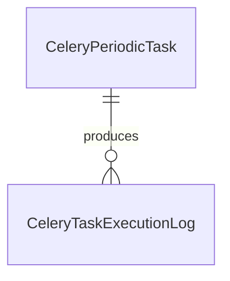

# 任务调度核心数据模型

任务调度核心数据模型围绕周期任务定义和执行日志展开。

## 主要实体

- `CeleryPeriodicTask`
- `CeleryTaskExecutionLog`
- `JobModel` 与相关查询/编辑模型

## 参见

- [任务调度域](../services/task-scheduler-domain.md)

## 被引用

- [项目总览](../../overview.md)
- [任务调度域](../services/task-scheduler-domain.md)
