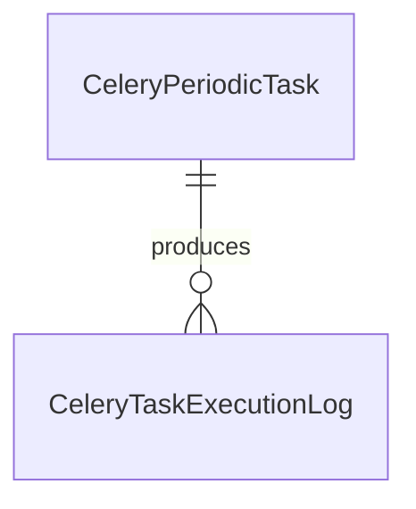

# 任务调度核心数据模型

任务调度核心数据模型围绕周期任务定义和执行日志展开。

## 主要实体

- `CeleryPeriodicTask`
- `CeleryTaskExecutionLog`
- `JobModel` 与相关查询/编辑模型
- `CeleryPeriodicTask.last_status` 记录最近一次最终状态；执行中的实时状态由 Redis 心跳键补充，而不是只靠数据库字段。
- `CeleryPeriodicTask.lock_ttl_seconds` 用于并发互斥锁的固定 TTL；超时后锁自然失效。
- `CeleryTaskExecutionLog` 以单次 `celery_task_id` 作为运行生命周期标识，任务开始时先落 `running` 记录，结束后回写 `success/failed/revoked/skipped`、耗时和异常详情。

## 参见

- [任务调度域](../services/task-scheduler-domain.md)

## 被引用

- [项目总览](../../overview.md)
- [任务调度域](../services/task-scheduler-domain.md)
