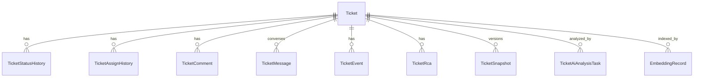

# 工单核心数据模型

工单核心数据模型覆盖工单本体、状态历史、指派历史、评论、事件、RCA、知识库、工作流、统计与日志拉取记录。

## 主要实体

- `Ticket`、`TicketStatusHistory`、`TicketAssignHistory`
- `TicketComment`、`TicketEvent`、`TicketRca`
- `TicketMessage`、`TicketSnapshot`
- `KnowledgeArticle`、`EmbeddingRecord`
- `TicketAiRepoMapping`、`TicketAiAnalysisTask`
- `WorkflowStatus`、`WorkflowTransition`
- `TicketStatisticsDaily`、`UserStatisticsDaily`
- `TicketLogPullRecord`

## 关键字段约束

- `Ticket.project_id` 与 `Ticket.module_id` 直接引用 HRM 项目/模块主键，工单归属不再维护独立“商户/模块”字典。
- `Ticket.ticket_no` 作为外部系统工单号，手动录入且全局唯一；`Ticket.extra_data.version_key` 用作版本号，供 AI 分析匹配仓库映射。
- 2026-07-08 待实施方案建议新增 `Ticket.submit_time` 作为统计主时间，外部同步工单取外部 `createTime`，手工创建工单取本地 `create_time`；查询过渡期优先 `submit_time`，为空再回退 `extra_data.external_sync.externalCreateTime` 和 `create_time`。
- 2026-07-08 待实施方案建议新增 `Ticket.processed_at` 作为“首次形成有效排查结论时间”，用它统计已处理数、处理率、首次处理耗时和未处理存量；`first_response_at` 继续表示首次响应/接手，不能替代 `processed_at`。
- 2026-07-08 待实施方案确认 `Ticket.resolved_at` 保留当前终态写入逻辑，语义为“工单处置完成时间”；真实 Bug 修复统计应结合 `is_problem/solution_type/resolution_code/fixed_version/released_at/verified_at`。
- 2026-07-08 待实施方案建议新增 `affected_version/planned_fix_version/fixed_version/released_version/released_at/verified_at`；其中 `affected_version` 可兼容 `extra_data.version_key`，`planned_fix_version` 是治理排期字段，不应继续塞进 `extra_data.version_key`。
- 2026-07-08 待实施方案将 `ticket_issue`、`ticket.issue_id` 与 `ticket_relation` 降为第二阶段增强：现有根因、根因分类和细分问题字段先继续承担分类统计，Issue 层仅在需要“真实问题实例数、重复工单数、影响工单数”时实施。
- `Ticket.issue_type_id/issue_type_name`、`Ticket.is_problem`、`Ticket.root_cause_type`、`Ticket.solution_type`、`Ticket.resolution_code/resolution_name` 是工单统计与后续 AI 分析的结构化维度，不能塞进 `extra_data` 替代；`Ticket.module_id/module_name` 继续承担业务域维度。
- `Ticket.problem_pattern_code/problem_pattern_name` 是长期治理用的细分问题类型字段，承载“内存泄露”“280开头券为纸质券规则说明”等固定问题模式；`problem_pattern_confidence/source/verified/verified_by/verified_at` 记录 AI 置信度、来源和人工确认状态。人工确认后的细分问题默认不被 AI 自动分类覆盖。
- `Ticket.extra_data.ticket_automation` 可记录创建工单时的自动拉日志与自动 AI 配置，便于后续追溯和重试。
- `Ticket.extra_data.ticket_automation.notifyConfig` 可记录自动化链路使用的推送配置，便于日志拉取失败、版本号缺失和 AI 结束时直接发送消息。
- `Ticket.extra_data.version_key` 除了手工维护外，也可由日志正文中的版本号自动提取回写。
- `Ticket.current_assignee_*` 继续表示当前处理人；新增 `Ticket.first_line_assignee_*` 表示一线接单人员，`Ticket.internal_owner_*` 表示内部模块/工单负责人，三者语义分离，避免一个字段同时承载多种职责。
- `Ticket.merchant_name` 继续作为兼容字段保存项目名称，保证旧前端字段 `merchantName` 和历史数据可平滑读取。
- `WorkflowTransition.allowed_roles` 现承载扩展 JSON，内部包含 `roles`、`assignee`、`notification` 三类配置。
- `TicketLogPullRecord` 只保存每次拉取任务过程与结果，外部地址、Cookie、归档与轮询参数不进该表，而是进入系统参数表。
- `TicketLogPullRecord.command_content` 会携带内部 `_automation` 扩展字段，用于记录日志拉取成功后是否自动触发 AI 以及目标 Agent 编码，外部提交前会自动剥离。
- `TicketLogPullRecord.command_content` 还可携带 `notifyConfig`，用于在日志拉取成功、版本号提取失败或 AI 分析结束时继续沿用同一套通知配置。
- `TicketAiRepoMapping` 记录项目、版本、仓库地址、分支、本地仓库路径和工作区根目录的兼容映射，用于历史任务审计和兜底；当前 AI Worker 执行时优先读取 Agent 本地配置中的仓库路径和工作区根目录。
- `TicketAiAnalysisTask.analysis_context` 仅保留 `selectedAgentCode`、`forceRefresh`、`extraInstruction`、`promptLayers`、日志记录ID等轻量任务快照，完整工单/日志上下文落到工作区 `context.json`，避免任务表因超大日志包触发 MySQL `max_allowed_packet`；`Ticket.ai_analysis` 则保存最新一次分析结论。
- `TicketMessage` 是持续协同和追问的上下文来源，字段包含 `role`、`message_type`、`content`、`attachments`、来源对象和创建人信息。
- `TicketSnapshot` 是 ACR 当前快照版本，字段包含 `version`、`summary`、`root_cause`、`solution`、`prevention`、`risk`、`owner`、`source_type` 和结构化数据。
- `EmbeddingRecord` 继续保存工单本地向量兜底索引，唯一键为 `object_type/object_id/embedding_model/embedding_version`；当 `ticket.similarity.config.provider=qdrant` 时，Qdrant 作为主检索索引，本表仍用于回退和审计。
- 相似度重建会按工单标题、描述、AI 摘要、根因、解决方案和 RCA 重新计算 `EmbeddingRecord.embedding/content_hash`，并可同步写入 Qdrant payload。
- `ticket.similarity.config` 是系统参数 JSON，不新增业务表；其中 `sceneTriggers` 控制外部同步、远端拉取、手动新增、手动编辑、Excel 导入和关闭知识沉淀是否自动刷新向量。

## 参见

- [工单域](../services/ticket-domain.md)
- [工单枚举集](../enums/ticket-enums.md)
- [工单流转路由流程](../../flows/ticket-workflow-routing.md)

## 被引用

- [项目总览](../../overview.md)
- [工单域](../services/ticket-domain.md)
- [工单流转路由流程](../../flows/ticket-workflow-routing.md)
