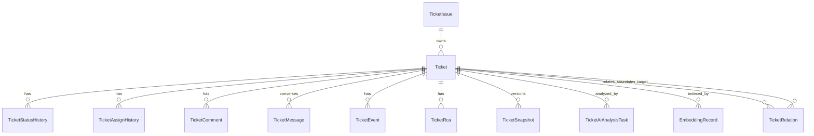

# 工单核心数据模型

工单核心数据模型覆盖工单本体、状态历史、指派历史、评论、事件、RCA、知识库、工作流、统计与日志拉取记录。

## 统计快照

`TicketStatisticsDaily` 现在承接自然日冻结统计结果，支持全局快照和项目/模块/工单类型叶子维度快照，字段覆盖：

- `statistics_date`
- `snapshot_scope`
- `project_id/project_name`
- `module_id/module_name/module_code`
- `issue_type_id/issue_type_name`
- `total_count`
- `submitted_count`
- `first_responded_count`
- `processed_count`
- `processed_in_new_count`
- `process_rate`
- `resolved_count`
- `closed_count`
- `unprocessed_backlog`
- `open_backlog`
- `avg_first_response_seconds`
- `avg_first_process_seconds`
- `avg_resolve_seconds`
- `avg_close_seconds`

第三阶段统计页会优先通过 `statistics_mode=snapshot` 读取这类冻结结果，避免实时字段变化影响历史周报口径。无筛选时读取 `snapshot_scope=all` 全局行；带项目、模块、模块 Code 或工单类型筛选时读取 `snapshot_scope=leaf` 并聚合叶子行。

`TicketStatisticsPeriodSnapshot` 承接非自然日周期快照，当前用于业务周精确统计。核心字段包括：

- `period_type`
- `period_key`
- `period_start_time/period_end_time`
- `snapshot_scope`
- `project_id/project_name`
- `module_id/module_name/module_code`
- `issue_type_id/issue_type_name`
- 与 `TicketStatisticsDaily` 一致的提交、响应、处理、关闭、存量和平均耗时指标

`period_type=business_week` 的记录由 `ticket_business_week_statistics_snapshot` 任务生成，默认统计上一完整业务周；`statisticsMode=snapshot&granularity=week&weekBucketMode=business_week` 会读取该表，不再用自然日快照模拟业务周。

## 主要实体

- `Ticket`、`TicketStatusHistory`、`TicketAssignHistory`
- `TicketComment`、`TicketEvent`、`TicketRca`
- `TicketMessage`、`TicketSnapshot`
- `KnowledgeArticle`、`EmbeddingRecord`
- `TicketAiRepoMapping`、`TicketAiAnalysisTask`
- `TicketIssue`、`TicketRelation`
- `WorkflowStatus`、`WorkflowTransition`
- `TicketStatisticsDaily`、`UserStatisticsDaily`
- `TicketStatisticsPeriodSnapshot`
- `TicketLogPullRecord`

## 关键字段约束

- `Ticket.project_id` 与 `Ticket.module_id` 直接引用 HRM 项目/模块主键，工单归属不再维护独立“商户/模块”字典。
- `Ticket.ticket_no` 作为外部系统工单号，手动录入且全局唯一；`Ticket.affected_version` 是问题发生/分析版本权威字段，`Ticket.extra_data.version_key` 仅作为历史版本号兼容字段，供旧数据和 AI 分析仓库映射兜底。
- 2026-07-08 第一阶段已新增 `Ticket.submit_time` 作为统计主时间，外部同步工单取外部 `createTime`，手工创建工单取本地 `create_time`；查询过渡期优先 `submit_time`，为空再回退 `extra_data.external_sync.externalCreateTime` 和 `create_time`。
- 2026-07-08 第一阶段已新增 `Ticket.processed_at` 作为“首次形成有效排查结论时间”，用它统计已处理数、处理率、首次处理耗时和未处理存量；`first_response_at` 继续表示首次响应/接手，不能替代 `processed_at`。
- 2026-07-08 待实施方案确认 `Ticket.resolved_at` 保留当前终态写入逻辑，语义为“工单处置完成时间”；真实 Bug 修复统计应结合 `is_problem/solution_type/resolution_code/fixed_version/released_at/verified_at`。
- 2026-07-08 第一阶段已新增 `affected_version/planned_fix_version/fixed_version/released_version/released_at/verified_at`；其中 `affected_version` 兼容 `extra_data.version_key`，且 2026-07-17 起被明确为 bug 首发版本/提单版本的唯一权威字段。版本号提取会过滤 `version`、`版本号` 等字段名误识别结果，`planned_fix_version` 是治理排期字段，不应继续塞进 `extra_data.version_key`。
- 2026-07-11 版本治理批量维护已启用这些字段：批量发版会写入 `released_version/released_at`，批量验证会写入 `verified_at`，并分别生成 `TicketEventType.DEPLOYED/VERIFIED` 事件。版本统计暂不新增数据表，直接按 `ticket` 当前态实时聚合；需要冻结历史版本周报时再新增版本统计快照表。
- `Ticket` 新增索引 `idx_ticket_del_submit_time`、`idx_ticket_del_processed_time`、`idx_ticket_del_resolved_time`、`idx_ticket_del_closed_time`、`idx_ticket_del_planned_fix_version`，支撑提交时间、处理时间、处置/关闭时间和计划版本筛选。
- 2026-07-10 第三阶段维度快照已补齐：`TicketStatisticsDaily.snapshot_scope='all'` 保存全局自然日快照，`snapshot_scope='leaf'` 保存 `project_id + module_id + issue_type_id` 叶子维度快照；唯一键为 `statistics_date/snapshot_scope/project_id/module_id/issue_type_id`。快照口径支持项目、模块、模块 Code 和工单类型筛选，细分问题 `problem_pattern_code` 暂不冻结。
- 2026-07-08 第二阶段已新增 `TicketIssue`、`Ticket.issue_id/issue_relation_type/issue_confirmed` 和 `TicketRelation`：`Ticket.issue_id` 是主归因字段，`TicketRelation` 只保存补充关系，不替代主归因。
- `TicketIssue.affected_ticket_count` 由 `TicketIssueService.refresh_affected_ticket_count` 按有效工单实时刷新，软删除工单不计入；解绑工单只清空主归因，不删除 Issue。
- `Ticket.issue_type_id/issue_type_name`、`Ticket.is_problem`、`Ticket.root_cause_type`、`Ticket.solution_type`、`Ticket.resolution_code/resolution_name` 是工单统计与后续 AI 分析的结构化维度，不能塞进 `extra_data` 替代；`Ticket.module_id/module_name` 继续承担业务域维度。
- `Ticket.problem_pattern_code/problem_pattern_name` 是长期治理用的细分问题类型字段，承载“内存泄露”“280开头券为纸质券规则说明”等固定问题模式；`problem_pattern_confidence/source/verified/verified_by/verified_at` 记录 AI 置信度、来源和人工确认状态。人工确认后的细分问题默认不被 AI 自动分类覆盖。
- `Ticket.extra_data.ticket_automation` 可记录创建工单时的自动拉日志与自动 AI 配置，便于后续追溯和重试。
- `Ticket.extra_data.ticket_automation.notifyConfig` 可记录自动化链路使用的推送配置，便于日志拉取失败、版本号缺失和 AI 结束时直接发送消息。
- `Ticket.extra_data.version_key` 除了手工维护外，也可由日志正文中的版本号自动提取回写。
- `Ticket.current_assignee_*` 继续表示当前处理人；新增 `Ticket.first_line_assignee_*` 表示一线接单人员，`Ticket.internal_owner_*` 表示内部模块/工单负责人，三者语义分离，避免一个字段同时承载多种职责。
- `Ticket.merchant_name` 继续作为兼容字段保存项目名称，保证旧前端字段 `merchantName` 和历史数据可平滑读取。
- `WorkflowTransition.allowed_roles` 现承载扩展 JSON，内部包含 `roles`、`assignee`、`notification` 三类配置。
- `TicketLogPullRecord` 只保存每次拉取任务过程与结果，外部地址、Cookie、归档与轮询参数不进该表，而是进入系统参数表。
- `ticket.logPull.storage` 除保存归档目录、FTP、轮询和下载配置外，还保存日志查看运行保护阈值：`maxContentChars` 控制入库文本字符数，`maxExtractSeconds/maxExtractFileCount/maxExtractTotalBytes` 控制日志查看准备解压，`maxSearchSeconds/maxSearchFileCount/maxPythonSearchBytes` 控制日志搜索和 Python 降级扫描。
- 日志上下文行索引会记录文件编码；上下文读取前会重新探测文件编码，若与索引缓存不一致则重建索引，确保搜索结果和详情区对 UTF-8、GB18030 等中文日志使用一致解码。
- `TicketLogSearchRequestModel` 支持 `keywords` 与 `searchMode`，并继续兼容旧 `keyword`；模型会去重、截断最多 10 个关键字，每个关键字最多 200 字符。`TicketLogSearchHitModel` 增加 `matchedKeywords`，标识当前命中行包含哪些搜索关键字。
- `TicketLogPullRecord.command_content` 会携带内部 `_automation` 扩展字段，用于记录日志拉取成功后是否自动触发 AI 以及目标 Agent 编码，外部提交前会自动剥离。
- `TicketLogPullRecord.command_content` 还可携带 `notifyConfig`，用于在日志拉取成功、版本号提取失败或 AI 分析结束时继续沿用同一套通知配置。
- `TicketAiRepoMapping` 记录项目、版本、仓库地址、分支、本地仓库路径和工作区根目录的兼容映射，用于历史任务审计和兜底；当前 AI Worker 执行时优先读取 Agent 本地配置中的仓库路径和工作区根目录。
- `TicketAiAnalysisTask.analysis_context` 仅保留 `selectedAgentCode`、`forceRefresh`、`extraInstruction`、`promptLayers`、日志记录ID等轻量任务快照，完整工单/日志上下文落到工作区 `context.json`，避免任务表因超大日志包触发 MySQL `max_allowed_packet`；`Ticket.ai_analysis` 则保存最新一次分析结论。
- `TicketMessage` 是持续协同和追问的上下文来源，字段包含 `role`、`message_type`、`content`、`attachments`、来源对象和创建人信息。
- `TicketSnapshot` 是 ACR 当前快照版本，字段包含 `version`、`summary`、`root_cause`、`solution`、`prevention`、`risk`、`owner`、`source_type` 和结构化数据。
- `EmbeddingRecord` 继续保存工单本地向量兜底索引，唯一键为 `object_type/object_id/embedding_model/embedding_version`；当 `ticket.similarity.config.provider=qdrant` 时，Qdrant 作为主检索索引，本表仍用于回退和审计。
- 相似度重建会按工单标题、描述、AI 摘要、根因、解决方案和 RCA 重新计算 `EmbeddingRecord.embedding/content_hash`，并可同步写入 Qdrant payload。
- 2026-07-11 起，工单详情页相似查询优先复用当前工单已保存的 `EmbeddingRecord.embedding`。查询前会按当前配置重新计算标准文本 `content_hash`，并校验模型、版本和维度；缺失或过期时同步刷新当前工单向量，刷新成功后继续使用新向量查询相似工单。
- `ticket.similarity.config` 是系统参数 JSON，不新增业务表；其中 `sceneTriggers` 控制外部同步、远端拉取、手动新增、手动编辑、Excel 导入和关闭知识沉淀是否自动刷新向量。
- `ticket.statistics.time.config` 是系统参数 JSON，用于配置统计页默认时间范围和周趋势分桶；自然日快照由 `TicketStatisticsDaily` 承载，业务周快照由 `TicketStatisticsPeriodSnapshot` 承载。

## 参见

- [工单域](../services/ticket-domain.md)
- [工单枚举集](../enums/ticket-enums.md)
- [工单流转路由流程](../../flows/ticket-workflow-routing.md)

## 被引用

- [项目总览](../../overview.md)
- [工单域](../services/ticket-domain.md)
- [工单流转路由流程](../../flows/ticket-workflow-routing.md)
