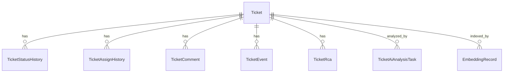

# 工单核心数据模型

工单核心数据模型覆盖工单本体、状态历史、指派历史、评论、事件、RCA、知识库、工作流、统计与日志拉取记录。

## 主要实体

- `Ticket`、`TicketStatusHistory`、`TicketAssignHistory`
- `TicketComment`、`TicketEvent`、`TicketRca`
- `KnowledgeArticle`、`EmbeddingRecord`
- `TicketAiRepoMapping`、`TicketAiAnalysisTask`
- `WorkflowStatus`、`WorkflowTransition`
- `TicketStatisticsDaily`、`UserStatisticsDaily`
- `TicketLogPullRecord`

## 关键字段约束

- `Ticket.project_id` 与 `Ticket.module_id` 直接引用 HRM 项目/模块主键，工单归属不再维护独立“商户/模块”字典。
- `Ticket.ticket_no` 作为外部系统工单号，手动录入且全局唯一；`Ticket.extra_data.version_key` 用作版本号，供 AI 分析匹配仓库映射。
- `Ticket.extra_data.ticket_automation` 可记录创建工单时的自动拉日志与自动 AI 配置，便于后续追溯和重试。
- `Ticket.merchant_name` 继续作为兼容字段保存项目名称，保证旧前端字段 `merchantName` 和历史数据可平滑读取。
- `WorkflowTransition.allowed_roles` 现承载扩展 JSON，内部包含 `roles`、`assignee`、`notification` 三类配置。
- `TicketLogPullRecord` 只保存每次拉取任务过程与结果，外部地址、Cookie、归档与轮询参数不进该表，而是进入系统参数表。
- `TicketLogPullRecord.command_content` 会携带内部 `_automation` 扩展字段，用于记录日志拉取成功后是否自动触发 AI 以及目标 Agent 编码，外部提交前会自动剥离。
- `TicketAiRepoMapping` 记录项目、版本、仓库地址、分支、本地仓库路径和工作区根目录的映射，用于 AI Worker 定位代码版本。
- `TicketAiAnalysisTask.analysis_context` 会保留 `selectedAgentCode` 等任务上下文，`TicketAiAnalysisTask` 记录 AI 分析任务上下文、执行命令、状态、原始输出和结构化结果；`Ticket.ai_analysis` 则保存最新一次分析结论。

## 参见

- [工单域](../services/ticket-domain.md)
- [工单枚举集](../enums/ticket-enums.md)
- [工单流转路由流程](../../flows/ticket-workflow-routing.md)

## 被引用

- [项目总览](../../overview.md)
- [工单域](../services/ticket-domain.md)
- [工单流转路由流程](../../flows/ticket-workflow-routing.md)
