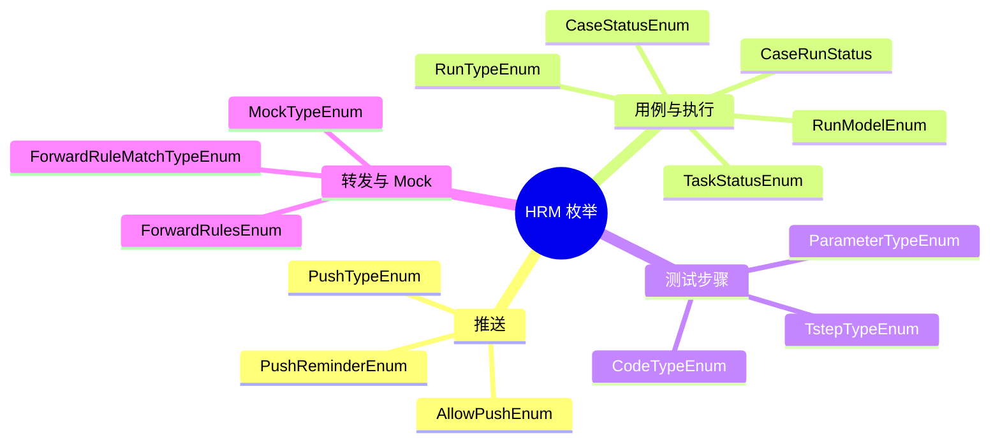

# HRM 枚举集

HRM 枚举集统一描述测试管理域中的状态、类型、范围和错误码。

## 代表性枚举

- `PushTypeEnum`、`PushReminderEnum`、`AllowPushEnum`
- `DataType`、`FuncTypeEnum`、`CaseRunStatus`、`QtrDataStatusEnum`、`CaseStatusEnum`
- `TstepTypeEnum`、`RunTypeEnum`、`RunModelEnum`、`ParameterTypeEnum`
- `TaskStatusEnum`、`ForwardRulesEnum`、`ForwardRuleMatchTypeEnum`
- `AgentResponseEnum`、`ScopeEnum`、`AssertOriginalEnum`、`CodeTypeEnum`
- `ConfigDataTypeEnum`、`MockTypeEnum`、`UrlContentEnum`

## 参见

- [HRM 测试管理域](../services/hrm-domain.md)
- [HRM 核心数据模型](../data-models/hrm-core-models.md)

## 被引用

- [项目总览](../../overview.md)
- [HRM 测试管理域](../services/hrm-domain.md)
