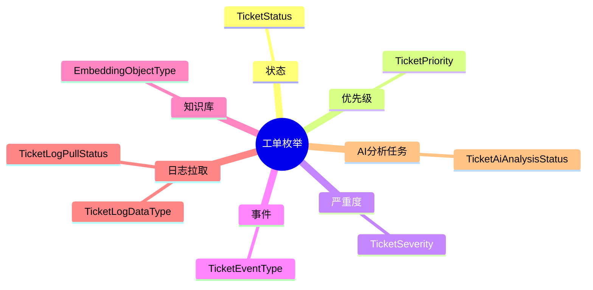

# 工单枚举集

工单枚举集统一描述工单状态、优先级、严重度、事件类型和日志拉取状态。

## 代表性枚举

- `TicketStatus`
- `TicketPriority`
- `TicketSeverity`
- `TicketEventType`
- `EmbeddingObjectType`
- `TicketLogPullStatus`
- `TicketLogDataType`
- `TicketAiAnalysisStatus`

## 本次关注项

- `TicketEventType` 新增 `NOTIFY_PENDING`，用于在状态流转后记录“待通知”的占位事件。
- `TicketLogPullStatus` 继续覆盖 `created -> success/failed/exception` 全链路状态，供工单列表和详情页直接展示。
- `TicketAiAnalysisStatus` 用于 AI 分析任务流转，覆盖 `created -> running -> success/failed/canceled`。
- 统计枚举不再写死为 Python Enum，而是通过 `ticket.sync.automation.statClassification` 配置：`issueTypes`、`rootCauseTypes`、`solutionTypes`、`resolutions`。前端同步配置页负责可视化维护，后端负责归一化和默认值兜底。

## 参见

- [工单域](../services/ticket-domain.md)
- [工单核心数据模型](../data-models/ticket-core-models.md)
- [工单流转路由流程](../../flows/ticket-workflow-routing.md)

## 被引用

- [项目总览](../../overview.md)
- [工单域](../services/ticket-domain.md)
- [工单流转路由流程](../../flows/ticket-workflow-routing.md)
