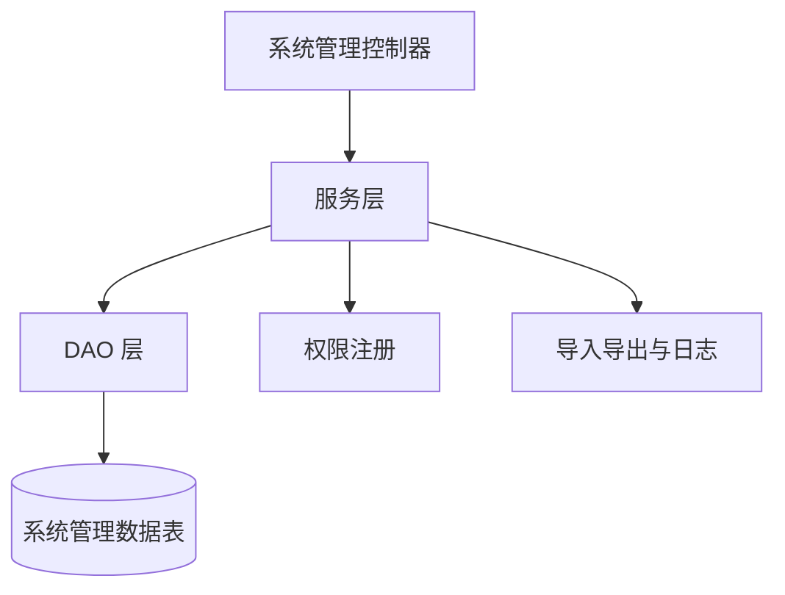

# 系统管理域

系统管理域负责用户、角色、菜单、部门、岗位、字典、参数、公告、日志、在线用户、缓存和 API Key 管理。

## 主要子模块

- 用户管理、角色管理、菜单管理、部门管理、岗位管理。
- 字典管理、参数管理、通知公告、日志管理。
- 在线用户、定时任务、服务监控、缓存监控、API Key。
- AI Provider、AI 提示词、AI 配置中心、AI 执行审计（`server/module_admin/controller/ai_task_execution_controller.py`，列表权限 `system:aitaskexecution:list`、详情权限 `system:aitaskexecution:query`；权限定义在 `server/module_admin/perms.py`，启动时 `sync_registered_menus` 自动落库，新按钮需在角色管理中授权后可见）。

## 参见

- [模块全景图](../../concepts/module-landscape.md)
- [系统管理数据模型](../data-models/admin-core-models.md)

## 被引用

- [项目总览](../../overview.md)
- [模块全景图](../../concepts/module-landscape.md)
