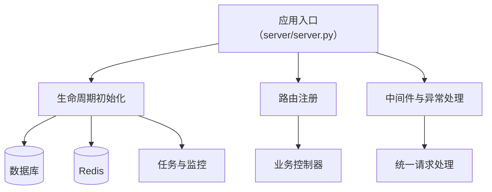

# 后端应用服务

后端应用服务以 `server/server.py` 为核心，负责 FastAPI 实例创建、生命周期管理、路由注册、中间件和异常处理挂载，以及数据库、Redis、任务和 Agent 初始化。

## 职责

- 创建并配置 `FastAPI` 应用。
- 在启动时初始化数据库、权限菜单、默认数据和缓存。
- 统一注册系统管理、HRM、QTR、工单等路由。
- 注入全局中间件与异常处理。

## 依赖关系

| 依赖 | 作用 |
|---|---|
| `server/config/env.py` | 提供应用名、端口、根路径、环境变量。 |
| `server/config/get_db.py` | 初始化数据表。 |
| `server/config/get_redis.py` | 创建 Redis 连接池并预热系统缓存。 |
| `module_admin` / `module_hrm` / `module_qtr` / `module_task` / `modules/ticket` 控制器 | 提供具体业务路由。 |
| `common/permission/sync.py` / `registry.py` / `route_scanner.py` | 提供菜单与权限同步能力。 |

## 参见

- [架构总览](../../concepts/architecture-overview.md)
- [HTTP API 入口流程](../../flows/http-api-entrypoint.md)
- [模块全景图](../../concepts/module-landscape.md)

## 被引用

- [项目总览](../../overview.md)
- [架构总览](../../concepts/architecture-overview.md)
- [HTTP API 入口流程](../../flows/http-api-entrypoint.md)
- [Wiki 约定](../../schema.md)
