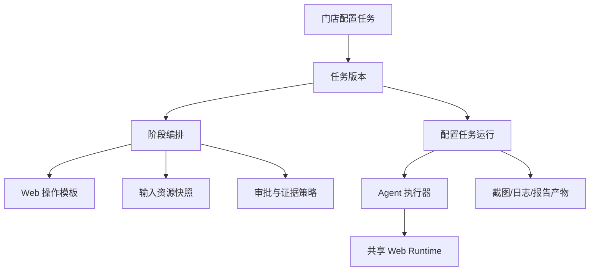

# 门店配置任务域设计

## 定位

门店配置任务用于把“按商家、门店和环境执行一组配置 SOP，并留下截图、日志和输入文件版本”的实施工作结构化。它不是普通 Web 测试用例的别名，也不是一段可以无限扩大的录制脚本。

本页是配置任务运行域的领域设计。当前最小闭环已实现：任务定义、任务版本快照（含输入资源绑定）、运行实例创建与 Agent 执行；阶段编排、审批流、截图产物和报告归档仍是后续设计，未实现部分不能按已上线接口使用。



## 与普通 Web 能力的关系

现有 Web 能力继续负责“如何操作网页”：

- 录制浏览器事件；
- 将录制事件重建为 `WebStepModel`；
- Playwright 浏览器启动和上下文管理；
- 元素定位器、目标快照和定位失败信息；
- `click`、`fill`、`select_option`、等待和断言；
- 运行时变量插值；
- `credentialBindingId` 对应的浏览器凭证投影；
- Agent WebSocket 传输、取消和事件上报。

配置任务负责“为什么执行以及如何留证”：

- 商家、门店、环境和地区；
- 要执行的业务阶段；
- 任务版本和参数快照；
- 输入文件资源及版本；
- 读操作、预填、写操作和验证的边界；
- 人工确认条件；
- 截图、日志和报告策略；
- 阶段重试、失败补偿和历史追溯。

不能把配置任务直接塞入 `HrmWebCase`、`HrmWebCaseRun` 或其 `result_json`。这几类实体的生命周期、权限、输入资产和运行产物不同。

## 核心对象

| 对象 | 职责 | 是否可变 |
|---|---|---|
| 操作模板 | 固定网页动作、定位器、参数占位符和成功断言 | 发布版本不可变 |
| 配置任务 | 任务名称、商家/门店范围、负责人和权限 | 可编辑 |
| 任务版本 | 某次可执行的完整阶段、参数、文件和策略快照 | 发布后不可变 |
| 配置任务阶段 | 一个业务边界，如门店查询、促销核对或系统参数验证 | 随版本冻结 |
| 配置任务运行 | 某个版本在某个 Agent 上的一次实际执行 | 运行后只追加状态和产物 |
| 输入资源 | 任务运行使用的文件资源引用和版本 | 资源版本不可覆盖 |
| 运行产物 | 截图、日志、报告和导出文件的资源引用 | 追加，不覆盖历史 |

## 阶段类型与生产闸门

阶段按实际副作用划分：

- `READ`：查询、筛选、读取和截图，不提交业务修改；
- `PREPARE_WRITE`：打开页面并填写待提交值，但不点击最终保存或导入；
- `WRITE`：在审批通过后执行保存、导入或状态变更；
- `VERIFY`：重新查询并断言最终值，生成 After 证据。

生产写操作默认采用以下状态机：

```text
DRAFT
  -> VALIDATING
  -> READY
  -> PREVIEW
  -> WAITING_APPROVAL
  -> RUNNING
  -> VERIFYING
  -> SUCCESS / PARTIAL_SUCCESS / FAILED / CANCELLED
```

`WRITE` 阶段至少需要：

1. 校验环境、商家和门店；
2. 查询并记录修改前值；
3. 展示待修改参数和输入文件版本；
4. 保存 Before 截图；
5. 等待具有权限的用户确认；
6. 执行保存或导入；
7. 重新查询并验证；
8. 保存 After 截图；
9. 记录实际结果和异常。

点击按钮成功不等于业务配置成功，必须以页面重新查询结果或明确成功断言为准。

## 录制转换边界

现有 `HrmWebRecordingSession` 和 `HrmWebRecordingEvent` 继续作为人工操作采集数据。录制完成后，经过人工整理才能成为配置操作模板：

```text
录制会话/事件
  -> 事件重建 WebStep
  -> 标记变量、文件输入、断言和证据点
  -> 保存操作模板版本
  -> 被任务阶段引用
```

首期采用人工参数化，不要求系统自动识别所有变量。录制数据、操作模板、配置任务版本和运行实例分别保存，避免一次临时录制污染已发布任务。

## 服务边界（当前实现）

当前已按职责拆分到独立文件：

- `modules/configuration_task/controller/task_controller.py`：任务/版本/运行路由、Pydantic 契约、鉴权和线程池包装；
- `modules/configuration_task/service/task_service.py`：任务 CRUD、版本草稿、发布校验（步骤非空、资源 READY、资源归属执行 Agent）；
- `modules/configuration_task/service/task_run_service.py`：运行创建、输入快照冻结、`run_case` 下发和终态落库；
- `modules/configuration_task/dao/task_dao.py`：任务、版本、运行的纯数据访问；
- 运行执行复用 `WebCaseService._extract_webui_run_response` 和 `module_qtr` 的 `send_message`，不复制浏览器执行逻辑。

阶段编排、审批闸门、截图产物和报告归档仍按下方设计目标推进，属于后续切片。

## 文件和凭证原则

- 首期文件真实内容可以只保存在执行 Agent 的受控目录；服务端保存资源 ID、Agent 归属、文件大小、哈希、版本和状态，不把 Agent 绝对路径作为业务契约；
- SFTP 作为独立 Provider，不与 Agent 本地 Provider 混用路径语义；
- 任务版本只引用 `resource_id`，运行开始时固定资源版本；
- Web 登录继续使用统一凭证的 `credentialBindingId`，不在任务 JSON 或录制步骤中保存账号密码；
- 截图可能包含敏感信息，需按任务策略遮罩、限制访问和设置保留期。

## 首期范围和明确不做

首期建议先覆盖只读查询、截图、资源登记和 Web 文件上传动作的底层协议验证。以下内容不作为首期默认能力：

- 自动新增门店；
- 全量无人值守生产写入；
- 未审批的批量导入；
- 自动识别全部变量；
- 直接公开 Agent 本地路径；
- 把截图或文件二进制塞入普通 Web 运行 JSON；
- 直接生成并发送飞书文档。

Word/飞书归档应在任务阶段、资源和产物模型稳定后实现，报告只读取任务运行数据和产物引用。

## 参见

- [配置任务资源与运行数据模型](../data-models/configuration-task-resource-models.md)
- [配置任务文件协议](../../contracts/configuration-task-file-protocol.md)
- [配置任务复用 Web 录制与执行](../../flows/configuration-task-web-reuse.md)
- [门店配置文件存储流程](../../flows/configuration-task-file-storage.md)
- [Web 录制流程](../../flows/ticket-recording-flow.md)
- [QTR 执行域](qtr-domain.md)

## 被引用

- [内容目录](../../index.md)
- [配置任务资源与运行数据模型](../data-models/configuration-task-resource-models.md)
- [门店配置文件存储流程](../../flows/configuration-task-file-storage.md)
