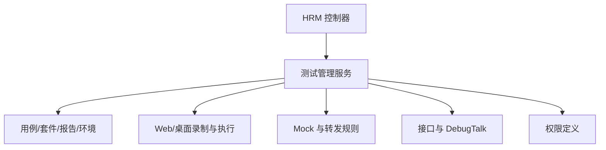

# HRM 测试管理域

HRM 域承载项目、模块、配置、用例、套件、执行计划、报告、环境、接口、Web 测试、桌面测试、Mock、转发规则、Agent 与工具能力。

## 主要子模块

- 项目管理、模块管理、配置管理、用例管理。
- 测试套件、执行计划、报告管理、环境管理。
- 接口管理、Web 测试、桌面测试、Agent 管理、转发规则管理、Mock 管理。

## 参见

- [模块全景图](../../concepts/module-landscape.md)
- [HRM 核心数据模型](../data-models/hrm-core-models.md)
- [HRM 枚举集](../enums/hrm-enums.md)

## 被引用

- [项目总览](../../overview.md)
- [模块全景图](../../concepts/module-landscape.md)
