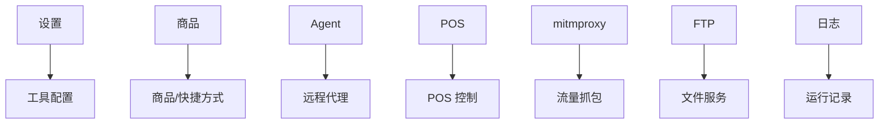

# 旧版客户端功能模块

旧版客户端功能模块提供设置、商品、Agent、POS、mitmproxy、FTP、日志和关于页，是 Flet 时代的功能集合。

## 参见

- [旧版客户端壳层](../components/legacy-client-shell.md)
- [旧版客户端运行时](../components/legacy-client-runtime.md)
- [模块全景图](../../concepts/module-landscape.md)

## 被引用

- [项目总览](../../overview.md)
- [双客户端架构](../../concepts/desktop-client-architecture.md)
