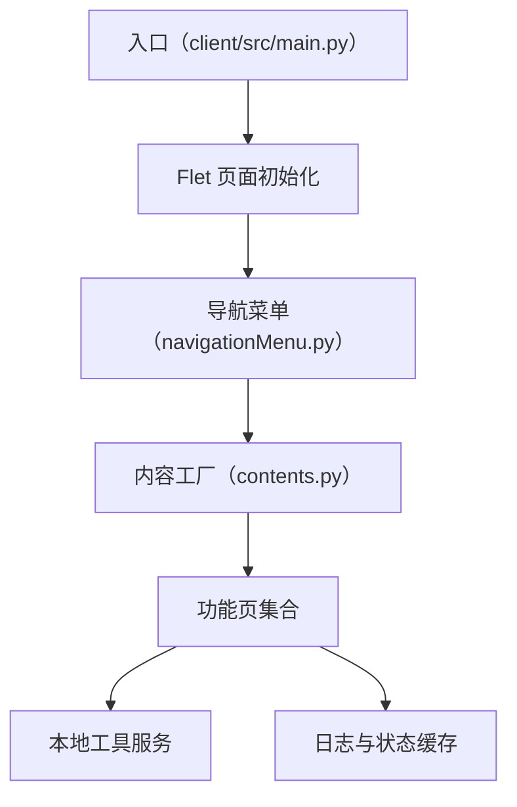

# 旧版 Flet 客户端

旧版客户端是基于 Flet 的桌面应用，采用导航菜单 + 内容工厂的方式组织功能页，功能聚焦设置、商品、Agent、POS、mitmproxy、FTP、日志和关于页面。

## 职责

- 初始化 Flet 页面、窗口关闭拦截和底部状态栏。
- 根据导航栏选择懒加载功能页。
- 组织旧版客户端的本地服务、工具和日志视图。
- 提供商品、POS、Agent、mitmproxy、FTP 等功能入口。

## 主要模块

| 模块 | 作用 |
|---|---|
| `main.py` | 应用入口与页面布局。 |
| `navigationMenu.py` | 导航栏与内容切换。 |
| `contents.py` | 功能页工厂与缓存。 |
| `view_contents` | 各功能页 UI。 |
| `server` | 本地服务与辅助进程。 |
| `utils` | 日志、线程、文件与网络辅助。 |

## 参见

- [双客户端架构](../../concepts/desktop-client-architecture.md)
- [旧版客户端启动壳](../components/legacy-client-bootstrap.md)
- [模块全景图](../../concepts/module-landscape.md)

## 被引用

- [项目总览](../../overview.md)
- [双客户端架构](../../concepts/desktop-client-architecture.md)
