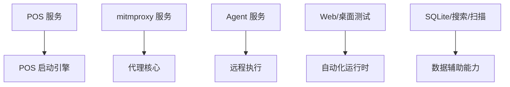

# 新版客户端服务模块

新版客户端服务模块把执行能力拆成 POS、mitmproxy、Agent、网页自动化、桌面测试、SQLite 查询、搜索与扫描等服务。

## 主要职责

- 统一封装客户端侧自动化和辅助执行能力。
- 将代理、抓包、POS 启动、浏览器运行时等能力分离。
- 为 UI 层提供可复用的服务接口。

## Agent 连接服务的线程边界（2026-09-04）

`services/agent_client_service.py` 与 `controller/agent_controller.py` 的 UI 线程约束：

- 重型模块 `server.agent_server`（级联 playwright、pyautogui、cv2 等，首次导入约 1.5 秒）
  的首次导入只允许发生在 agent-client-loop 后台线程（`_thread_main` 内），
  `_agent_server_module()` 用双重检查锁保证全局只导入一次。
- `AgentClientService.start()` 与 `update_runtime_config()` 不得在调用线程触发首次导入
  （后者有模块已加载守卫，未加载时跳过分片配置同步）。
- `AgentController.start()` 为两段式：UI 线程仅做状态校验与置灰（`starting` 即时生效），
  MAC 解析与配置读取在 `_ConnectPrepareThread` 后台完成，主线程回调中再发起连接；
  连接准备阶段（尚无连接线程）点停止直接取消启动。
- 页面在 `starting` 状态即置灰连接按钮（`set_running(True)`），失败落回 `stopped` 后恢复可点。

## 参见

- [新版客户端壳层](../components/new-client-shell.md)
- [新版客户端运行时](../components/new-client-runtime.md)
- [模块全景图](../../concepts/module-landscape.md)

## 被引用

- [项目总览](../../overview.md)
- [双客户端架构](../../concepts/desktop-client-architecture.md)
