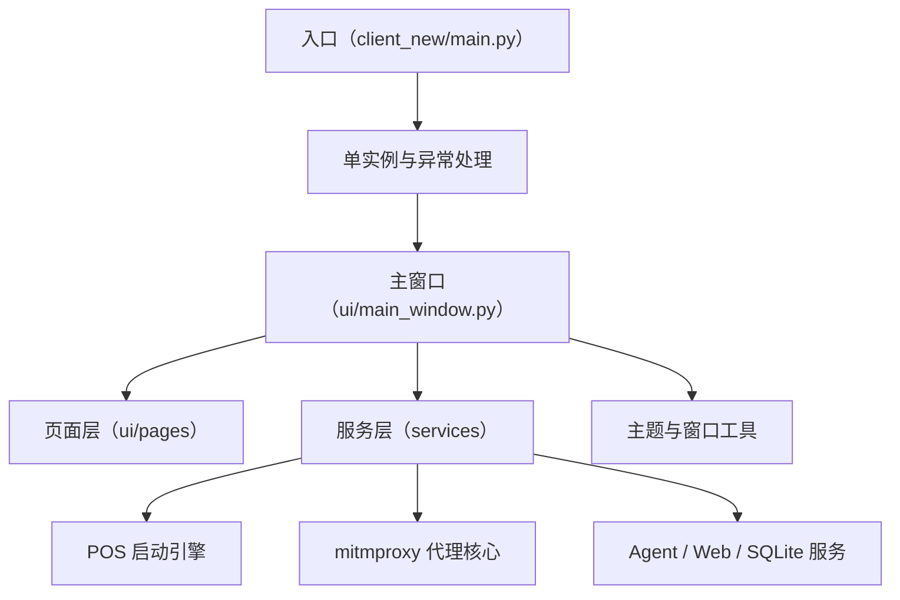

# 新版 PySide6 客户端

新版客户端是基于 PySide6 的桌面应用，围绕主窗口、服务层和页面层拆分功能，覆盖 Agent、POS、SQLite 查询、mitmproxy、日志与关于页面。

## 职责

- 提供更工程化的桌面 UI 入口和主题管理。
- 通过单实例机制避免重复启动。
- 将 POS、mitmproxy、Agent、SQLite 等能力拆成可复用服务。
- 负责窗口关闭、后台进程清理和辅助进程控制。

## 主要模块

| 模块 | 作用 |
|---|---|
| `main.py` | 应用启动、异常捕获、单实例控制。 |
| `ui/main_window.py` | 主窗口、导航和页面装配。 |
| `services/pos` | POS 启动规则、上下文和引擎。 |
| `services/mitmproxy_service` | 代理核心、mock 处理和本地运行。 |
| `services` | Web 测试、SQLite、搜索、进程和 Agent 服务。 |
| `ui/pages` | 具体功能页。 |

## 参见

- [双客户端架构](../../concepts/desktop-client-architecture.md)
- [新版客户端启动壳](../components/new-client-bootstrap.md)
- [模块全景图](../../concepts/module-landscape.md)

## 被引用

- [项目总览](../../overview.md)
- [双客户端架构](../../concepts/desktop-client-architecture.md)
