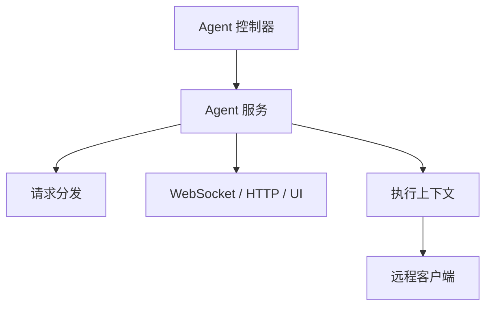

# QTR 执行域

QTR 域负责 Agent 侧的请求转发、执行上下文建立和连接管理，是桌面/浏览器自动化与远程代理执行的桥接层。

在工单 AI 场景里，QTR 域还承担 FastAPI 内部网关和 Redis 排队控制职责：Worker 进程通过受保护的内部接口提交 AI 分析请求，由 `AgentDispatchService` 负责按单 Agent 并发上限排队、抢占运行槽位、回写状态和结果。

## 主要职责

- 管理 Agent 连接与消息分发。
- 根据请求类型选择 HTTP、WebSocket、WebUI 或桌面 UI 处理逻辑。
- 为跨进程 AI 分析提供内部网关、Redis 队列、运行中租约和失败回退。
- 作为后端与客户端执行端之间的桥梁。

## 分片注册表与内存治理（2026-08-27）

WebSocket 大消息按 5KB 分片传输，控制器使用两个进程内注册表暂存分片：

- `event_chunks`：事件消息分片组，键为 `{agent_code}:{chunk_id}`，附带 `first_seen_at` 首见时间戳。
- `response_futures`：请求-响应 Future 注册表，响应分片挂在条目的 `chunks` 字段上，附带 `chunks_first_seen_at`。

两者历史上只在"凑齐分片"或"连接关闭"时清理；一旦分片丢失、断流或未来不回帧，条目会永久驻留，
是工单模块内存缓慢增长的真实泄漏点之一。治理规则：

- 未凑齐且首见时间超过 `CHUNK_REGISTRY_EXPIRE_SECONDS`（10 分钟）的分片组，由心跳任务每 30 秒
  调用 `_sweep_stale_event_chunks` / `_prune_response_future_chunks` 清理；
- 响应分片回收时若 Future 仍在等待则只释放分片内容、保留条目，Future 已结束则整体移除；
- 单个事件分组收到超过 `EVENT_CHUNK_MAX_PIECES`（2048）片时整组丢弃；
- 等待方已消失的孤儿响应分片直接丢弃，不为孤儿请求重建注册表条目。

## 参见

- [模块全景图](../../concepts/module-landscape.md)
- [HTTP API 入口流程](../../flows/http-api-entrypoint.md)

## 被引用

- [项目总览](../../overview.md)
- [模块全景图](../../concepts/module-landscape.md)
