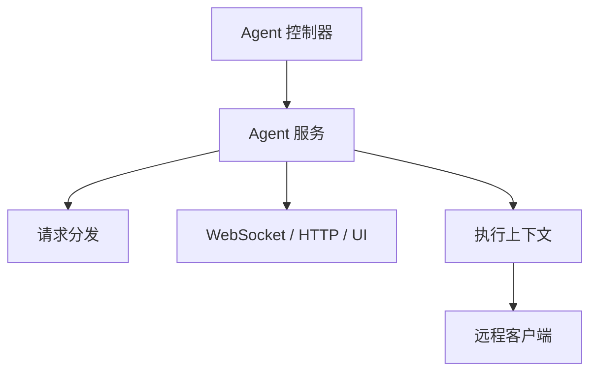

# QTR 执行域

QTR 域负责 Agent 侧的请求转发、执行上下文建立和连接管理，是桌面/浏览器自动化与远程代理执行的桥接层。

在工单 AI 场景里，QTR 域还承担 FastAPI 内部网关和 Redis 排队控制职责：Worker 进程通过受保护的内部接口提交 AI 分析请求，由 `AgentDispatchService` 负责按单 Agent 并发上限排队、抢占运行槽位、回写状态和结果。

## 主要职责

- 管理 Agent 连接与消息分发。
- 根据请求类型选择 HTTP、WebSocket、WebUI 或桌面 UI 处理逻辑。
- 为跨进程 AI 分析提供内部网关、Redis 队列、运行中租约和失败回退。
- 作为后端与客户端执行端之间的桥梁。

## 参见

- [模块全景图](../../concepts/module-landscape.md)
- [HTTP API 入口流程](../../flows/http-api-entrypoint.md)

## 被引用

- [项目总览](../../overview.md)
- [模块全景图](../../concepts/module-landscape.md)
