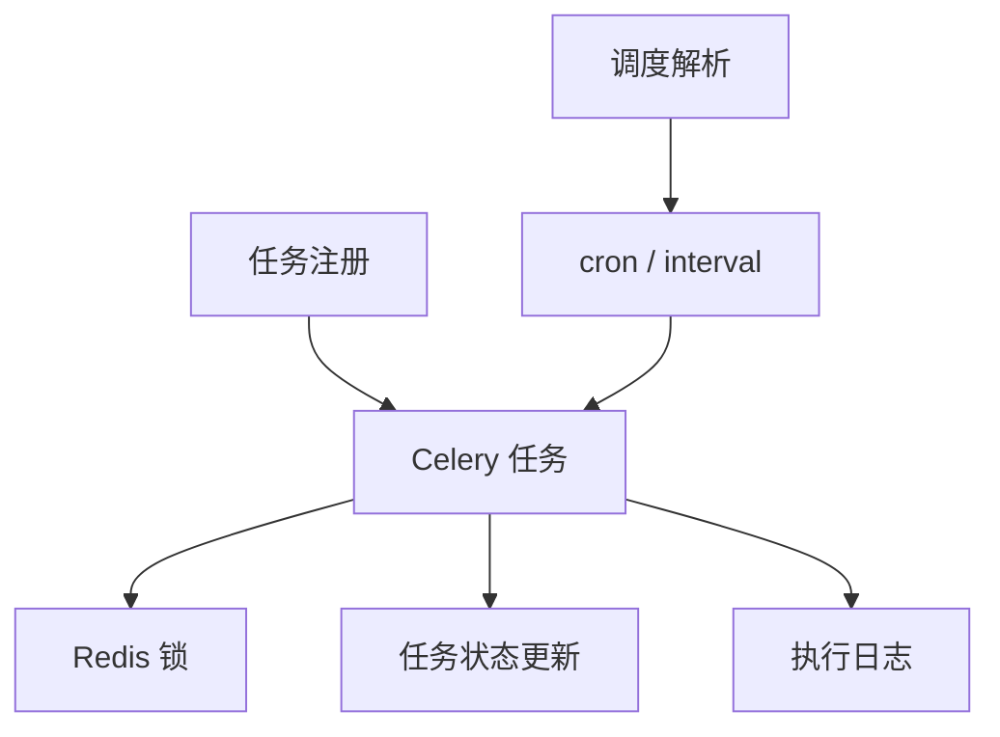

# 任务调度域

任务调度域负责 Celery 任务定义、调度规则解析、任务注册、执行日志和定时任务运行状态管理。

## 主要职责

- 将调度配置转换为可执行任务。
- 维护任务、任务日志与执行状态；运行中任务通过 Redis 心跳记录“活跃”状态。
- 支持 QTR、测试和促销等调度入口。
- `lock_ttl_seconds` 表示互斥锁的固定 TTL，不会自动续租；如果任务执行时间超过该值，锁会先过期，后续触发源可能再次派发同一任务。
- 执行日志在任务真正开始时先写入一条 `running` 记录，带上 `celery_task_id` 和触发来源；任务结束后再回写同一条日志的最终状态、耗时和异常信息。
- 子进程执行结果不再依赖 `multiprocessing.Queue` 回传，改为 `Pipe` 直接通信，避免 Windows `spawn` 场景下队列 flush 竞态导致父进程误判“子进程未返回结果”。
- 当子进程异常退出或未返回结果时，父进程会记录退出码并写入失败日志，便于在应用日志中直接定位根因。
- 手动终止运行中任务时，服务层会写入停止标记并触发 Celery revoke，任务执行入口会优先检查停止请求并清理运行态。

## 参见

- [模块全景图](../../concepts/module-landscape.md)
- [任务调度数据模型](../data-models/task-core-models.md)

## 被引用

- [项目总览](../../overview.md)
- [模块全景图](../../concepts/module-landscape.md)
