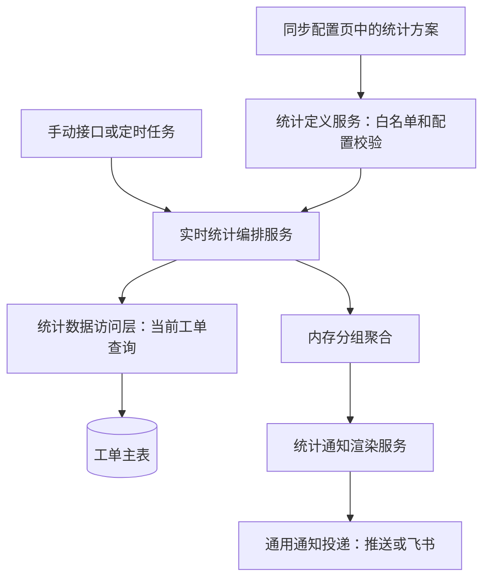

# 工单自定义实时统计服务

该服务以配置方案为输入，从当前系统工单表实时查询、内存聚合并投递通知。它不创建统计快照，也不保存分组明细。

## 核心职责

| 组件 | 职责 |
|---|---|
| `TicketCustomStatisticsDefinitionService` | 限制字段、时间字段和操作符，归一化统计方案。 |
| `TicketCustomStatisticsDao` | 按单一时间字段、左闭右开区间和范围筛选查询 `Ticket` ORM 实体。 |
| `TicketCustomStatisticsService` | 解析时间范围、控制 50,000 条扫描上限、按字段或规则聚合，并组织手动/调度结果。 |
| `TicketStatisticsNotificationService` | 渲染受控模板变量和飞书卡片，调用通用通知投递。 |

## 关键规则

- 方案保存在 `ticket.sync.automation.customStatisticsProfiles`，方案编码全局唯一。
- `timeField` 只允许提交、创建、首次响应、形成结论、处置完成和关闭时间；查询不再使用多个时间列 OR 的语义。
- 条件只允许白名单字段和 `equals/contains/in/regex/is_empty/is_not_empty`，不接受 SQL 或 Python 表达式。
- `hasConclusion` 是 `processed_at` 是否为空的派生字段。它表示是否已经形成首次有效排查结论，不等同于流程状态。
- 历史区间按工单当前字段计算。由于不落快照，后续状态或分类修改会影响重跑结果。
- 任务运行摘要不包含分组详情，避免把统计内容写入调度执行日志。

## 依赖关系

| 依赖 | 关系 |
|---|---|
| `TicketSyncConfigService` | 读取和保存方案配置。 |
| `TicketProcessingStatsDao` | 复用项目、模块、类型等范围过滤条件。 |
| `TicketSyncNotifyService` | 复用推送、飞书应用文本和飞书卡片通道。 |
| `ticket` 主表 | 作为实时统计数据源，不新增统计表。 |

## 参见

- [工单域](ticket-domain.md)
- [工单自定义统计通知流程](../../flows/ticket-custom-statistics-notification.md)
- [工单自定义统计接口与配置契约](../../contracts/ticket-custom-statistics.md)

## 被引用

- [内容目录](../../index.md)
- [工单域](ticket-domain.md)
- [工单自定义统计通知流程](../../flows/ticket-custom-statistics-notification.md)
- [工单自定义统计接口与配置契约](../../contracts/ticket-custom-statistics.md)
- [任务调度域](task-scheduler-domain.md)
