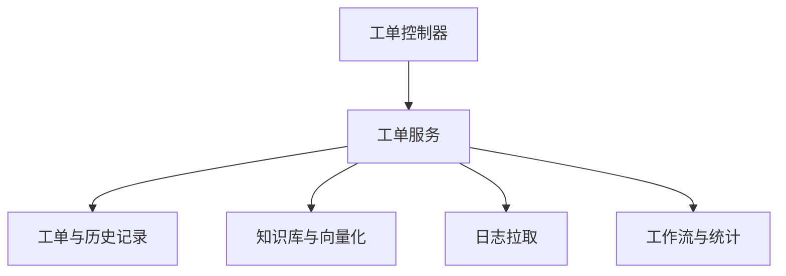

# 工单域

工单域负责工单生命周期、评论、事件、RCA、知识库、工作流、统计和日志拉取，是项目中的独立知识管理子系统。

## 主要子模块

- 工单列表、状态流转、时间线、评论、RCA。
- 知识库、工作流、统计、日志拉取、导入与向量化。

## 当前关键约束

- 工单所属维度复用 HRM 测试管理中的项目/模块，前端通过工单域选项接口拉取有效项目与模块。
- 工单新增/编辑时项目和模块联动，模块必须属于当前项目；工单号作为外部系统唯一编号手动录入，不再自动生成。
- 工单 `extra_data.version_key` 作为版本号来源，AI 分析按“项目 + 版本号”匹配仓库映射。
- 工单项目/模块选项直接复用 HRM 公共项目管理，不单独维护工单项目库；后端按 HRM 的正常状态值 `QtrDataStatusEnum.normal = 2` 过滤有效项。
- 若后续需要把“工单项目”和“测试项目”显式区分，优先增加结构化 `project_type`，不建议只靠自由标签做长期筛选。
- 历史字段 `merchant_name` 仍保留，用于兼容旧数据和前端旧字段 `merchantName`，实际语义已经切换为项目名称。
- 日志拉取不再在工单详情页维护地址、Cookie 和归档参数，统一通过系统参数 `ticket.logPull.external`、`ticket.logPull.storage` 管理。
- 日志拉取查看入口改为弹窗模式，默认返回入库内容；切换为原始文档后可显示当前截取范围并按时间范围实时重截。
- 日志拉取提交入口改为弹窗，标签页默认只保留记录列表，减少页面占用。
- 参数配置说明改为通用提示按钮组件 `PromptButton`，后续可在其他页面复用。
- 日志拉取时间范围改为必填，前端与接口都要求使用“开始/结束时间”或“时间点+前后分钟范围”二选一。
- 日志包解析阶段只读取文件名包含 `_pos.log` 的条目，其他文件不进入时间戳切片流程。
- 日志内容按时间范围完整入库并原样保存，不再附加文件名前缀；若超过 `maxContentChars`，任务直接失败并提示缩小时间范围。
- 日志内容传输采用压缩串，前端通过 `decompressText` 解压后展示，减少大日志查看时的传输成本。
- 日志内容查看默认不换行，可通过开关切换换行显示。
- 新增工单时可勾选自动拉日志和日志后自动 AI 分析，日志拉取配置与 Agent 编码会跟随工单/日志记录一起保存。
- 工单详情页的时间线、日志拉取、RCA 和 AI 分析改为按需加载，避免打开详情页时一次性拉取过多数据。
- 工单事件的 `event_data` 写入前会做 JSON 安全转换，避免 `datetime` 等对象直接写入 JSON 列时报错。
- 日志拉取列表和详情页支持 `重新拉取`、`重新下载`、`重新截取` 三类记录级动作：重拉基于原始参数新建任务，重下恢复原始压缩包到原位置，重截按当前查看时间范围更新当前记录的入库内容。
- 重新拉取优先恢复原始时间模式参数；历史记录若缺少点位参数，允许回退到已保存的开始/结束范围继续提交。
- 工单 AI 分析已接入 Codex CLI：新增仓库映射表 `ticket_ai_repo_mapping`、分析任务表 `ticket_ai_analysis_task`，分析结果写回 `ticket.ai_analysis` 并同步更新 RCA/事件。
- 仓库映射已单独拆分为独立菜单页面，便于维护同项目下的多分支、多版本映射记录。
- 当前执行链路改为服务端只做任务编排，真正的 `codex exec` 由本地 `client_new` agent 执行并回传结果；服务端通过 `ticket.ai.agent.code` 优先指定目标 Agent，未配置时自动选择在线 Agent。
- AI 分析任务提交时需要先维护项目版本和仓库/分支映射；当前版本按工单项目 + 版本号匹配映射，未命中时拒绝提交。
- 工单模块选项会同时读取 HRM 模块的项目字段和项目-模块关联表，保证不同维护方式下都能正确返回模块下拉列表。
- AI 分析任务的执行过程会在系统日志里按阶段输出，失败时输出异常堆栈；数据库只保留最后失败原因，避免把调试细节落到业务表。
- Windows 开发环境会优先解析 `codex` 的绝对路径再执行，避免 Agent 进程找不到 Worker 可执行文件。
- AI 分析 Worker 会为每个任务准备独立 `CODEX_HOME` 并复制当前 Codex 配置，避免 Windows 下复用用户目录临时状态导致的初始化失败。
- AI 分析 Worker 的认证环境优先从 Codex 配置目录 `.env` 读取，再回退进程环境变量，避免开发机密钥只配置在 Codex 目录时失效。
- AI 分析 Agent 会在任务工作区落盘 `worker.stdout.txt` 和 `worker.stderr.txt`，并在系统日志中记录环境快照，便于对比手工终端与后端线程的运行差异。
- AI 分析 Worker 的输出 schema 必须满足 Codex `response_format` 约束，根对象需要显式设置 `additionalProperties: false`，否则会返回 `invalid_request_error`。
- Agent 执行过程会通过 `ai_analysis_step` / `ai_analysis_status` / `ai_analysis_error` / `ai_analysis_finished` 事件把阶段日志回传服务端，服务端只记录系统日志，不把调试细节落到业务表。
- 工作流流转规则会把允许角色、默认处理人和通知预留统一压到 `workflow_transition.allowed_roles` JSON 中，避免引入额外表结构迁移。

## 参见

- [模块全景图](../../concepts/module-landscape.md)
- [工单核心数据模型](../data-models/ticket-core-models.md)
- [工单枚举集](../enums/ticket-enums.md)
- [工单流转路由流程](../../flows/ticket-workflow-routing.md)
- [工单AI分析最终方案落地记录](../../../../docs/2026-05-22-ticket-ai-analysis-final-solution.md)
- [工单表单与 AI 流程更新记录](../../../../docs/2026-05-22-ticket-form-and-ai-flow-update.md)
- [工单自动化链路流程](../../flows/ticket-automation-flow.md)

## 被引用

- [项目总览](../../overview.md)
- [模块全景图](../../concepts/module-landscape.md)
- [工单流转路由流程](../../flows/ticket-workflow-routing.md)
