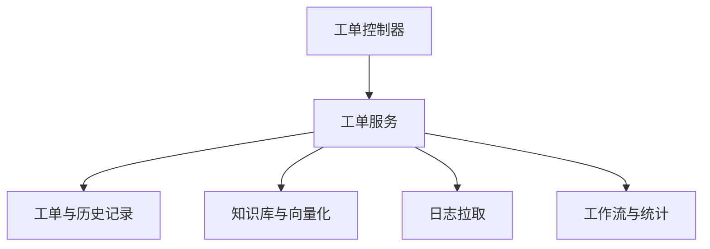

# 工单域

工单域负责工单生命周期、评论、事件、RCA、知识库、工作流、统计和日志拉取，是项目中的独立知识管理子系统。

## 主要子模块

- 工单列表、状态流转、时间线、评论、RCA。
- 知识库、工作流、统计、日志拉取、导入与向量化。

## 2026-06-16 分类统计维度

- 工单统计现在拆分为独立维度：`status` 表示流程状态，`module_id/module_name` 表示业务域，`issue_type_id/issue_type_name` 表示工单类型，`is_problem` 表示是否真实问题，`root_cause_type` 表示根因分类，`solution_type` 表示解决方式，`resolution_code/resolution_name` 表示关闭结果。
- 统计枚举配置统一保存在系统参数 `ticket.sync.automation.statClassification`，由工单同步自动化页面可视化维护；默认枚举来自 `TicketSyncConfigService.DEFAULT_TICKET_STAT_CLASSIFICATIONS`。
- 2026-07-01 起，细分问题类型也进入同一套统计枚举：`problemPatterns`，工单主表落点为 `problem_pattern_code/problem_pattern_name/problem_pattern_confidence/problem_pattern_source/problem_pattern_verified*`。该字段用于统计“内存泄露”“280开头券为纸质券规则说明”等可治理问题模式，`tags` 仅作为辅助检索，不作为领导看板主统计口径。
- 工单分类 AI 的 Provider 与提示词正文统一由系统管理中的 AI Provider / AI 提示词维护；`ticket.sync.automation.aiClassification` 只保存场景开关、Provider 编码和提示词编码选择。
- 2026-07-01 修正提示词优先级：`classify_ticket_statistics` 现优先使用 DB 模板表 `SysAiPromptTemplate` 中的提示词，同步配置中的旧版 `promptContent` 仅作为 DB 模板为空时的兜底，不再覆盖已维护好的新版模板。同步配置保存时若前端显式提交了 `promptContent` 字段（含空字符串），以提交值为准而不再强制恢复旧值；仅在前端未提交该字段时才保留历史值防止数据丢失。
- 工单列表、状态流转、RCA、外部同步入库和统计页均读取同一套枚举配置；旧 `category_name` 与 `categoryCounts` 继续保留兼容，不再承担新统计主维度。
- AI 分类统计只允许从启用的固定枚举候选中选择细分问题类型；人工确认的细分问题不会被后续 AI 分类覆盖。
- 工单列表展示工单类型时只读取 `issue_type_name` 或命中配置的 `issue_type_id`，不再回退 `category_name`，避免历史分类/模块文案误显示为新工单类型。
- 工单列表已接入根因分类、解决方式和关闭结果筛选及显示列；列表列显示配置通过当前用户配置 `ticket/ticket_list_columns` 保存。
- 工单统计页的统计块显示配置通过当前用户配置 `ticket/ticket_statistics_blocks` 保存，用户可按关注维度隐藏不需要的统计块。
- 工单统计页新增趋势统计，接口 `GET /ticket/statistics/trend` 按 `day/week/month` 返回新增、关闭、净增、周期末未关闭存量、Bug、非 Bug、支持类、Top 模块和 Top 细分问题。当前趋势按事件时间实时计算当前分类，正式周报如需历史口径冻结，后续应增加统计快照。
- 用户级偏好采用通用表 `sys_user_config`，以 `user_id + config_type + config_key` 唯一定位，`config_value` 保存少量 JSON 配置；后续用户级 AI prompt/provider 等零散配置优先复用该模型。
- 工单列表页和统计页的模块筛选规则统一：未选择项目时模块候选为全部有效模块，选择项目后候选收敛为所选项目下的模块；列表页新增按 `module_code` 下拉筛选，统计页新增按 `moduleCodes` 多选筛选，`GET /ticket/statistics/overview` 接收 `projectIds/moduleIds/moduleCodes` 参数，后端所有统计维度和状态流转统计都共用该过滤条件。
- 工单列表页支持服务端表头排序，默认 `submitTime desc`；点击表头会传 `sortField/sortOrder` 重新分页查询。当前可排序列覆盖列表展示字段：工单编号、标题、状态、处理状态、项目、模块、工单类型、问题性质、根因分类、解决方式、关闭结果、细分问题、优先级、来源、1线人员、内部负责人、当前处理人、提交时间和创建时间。
- 2026-07-02 起，工单列表页主要下拉筛选项支持多选：状态、处理状态、项目、模块、模块Code、工单类型、问题性质、根因分类、解决方式、关闭结果、细分问题、内部优先级和三类负责人；前端按逗号分隔提交多值参数（通过 `joinQueryList` 将数组拼成逗号分隔字符串，由 `tansParams` 序列化为 `key=val1%2Cval2` 格式），后端兼容旧单值参数并使用 `IN` 过滤。`Ticket` 模型同步声明常用筛选组合索引，数据库侧已手动创建对应索引。
- **注意**：多选查询字段在 `TicketQueryModel` 和 `TicketStatisticsQueryModel` 中的类型必须为 `str | None`（不能是 `str | list[X] | None`）。因为 FastAPI 的 `Query()` 检测到类型含 `list[...]` 时会自动将标量查询值包装成列表（如 `"3,2"` → `["3,2"]`），导致 DAO 的 `_normalize_*_list` 收到已包装的列表后不再拆分，文本字段用 `.in_(["open,closed"])` 查不到数据，整数人员字段则直接触发 Pydantic 验证错误。
- 工单编辑弹窗回填时会抑制项目监听器误清空 `module_id`，模块下拉变更和提交前会按 `module_id` 补齐 `module_name`，保证列表模块列在编辑保存后不丢失。
- 若工单的 `module_name` 来自外部同步或历史数据且无法匹配当前项目 HRM 模块，编辑弹窗会以可创建下拉项形式原样展示并保存文本；只有用户手动选择现有模块时才切换为标准 `module_id/module_name`。
- `first_line_assignee_name` 与 `internal_owner_name` 允许在对应用户 ID 为空时作为原始名称保留，编辑页通过同一个人员选择控件显示，匹配不到现有用户时不强制清空名称。

## 当前关键约束

- 2026-07-04 工单拆分后保留多个控制器和子服务：CRUD、同步、日志拉取、AI、配置和 Webhook 路由分别注册；`TicketSyncService` 中仅为兼容拆分前私有入口存在的门面已清理，配置、主动拉取、评论同步、发布状态收敛和 AI 分类统计均直接调用对应子服务。
- 拆分后禁止在 `TicketService`、`TicketMessageSyncService`、`TicketSyncService` 之间通过函数内导入、延迟代理或兼容门面规避依赖问题；跨链路共享能力必须下沉到无上层依赖的独立子服务或 util。当前评论幂等和消息流写入由 `TicketCommentCoreService` 承接，AI 分类统计由 `TicketAutoClassificationService` 承接，用户上下文和版本号工具由 `ticket_common_util` 承接。
- 当前工单服务已按依赖关系组织为独立子包：`service/sync` 承接同步编排、配置、主动拉取、远端拉取、同步交付、payload、延后后处理、自动化、群推送和同步通知任务；`service/ai` 承接 AI 分析、轻量 AI、提示词、自动分类统计和向量能力；`service/log_pull` 承接日志拉取和日志查看；`service/core` 承接工单 CRUD、导入、状态流转、RCA、知识库和快照；`service/collaboration` 承接评论幂等、飞书消息同步和事件监听；`service/notification` 承接通用通知；`service/stats` 承接专题统计。旧 `modules.ticket.service.ticket_*` 顶层服务入口已删除，不保留只转发或 re-export 的兼容文件。
- 当前 `service/sync/TicketSyncService` 仍偏大，但主动拉取已拆入 `TicketBitablePullService`，人员催办和汇总统计通知任务已拆入 `TicketSyncNotificationJobService`，外部推送多维表格邮箱补齐已拆入 `TicketExternalBitableEmailService`，远端 pending 拉取与远端 ack 回写已拆入 `TicketRemoteSyncService`，消费者 pending 拉取、ack 回执、`delivered_revision` 推进和 `syncSummary` 构造已拆入 `TicketSyncDeliveryService`，批量重归类和未归类统计已拆入 `TicketBatchReclassificationService`，外部请求读取和字段归一化已拆入 `TicketExternalSyncRequestService`，外部同步入库 payload、同步 meta、外部创建时间、来源快照和自动拉日志日期解析已拆入 `TicketSyncPayloadService`，延后后处理投递与执行已拆入 `TicketSyncPostProcessService`，字段识别和同步自动化执行已拆入 `TicketSyncAutomationService`；后续继续拆分应在 `service/sync` 内按职责下沉，不恢复旧顶层路径。
- `TicketSyncService` 中已删除配置默认值、外部字段模型、统计枚举、Celery 分发模式、消费者交付、群推送锁和 AI 任务状态等已迁移常量副本；当前仅保留入库主编排实际使用的 `PUBLISH_STATUS_PROCESSING_AI`。
- 2026-07-04 起，项目实现规则已固化到根目录 `AGENTS.md` 和 `web/public/docs/2026-07-04-project-implementation-boundary-rules.md`：新增功能必须先按 controller/service/dao/util/scheduler 作用域拆分，不得继续堆大文件或新增只转发的兼容 shim；拆分后子服务对外方法必须使用公开命名，不允许以 `_` 开头。
- 工单控制器拆分后必须保持备份分支接口兼容；当前路由包含 `PUT /ticket/{ticket_id:int}/rca`，前端保存 RCA 依赖该接口。
- 工单所属维度复用 HRM 测试管理中的项目/模块，前端通过工单域选项接口拉取有效项目与模块。
- 工单新增/编辑时项目和模块联动，模块必须属于当前项目；工单号作为外部系统唯一编号手动录入，不再自动生成。
- 工单责任人拆分为三类：`current_assignee` 表示当前处理人，`first_line_assignee` 表示一线接单人员，`internal_owner` 表示内部模块/工单负责人；其中当前处理人继续承接指派、流转和时间线语义，另外两类用于真实业务分工展示和后续路由扩展。
- 工单列表页同步提供上述三类责任人的筛选和展示列，查询层按 `id` 与名称双通道过滤，便于在运维和业务排查时快速定位工单归属。
- 工单 `extra_data.version_key` 作为版本号来源，AI 分析按“项目 + 版本号”匹配仓库映射。
- 工单 AI 仓库映射中的本地仓库路径和工作区根目录已下沉为 Agent 本地配置优先；服务端仍保留兼容字段用于历史审计和兜底。
- 工单同步新增独立外部入口与内网拉取链路：`POST /ticket/sync/external` 负责入站创建/更新工单，`GET /ticket/sync/pending` 负责按 `consumer` 拉取未交付 revision，`POST /ticket/sync/ack` 用于可选回执处理结果。
- 公网外部推单更新已有工单时，若新 `ticketModle` 有文本但未命中有效 HRM 模块 ID，会清空旧 `module_id` 并用新模块文本覆盖 `module_name`，避免外部模块变化后仍展示旧模块；远端拉取入库也会兼容 `moduleName/module_name` 与外部字段 `ticketModle/ticketModel/ticket_model`。
- 同步状态统一写入 `ticket.extra_data.external_sync`，不再依赖单一“是否已同步”布尔值，而是按 `revision + consumers.{consumer}.delivered_revision` 判断某个消费方是否已经拿到当前版本。
- `/ticket/sync/pending` 只会返回真正带同步元数据的工单，避免把普通人工创建的工单误返回给内网同步系统。
- 外部同步后的自动化链路支持规则化识别项目、模块、商家、门店、POS/SCO、版本号，识别结果与自动化步骤状态都回写到 `extra_data.external_sync.sync_state.automation`。
- 外部同步延后后处理会继承入库请求 tid：Celery 可用时随 `module_ticket.sync_deferred_post_process` 投递，Celery 不可用回退 FastAPI 本地后台任务时通过 `trace_context` 设置，保证入库、自动化、AI 和群推送日志可按同一个 tid 串联；定时任务主动拉取等非 HTTP 入口由 Celery Worker 生成 `job-xxxxxxxx`。
- 外部同步识别项目失败时会保留 `ticketVender/projectName/merchantName` 原始文本到 `merchant_name`，模块识别失败时保留 `ticketModle/moduleName` 原始文本到 `module_name`，避免本地 HRM 未配置映射时入库数据丢失。
- 识别和自动化配置统一由系统参数 `ticket.sync.automation` 驱动，优先通过映射规则、正则和默认参数适配不同工单系统，避免把定制话术写死在服务代码里。
- 外部推送多维表格邮箱补齐由 `TicketExternalBitableEmailService` 承接，并由 `ticket.sync.automation.externalSyncBitable.enabled` 控制；成功补齐后会在 `extra_data.external_sync.bitableEmailSync` 记录 `status=success`、`recordId`、`emailKeys` 和 `syncedAt`，同一工单再次推送同一个 `recordId` 时会跳过重复查询。
- 飞书多维表格公共配置已下沉到 `ticket.sync.automation.bitableCommon`；工单汇总统计、按人催办、外部推送邮箱补全和主动拉取默认继承该配置，局部配置非空时覆盖公共配置。
- 外部字段枚举已抽成 `ticket.sync.automation.externalFieldModel`；同步配置页的必填字段下拉与主动拉取字段映射目标字段统一读取该模型。
- `externalFieldModel` 现在同时承担“字段全集”和“必填标记”职责；页面不再建议单独维护另一份必填字段配置，服务端仅保留 `externalSyncRequiredFields` 作为历史兼容输出。
- 新增主动拉取配置 `ticket.sync.automation.bitablePull` 与定时任务 `module_task.scheduler_maintenance.pull_feishu_bitable_ticket_sync`：任务按条件搜索飞书多维表格记录，由 `TicketBitablePullService` 经字段映射转换后复用外部同步入库链路；默认时间窗口会下推到飞书 `records/search` filter，按更新时间字段或创建时间字段大于等于当前时间前 1 小时查询，`createdAfter` 仅用于覆盖窗口下限。
- 主动拉取的 `filterFormula` 支持飞书嵌套 filter JSON：顶层存在 `children` 时，服务会递归补齐内部时间字段空值，并把默认时间窗口作为新的最外层 child 追加；顶层不是嵌套模式时只补齐已有时间字段，不额外追加默认时间范围。飞书 `records/search` 分页参数 `page_size/page_token` 必须放在 URL 查询参数，服务会记录每页实际条数，并在返回重复 `page_token` 时停止继续拉取，避免同一页无限循环。
- 主动拉取记录会把 `recordId/snapshotHash/fieldMappings/sourceSystem/pulledAt` 落到 `ticket.extra_data.bitable_pull`；同一记录内容未变化时直接跳过，避免定时任务反复递增同步 revision。
- 飞书多维表格搜索结果中的 `record_id` 不能直接拼成可访问详情链接；当前环境下 `records/search` 实际可能不返回 `record_url/shared_url`，因此服务会继续按缺失记录的 `record_id` 调用 `records/batch_get(with_shared_url=true)` 批量补齐 `shared_url`，再写入 `ticket_url/source.recordUrl/detailUrl`；若补查后仍为空，则保持空字符串，不再伪造 `...?record=record_id` 假链接。
- 主动拉取映射中的“多维字段”支持按当前配置读取飞书字段元数据作为下拉选项；字段元数据读取失败时才回退到不带过滤条件的样例记录推断字段，同时保留手动输入。
- 主动拉取定时任务场景使用完整系统用户上下文执行入库和延后后处理，Celery payload 包含 `permissions/roles/userId/userName`；延后后处理入口会兼容历史只包含 `user` 且字段为 snake_case 的任务载荷，避免 `CurrentUserModel` 校验失败。
- 主动拉取字段映射目标字段兼容 `moduleName/module_name/ticketModel/ticket_model`，统一归一为 `ticketModle` 后再执行必填校验；但如果来源多维字段本身为空，仍会按缺失必填字段跳过该记录。
- 主动拉取新增 `forceSync` 运行参数和页面开关；开启后只绕过本地快照去重，是否拉到历史远端数据仍取决于 `createdAfter/filterFormula/viewId`。任务参数兼容 `forceSync` 和 `force_sync`。
- 主动拉取会把映射后的 `ticketVender/ticketModle/internalOwner` 写入 `extra_data.external_field_mapping`，并同步到 `projectName/moduleName/internalOwnerName`，避免 Pydantic 模型丢弃外部字段后导致项目、模块、内部负责人为空。
- 外部推送 `/ticket/sync/external` 的 JSON/表单读取、必填校验、人员字段拆分、`extra_data.external_field_mapping` 和 `raw_payload` 构造由 `TicketExternalSyncRequestService` 承接；控制器只做协议、鉴权、配置读取、模型校验和响应转换。
- 主动拉取不经过外部推送 controller 的入参归一化，因此 `_build_bitable_pull_sync_object` 内会补齐主动拉取专用兼容：内部优先级为空时使用对方优先级，当前处理人字段兼容 `ticketAssigneeName/assigneeName` 等别名，并同步写入顶层模型和 `extra_data.external_field_mapping`；外部推送 `/ticket/sync/external` 归一化规则由 `TicketExternalSyncRequestService` 维护。
- 主动拉取必填校验直接读取 `externalFieldModel.fields[].required`，不再优先使用历史兼容字段 `externalSyncRequiredFields`；缺少必填字段的记录只计入失败汇总和 `missing_required_fields` 日志，不调用入库，也不会触发延后后处理或自动群消息。
- 主动拉取会识别飞书长文本富文本片段数组，按片段顺序拼接并保留 `\n` 为真实换行；空文本片段不会被 JSON 化，避免描述内容挤在一起，也保证 `stepReason` 仍可按日期行拆分同步评论。
- 飞书话题评论入站同步会使用 `sender.open_id` 查询飞书通讯录用户详情，工单评论 `user_name` 和多维表格排查过程 `{user}` 都写入解析后的用户名；飞书凭证缺失或查询失败时才回退事件自带名称或 ID。
- 飞书话题正文中的 `@_user_1` 会根据 `message.mentions` 映射为 `@用户名` 保存到工单评论，评论附件保存 `mentions/content_segments`；多维表格 Text 字段富文本片段中的 `mention_user_id` 同样会归一为 `@用户名` 并保留片段，后续写回飞书群或多维表格时恢复真实 @ 人员样式。
- 主动拉取传入 `automation.autoTranslate` 时，外部同步主链路和延后后处理都会优先使用该场景开关；只有未传 automation 时才回退全局 `autoTranslateOnSync`。
- 远端拉取由 `TicketRemoteSyncService` 和 `ticket.sync.automation.remoteSync.enabled` 控制，拉取入库不会再次查询公网多维表格；它只使用远端 payload 已携带的邮箱/姓名，并按内网本地 `assigneeMappings` 或邮箱用户匹配解析人员。该服务公开方法不使用 `_` 前缀，对外提供 `build_upsert_model`、`should_apply_remote_sync_item`、`build_request_headers` 和 `sync_remote_pending_tickets`。
- 工单项目/模块选项直接复用 HRM 公共项目管理，不单独维护工单项目库；后端按 HRM 的正常状态值 `QtrDataStatusEnum.normal = 2` 过滤有效项。
- HRM 模块的 `module_code` 约束已调整为“同一项目下唯一”，不同项目允许复用同一业务 code，便于按业务域横向统计问题分布。
- 若后续需要把“工单项目”和“测试项目”显式区分，优先增加结构化 `project_type`，不建议只靠自由标签做长期筛选。
- 历史字段 `merchant_name` 仍保留，用于兼容旧数据和前端旧字段 `merchantName`，实际语义已经切换为项目名称。
- 日志拉取不再在工单详情页维护地址、Cookie 和归档参数，统一通过系统参数 `ticket.logPull.external`、`ticket.logPull.storage` 管理。
- `ticket.logPull.external` 现同时承载日志页面商家/门店联动选项：新增 `vendors` 列表，商家项包含 `vendorId/vendorCode/vendorName`，门店项包含 `storeId/storeCode/storeName`；服务端通过 ticket 域只读接口向前端下发脱敏后的选项数据，不直接暴露 Cookie 等敏感配置。
- `ticket.logPull.external` 的大体量门店基础数据已拆分到 `ticket_log_pull_store_config` 独立表，支持模板导入、增量覆盖、整表覆盖和 `org_no/sap_org_no` 搜索；同时新增 `ticket_log_pull_project_vendor_map` 保存项目 ID 到 `vender_no` 的映射，日志拉取弹窗会优先按项目自动回填商家编号。
- 门店配置增量导入的判重逻辑已经改为 `vender_no + org_no + sap_org_no` 三字段联合唯一键精确匹配，只有三者同时一致才会覆盖，不再按任意单字段命中就覆盖；导入时也会先批量加载已有配置并在内存中 upsert，减少大文件导入的查库压力。
- 日志拉取页面和工单日志拉取记录页的商家/门店联动选项已改为直接聚合 `ticket_log_pull_store_config` 表，不再依赖系统参数里的商家门店配置；接口仍返回 `vendorId/vendorCode/vendorName` 与 `storeId/storeCode/sapOrgNo/storeName` 的联动结构，其中 `storeId` 实际回填为 `org_no` 字符串，前端下拉可按 `org_no`、`sap_org_no` 和门店名称搜索。
- 日志拉取查看入口改为弹窗模式，默认返回入库内容；切换为原始文档后可显示当前截取范围并按时间范围实时重截。
- 日志拉取提交入口改为弹窗，标签页默认只保留记录列表，减少页面占用；后台会先查外部列表，命中可下载结果时只比较 `modifyTime/path`，且双方参数个数必须一致，满足时会跳过重新提交申请。
- 日志拉取链路补充步骤级日志，提交、轮询、下载、解析、导入以及跳过原因都会写入系统日志和工单事件，方便定位工单号执行到哪一步。
- 日志拉取记录已拆出独立管理菜单页，支持跨工单分页查看；新增日志拉取时可以关联工单，也可以不关联工单独立创建，未关联时不允许启用自动 AI。
- 日志拉取管理页和新增弹窗中的商家/门店字段已改为联动下拉：必须先选商家才能选门店，门店候选只保留当前商家下的门店；日志拉取请求仍提交 `vendorId/storeId`，不改变后端记录结构和外部接口入参。
- 日志拉取记录的 `command_content` 保存前端原始入参，实际提交给三方平台时再按既有过滤逻辑生成请求参数；重试同样基于原始入参重新过滤，避免丢失可恢复字段。
- 日志拉取管理页的列表现在会回显 `modifyTime` 作为拉取日期，便于直接区分相同工单下的不同拉取批次。
- 日志拉取成功后会优先从日志正文直接提取版本号，命中后回写到 `ticket.extra_data.version_key`，未提取到则发送通知并终止后续自动 AI。
- 工单手动编辑或后续同步未携带版本号时不会清空已有 `extra_data.version_key`；手动发起 AI 分析可选择版本号，未选择时后端会先使用工单已有版本号，再尝试从指定日志记录或最近成功日志记录中提取版本号并回写后提交分析。
- 工单自动化通知统一复用已有推送配置，页面侧可选择具体推送项和成功/失败通知开关；自动 AI 成功和失败都会发送消息，便于业务闭环确认。
- 参数配置说明改为通用提示按钮组件 `PromptButton`，后续可在其他页面复用。
- 日志拉取时间范围支持可空：有时间范围时按“开始/结束时间”或“时间点+前后分钟范围”提取入库；未填时间范围时只下载整包压缩文件，不落日志正文，供 AI 分析时由 Agent 基于 `commandResultUrl` 在本地工作区下载并解压整包。
- AI 整包日志分析不再默认让 Codex 通读 `source_logs/` 完整日志目录；Agent 会先生成受控大小的 `logs_ai_digest.txt`，prompt 要求优先读取摘要，证据不足时再按摘要文件名和行号定点读取原始日志。
- 日志拉取管理页新增拉取日期展示，并提供日志下载和记录删除能力；删除会同步清理本地或 FTP 归档文件，未关联工单的独立记录也能直接下载。
- 日志拉取下载接口支持 `source=auto/service/original`：管理页“下载日志”使用 `auto`，优先本服务归档文件，本服务文件不存在或未下载时回退外部原始地址；工单详情页“归档地址”使用 `service` 只下载本服务归档，“原始压缩包”使用 `original` 只下载外部原始地址。工单详情页日志拉取列表展示商家、门店、POSID，便于同一工单下区分不同 POS 的拉取记录。
- 为避免大文件下载卡住 FastAPI 事件循环，工单详情页“原始压缩包”改为浏览器直接打开 `commandResultUrl`，不再由后端代理下载外部压缩包；HTTP 形式的归档地址也直接浏览器打开，本地/FTP 归档仍走后端鉴权下载。
- 工单详情页“原始压缩包”和日志拉取管理页“下载日志”均提供“复制链接”入口：原始压缩包复制外部 `commandResultUrl`，管理页按当前下载策略复制 HTTP 归档地址、原始地址或需登录态的系统下载接口地址。
- 工单日志查看器的搜索结果列表和上下文窗口支持独立全屏、还原和最小化；搜索结果上限由前端配置，默认 500、最大 5000，搜索默认只返回命中列表，点击命中后再按需读取上下文。
- 日志上下文翻页由后端按当前窗口大小返回非重叠 `prevFile/prevLine` 与 `nextFile/nextLine` 指针，前端不再自行使用边界行推算上一段/下一段，避免重复展示上一段数据。
- 日志查看中文编码兼容优先覆盖 UTF-8、UTF-8 BOM、GB18030、GBK 和 Big5；非 ASCII 关键字搜索走 Python 编码兼容路径，ASCII 关键字仍优先使用 `rg` 提升速度。
- 工单外部推送、内网 pending 拉取、ack、日志内容读取、日志列表、日志拉取提交、重新拉取、重新下载、重新截取和删除等 `async def` 接口内的同步服务调用已显式使用 `run_in_threadpool`；这样保留异步请求体/后台任务编排能力，同时避免同步数据库、`requests`、文件和 FTP 操作直接阻塞事件循环。
- 工单同步配置页的 `GET /ticket/sync/auto-category/stats` 只统计未归类数量，不执行自动归类；批量处理必须调用 `POST /ticket/sync/auto-category/reclassify`。这两个手动管理入口由 `TicketBatchReclassificationService` 承接，不再进入 `TicketSyncService`；自动归类链路已经补充入口、筛选、逐条处理、跳过原因、AI 配置、模型执行和字段回填日志，便于从服务日志判断为什么未执行。
- 专题工单会话状态统计任务 `module_task.scheduler_maintenance.ticket_topic_stats_report` 按根消息中的“主题”文本归类促销、券、会员和印花；`主题:` 与 `主题：` 都可识别，英文专题关键词按词边界匹配，详情、回复和飞书富文本元数据不再参与专题分类，避免非券类工单被隐藏字段、人员 ID 或单词内部片段误判。
- 该任务支持通过定时任务参数补充分类和状态关键词：`couponKeywords/stampKeywords/memberKeywords/promoKeywords/closedKeywords/conclusionKeywords`，传入后会与代码内置默认关键词合并，不传则继续使用默认关键词口径。
- 工单详情页协同/AI 区域已去掉右侧“最新AI建议”，仅保留顶部的“发起AI分析”和“任务历史”；详情弹窗改为固定标题、内容区域独立滚动，避免超高弹窗整体滚动。
- 工单详情弹窗顶部基础信息表格不再直接承载“描述”，描述改为表格下方独立整行并自动展示全部内容；顶部表格灰色标签列禁止换行，避免长描述或标签换行撑高基础信息行。
- 工单描述翻译继续复用轻量 AI 翻译配置 `ticket.ai.translate.provider.code` 和 `ticket.ai.translate.prompt.code`：详情页优先用 `extra_data.origin_description` 展示原文，用 `extra_data.ai_translation` 在描述下方单独展示译文；手动翻译入口会在缺少翻译总开关、Provider 或提示词时直接提示，不写入空译文。
- 工单详情页描述与翻译支持独立展开/收起，默认展开描述、收起翻译，收起时保留一行内容预览；评论已从历史页二级 tab 提升为详情页一级 tab，并通过 `GET /ticket/{ticket_id}/comments` 在点击评论时按需加载。
- 前端时间线接口调用 `TicketDao.get_timeline(..., include_comments=False)`，不再为历史页捎带评论；DAO 默认仍保留评论，供 AI 分析和知识提炼内部上下文复用。
- 工单详情页新增“刷新AI数据”按钮，方便在 AI 任务完成后手动刷新当前详情与任务历史，不再依赖退出重进页面。
- 工单详情页的相似工单现在提供两个跳转入口：“系统详情”打开隐藏路由 `#/ticket/detail/:ticketId`，进入后复用现有全屏详情弹窗独立展示指定工单；“飞书详情”在相似工单携带外部详情链接时打开原飞书/外部记录 URL。
- 工单新增/编辑接口保持同步返回业务结果，但保存服务调用已放入 `run_in_threadpool`，并在线程内使用独立数据库会话执行轻量 AI 翻译、自动分类、日志拉取任务创建等同步逻辑，避免保存慢时占用 FastAPI 事件循环。
- 工单新增/编辑弹窗保存期间会锁定“确定”和“取消”按钮，接口响应前不能重复点击提交。
- 日志拉取配置与通知配置已抽成复用组件，分别用于新增工单、工单详情页拉取任务弹窗和日志拉取管理页，确保推送项选择、成功/失败通知开关和表单字段表现一致。
- 日志包解析阶段只读取文件名包含 `_pos.log` 的条目，其他文件不进入时间戳切片流程。
- 日志内容按时间范围完整入库并原样保存，不再附加文件名前缀；若超过 `maxContentChars`，任务直接失败并提示缩小时间范围。
- 日志内容传输采用压缩串，前端通过 `decompressText` 解压后展示，减少大日志查看时的传输成本。
- 日志内容查看默认不换行，可通过开关切换换行显示。
- 新增工单时可勾选自动拉日志和日志后自动 AI 分析，日志拉取配置与 Agent 编码会跟随工单/日志记录一起保存。
- 工单详情页的顶层入口已收敛为 `概览`、`日志拉取`、`协同/AI`、`历史` 四块；概览区的“最新AI结论”优先展示最新快照，日志拉取前置到 AI 分析前面，详情页从右侧抽屉改为全屏弹窗，任务历史和任务原文改为弹窗查看，仓库映射不再占用详情页主视图。
- AI 分析成功后只更新 `ai_analysis`、RCA 和快照，不自动覆盖工单主根因/解决方案；主结论建议由人工确认后再写回，避免多轮追问把中间结论误当最终结论。
- AI 分析提示词采用三层组装：项目默认提示词、模块默认提示词和用户额外说明；项目/模块默认提示词来源于工单关联项目/模块的基础描述字段，用户额外说明只补充本次分析重点，不覆盖系统约束和输出 schema。
- 概览区只保留工单主信息和最新 AI 结论，不再重复展示一个独立的“工单概览”卡片；协同区默认沿用工单版本号，不允许单独改版本，避免和 AI 分析入口职责混淆。
- 工单详情页的时间线、日志拉取、RCA 和 AI 分析改为按需加载，避免打开详情页时一次性拉取过多数据。
- 工单事件的 `event_data` 写入前会做 JSON 安全转换，避免 `datetime` 等对象直接写入 JSON 列时报错。
- 日志拉取列表和详情页支持 `重新拉取`、`重新下载`、`重新截取` 三类记录级动作：重拉基于原始参数新建任务，重下恢复原始压缩包到原位置，重截按当前查看时间范围更新当前记录的入库内容。
- 重新拉取优先恢复原始时间模式参数；历史记录若缺少点位参数，允许回退到已保存的开始/结束范围继续提交；若历史记录未配置日志截取范围，不会显式传空范围字段，避免被模型误判为时间范围填写不完整。
- 重新拉取参数恢复兼容 `command_content` 为字典或 JSON 字符串，以及驼峰/下划线字段名差异；但仍要求至少能恢复 `modifyTime` 或 `path`，否则不提交不完整外部命令。
- 服务重启时不会自动恢复日志拉取或 AI 分析任务；启动只会把残留的 active 记录清理为失败，避免任务在重启后再次开始。
- 手动终止 Celery 定时任务时会先保留运行态并写入停止请求，避免运行中的任务从列表中瞬间消失；任务函数需要读取停止标记后才会真正退出。
- 工单 AI 分析已接入 Codex CLI：新增仓库映射表 `ticket_ai_repo_mapping`、分析任务表 `ticket_ai_analysis_task`，分析结果写回 `ticket.ai_analysis` 并同步更新 RCA/事件。
- 工单二阶段闭环新增消息流 `ticket_message` 和 ACR 快照 `ticket_snapshot`：评论、追问、AI 回复、开发/测试补充会进入消息流；AI 分析、RCA 保存、状态闭环或手工操作会生成快照版本。
- AI 分析上下文现在包含工单消息、最近 ACR 快照和相似工单推荐，追问入口会先保存消息，再按工单版本和 Agent 配置提交新的 AI 分析任务。
- 协同/AI 追问提交时，本次追问正文会作为 AI 分析任务的 `extraInstruction` 下发；若版本号、映射或 Agent/Provider 配置导致 AI 未发起，消息仍保留，前端会展示 `aiMessage` 失败原因并避免误提示为完整成功。
- AI 分析结束后无论成功失败都会发送通知，通知内容会包含工单号、工单标题、项目名称、状态和摘要说明。
- 按人催办使用多维表格数据源时，明细链接优先读取本地工单 `ticket_url`；本地未保存链接但记录包含飞书 `recordId` 时，会按人员催办配置的 `appToken/tableId/viewId` 生成飞书多维表格记录 URL，默认行模板的 `${detail_link}` 会自动带出可点击链接。
- AI 协同追问的输出契约需要满足 Codex structured output 约束，`evidence`、`risk_items`、`next_steps` 也必须出现在 `required` 中；`symptom`、`similar_cases`、`sop_suggestion`、`monitoring_suggestion` 等增强字段允许为空或缺省，由服务端归一化补默认值，避免模型未产出扩展字段时任务失败。
- AI 分析下发给 Agent 的日志正文会做中间截断，默认最多保留首尾约 80 万字符，并记录 `textTruncatedForAi` 与原始字符数，避免追问请求因超大上下文触发 Codex/OpenAI `bad_response_status_code`。
- 工单关闭时会尝试从工单、RCA、事件和消息流自动生成知识库案例，知识文章关联原工单并刷新工单向量，供下一次相似工单检索复用。
- 工单相似度检索已抽象为 `TicketEmbeddingService` 配置化 Provider：系统参数 `ticket.similarity.config` 控制 `local_hash` 或 `qdrant`，默认保留本地哈希兜底；Qdrant 不可用时查询会回退本地向量。
- 相似工单入库文本扩展为标题、描述、AI 摘要、最终根因、解决方案和 RCA，批量重建接口 `POST /ticket/similarity/rebuild` 可刷新历史工单本地 `embedding_record` 并按配置同步 Qdrant。
- 关键词命中在相似度合并中只作为弱加分，不再直接写成 100% 分，避免“包含同一字段文案”导致相似工单统计失真。
- 相似工单配置已新增独立菜单 `ticket.similarity.config`，页面组件为 `ticket/similarityConfig/index`；页面可保存 Provider、Embedding、Qdrant、参与字段、阈值权重和 `sceneTriggers`，也可手动触发全部或指定工单向量重建。
- `sceneTriggers` 当前支持 `externalSync`、`remotePull`、`manualCreate`、`manualUpdate`、`import`、`closeKnowledge` 六类场景；外部同步延后后处理、远端拉取、手动新增/编辑、Excel 导入和关闭工单知识沉淀都会先检查开关，再调用 `vectorize_ticket_for_scene` 或 `vectorize_tickets_for_scene`。
- 仓库映射已单独拆分为独立菜单页面，便于维护同项目下的多分支、多版本映射记录。
- 当前执行链路改为服务端只做任务编排，真正的 `codex exec` 由本地 `client_new` agent 执行并回传结果；服务端通过 `ticket.ai.agent.code` 优先指定目标 Agent，未配置时自动选择在线 Agent。
- AI 分析任务提交前会校验解析到的 Agent 是否已连接服务端；指定 Agent 离线时接口直接返回明确失败原因，不再创建必然失败的后台任务。提交或重试后若后台快速失败，前端会短轮询任务终态并弹出任务 `error_message`。
- AI 分析任务提交时需要先维护项目版本和仓库/分支映射；当前版本按工单项目 + 版本号匹配映射，未命中时拒绝提交。
- Agent 侧解析仓库映射时会先校验 `localRepoPath` 当前分支；如果历史映射指向普通 clone 且分支不匹配，会优先从该本地仓库创建 AI 工作区内按分支隔离的 Git worktree，复用原项目 Git 配置和凭据，避免在原项目目录中分析错误分支。
- 版本号现在也可由日志正文自动提取，减少人工手动补录 `extra_data.version_key` 的次数。
- AI 分析任务列表新增“重试”入口，基于原任务 ID 重新提交；Agent 会先检查工作区 `result.json`，存在可用历史结果时直接返回，任务仍在运行则返回“正在分析中”的提示。
- AI 分析任务入库时只保留轻量上下文快照，完整工单/时间线/日志内容由执行端工作区生成 `context.json` 和 `logs.txt`，执行阶段优先从工作区读取，避免任务表被超大日志正文撑爆。
- 服务端容器不再把 AI 分析工作区当持久化存储，任务状态只记录路径字符串和轻量快照；日志内容按“数据库压缩内容 -> 本地归档 -> FTP 归档 -> 外部下载地址”逐级回退获取，避免重启后本地文件丢失。
- Agent 侧执行 AI Worker 时改为后台线程执行，避免同步 `subprocess.run` 阻塞 WebSocket 事件循环；同时服务端会记录分片大小、请求耗时，客户端会记录关闭码与关闭原因，便于判断是超时还是执行阻塞。
- 服务端发送 AI 分析请求与回写 Future 时都必须遵守 Agent WebSocket 的事件循环归属：发送阶段需要切回 Agent 所属 loop，回写阶段需要按 Future 所属事件循环使用 `call_soon_threadsafe()`，否则会出现任务卡在“进行中”或 `got Future attached to a different loop`。
- 服务端心跳在同一 Agent 存在未完成请求时会跳过离线判定，并在完整响应分片到达时明确回写 Future，避免 AI 分析已完成但任务状态仍停留在“进行中”。
- 工单模块选项会同时返回 `moduleId/moduleName/moduleCode/projectId`；前端的模块 code 筛选下拉统一基于该接口动态生成，避免枚举写死。
- AI 分析任务的执行过程会在系统日志里按阶段输出，失败时输出异常堆栈；数据库只保留最后失败原因，避免把调试细节落到业务表。
- Windows 开发环境会优先解析 `codex` 的绝对路径再执行，避免 Agent 进程找不到 Worker 可执行文件。
- AI 分析 Worker 会为每个任务准备独立 `CODEX_HOME` 并复制当前 Codex 配置，避免 Windows 下复用用户目录临时状态导致的初始化失败。
- AI 分析 Worker 的认证环境优先从 Codex 配置目录 `.env` 读取，再回退进程环境变量，避免开发机密钥只配置在 Codex 目录时失效。
- AI 分析 Agent 会在任务工作区落盘 `worker.stdout.txt` 和 `worker.stderr.txt`，并在系统日志中记录环境快照，便于对比手工终端与后端线程的运行差异。
- AI 分析 Agent 通过工作区内 `analysis.lock` 规避同任务重复并发执行；锁文件存在且未过期时会直接返回运行中提示，锁文件异常或过期会自动放行重试。
- `client_new` Agent 执行工单 AI 分析时必须使用 Codex CLI；可执行文件通过 `codex --version` 校验，返回 `codex-cli` 才允许执行，即使入口位于 OpenAI Codex 安装目录也可使用；可通过本地配置 `ticket_ai_codex_cli_path` 显式指定 CLI 路径，Windows 子进程会隐藏控制台窗口。
- 工单 AI Worker 失败时只向服务端返回错误摘要和工作区日志路径；Codex 账号并发限制会归一提示 `Concurrency limit exceeded`，完整 stdout/stderr 保留在任务工作区文件中。
- 工单 AI 执行仓库现在按分支隔离：优先校验仓库映射中的 `localRepoPath` 当前分支必须等于 `branchName`；若未配置 `localRepoPath`，Agent 会按 `repoUrl + branchName` 在工作区下自动创建固定 Git worktree。执行前不会自动 checkout，分支不匹配时直接失败并提示实际路径与当前分支。
- Agent 创建分支 worktree 前会读取 `git worktree list --porcelain`；如果同一 Git 仓库已经登记了目标分支 worktree，且目录存在、分支校验通过，会直接复用该目录，避免工作区根目录调整后重复 `git worktree add` 触发 `already used by worktree`。
- AI 分析 Worker 的输出 schema 必须满足 Codex `response_format` 约束，根对象需要显式设置 `additionalProperties: false`，否则会返回 `invalid_request_error`。
- 输出 schema 不应把协同增强字段全部设为必填；核心字段用于写回 RCA 和 ACR，增强字段用于知识沉淀与经验复用，缺失时由服务端默认空数组、空字符串或人工复核标记。
- Agent 执行过程会通过 `ai_analysis_step` / `ai_analysis_status` / `ai_analysis_error` / `ai_analysis_finished` 事件把阶段日志回传服务端，服务端只记录系统日志，不把调试细节落到业务表。
- 工作流流转规则会把允许角色、默认处理人和通知预留统一压到 `workflow_transition.allowed_roles` JSON 中，避免引入额外表结构迁移。
- 工单列表页和流转弹窗的状态选项优先读取 `/ticket/workflow/config` 的动态工作流状态节点；流转弹窗只展示当前状态已配置流转规则的目标状态。新增状态节点后必须配置对应流转规则，才会出现在目标状态下拉中。

## 参见

- [模块全景图](../../concepts/module-landscape.md)
- [工单核心数据模型](../data-models/ticket-core-models.md)
- [工单枚举集](../enums/ticket-enums.md)
- [工单流转路由流程](../../flows/ticket-workflow-routing.md)
- [工单外部同步与内网拉取流程](../../flows/ticket-external-sync-flow.md)
- [工单AI分析最终方案落地记录](../../../../docs/2026-05-22-ticket-ai-analysis-final-solution.md)
- [工单表单与 AI 流程更新记录](../../../../docs/2026-05-22-ticket-form-and-ai-flow-update.md)
- [工单自动化链路流程](../../flows/ticket-automation-flow.md)

## 被引用

- [项目总览](../../overview.md)
- [模块全景图](../../concepts/module-landscape.md)
- [工单流转路由流程](../../flows/ticket-workflow-routing.md)
- [工单外部同步与内网拉取流程](../../flows/ticket-external-sync-flow.md)
