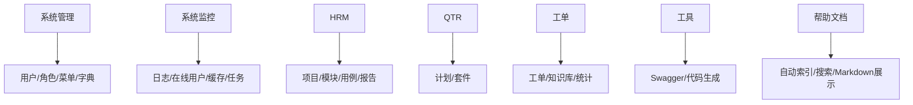

# Web 功能模块

Web 功能模块按业务域拆分为系统管理、系统监控、HRM 测试、QTR 调度、工单、工具和帮助文档七大板块。

## 主要职责

- 面向管理端用户提供业务操作界面。
- 通过页面、组件和 API 封装连接后端服务。
- 与后端模块一一对应，方便按域维护。
- 帮助中心读取 `web/public/docs/docs-index.json` 自动展示 Markdown 文档，业务说明和配置说明只要写入 `web/public/docs` 并重新启动或构建前端即可出现在页面中。
- 工单日志拉取列表的参数展示、归档/原始压缩包链接解析和 AI 表单前端偏好由工单前端 hook/shared 维护；用户手动选择的 Agent、Provider、追加提示词优先于配置项，下次打开表单自动沿用。
- 工单日志查看器支持“全局关键字搜索 -> 命中文件范围搜索”的收敛流程；日志详细信息块独立控制换行，并在当前上下文内按用户选中文案做临时高亮，翻到上一段/下一段时保持高亮关键字。

## 参见

- [模块全景图](../../concepts/module-landscape.md)
- [Web 控制台壳层](../components/web-shell.md)

## 被引用

- [项目总览](../../overview.md)
- [模块全景图](../../concepts/module-landscape.md)
