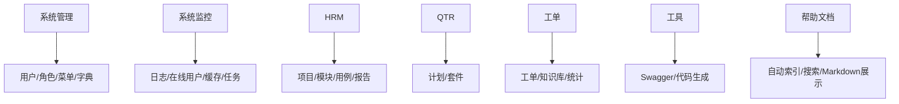

# Web 功能模块

Web 功能模块按业务域拆分为系统管理、系统监控、HRM 测试、QTR 调度、工单、工具和帮助文档七大板块。

## 主要职责

- 面向管理端用户提供业务操作界面。
- 通过页面、组件和 API 封装连接后端服务。
- 与后端模块一一对应，方便按域维护。
- 帮助中心读取 `web/public/docs/docs-index.json` 自动展示 Markdown 文档，业务说明和配置说明只要写入 `web/public/docs` 并重新启动或构建前端即可出现在页面中。
- 工单日志拉取列表的参数展示、归档/原始压缩包链接解析和 AI 表单前端偏好由工单前端 hook/shared 维护；用户手动选择的 Agent、Provider、追加提示词优先于配置项，下次打开表单自动沿用。
- 工单日志查看器支持“全局关键字搜索 -> 命中文件范围搜索”的收敛流程；搜索关键字使用文本框输入，支持英文逗号或换行分隔多个关键字，并可选择“任一/全部”匹配模式。
- AI Provider 已按平台、API协议、业务用途与执行器能力分离。工单轻量 AI 只使用 `ticket_light_text + direct_http` Provider，工单 AI 分析只使用 `ticket_analysis_worker + codex` Provider；候选过滤与运行时校验均由后端能力契约统一执行。
- AI Provider 新增和编辑弹窗的“更新模型”“测试”均基于当前表单草稿执行，不需要先保存；新增必须输入密钥，编辑未输入新密钥时服务端只临时使用同一 Provider 的已保存密文密钥，密钥不会回显或写入日志。
- 日志详细信息高亮位于详情区顶部文本框，支持英文逗号或换行分隔多个字符串；上下文行数配置也在详情区顶部。2026-07-16 起上下文文本选中会作为临时高亮候选词并立即高亮，取消浏览器选区时自动移除本次临时高亮。
- 支持 CSS Highlight API 的浏览器使用 `CSS.highlights` 对日志上下文做非侵入高亮，减少 `<mark>` 节点拆分；不支持时继续回退到原 `<mark>` 片段渲染。
- 2026-07-21 起，拆分后的日志拉取 tab 恢复 CSS Highlight API 主路径：选区高亮不重建日志正文 DOM，浏览器原生选区可继续 `Ctrl+C` 复制；高亮输入框固定单行高度，多个高亮词不会撑高工具栏。
- 日志详情顶部的高亮摘要过长时单行省略，避免挤压清除高亮和翻页等操作按钮。
- 日志搜索结果区和上下文区支持独立全屏、还原、最小化；当其中一个区域最小化或暂未加载上下文时，另一个区域会填满剩余空间。工单详情和日志拉取记录页的日志拉取表格常显横向滚动条，并取消固定操作列以提升横向拖动顺滑度。
- 2026-07-17 起，工单管理页的详情全屏弹窗由 `TicketDetailWithList.vue` 自闭环承接，列表页仅传 `ticketId/open` 并监听 `changed/closed`；详情组件内部管理详情数据、描述/AI 翻译、AI 分析、任务历史、仓库映射、问题归因和商家映射弹窗。下方内容区拆为概览、日志拉取、协同、评论、历史 5 个 tab 子组件，tab 不接收父级上下文对象；概览、日志拉取、协同优先复用父详情传入的 `detail`，未传详情时按 `ticketId` 自行拉取，评论和历史继续只按 `ticketId` 使用独立接口。

## 参见

- [模块全景图](../../concepts/module-landscape.md)
- [Web 控制台壳层](../components/web-shell.md)

## 被引用

- [项目总览](../../overview.md)
- [模块全景图](../../concepts/module-landscape.md)
