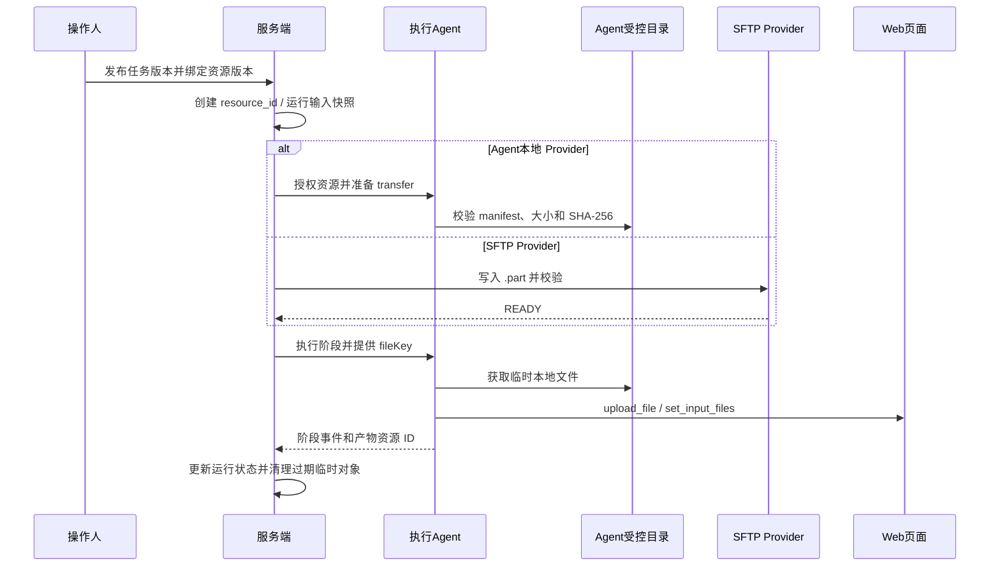

# 门店配置文件存储流程

本流程区分当前已实现的资源传输切片与后续配置任务运行域。当前输入文件仍以 Agent 受控目录为最终存储位置，服务端保存资源元数据和传输状态，并通过 `begin/chunk/commit` 将受限分片发送到已登记且在线的 Agent；任务版本绑定、SFTP、下载回传和报告归档仍未实现。



## 1. 发布任务版本

任务版本发布时不保存机器路径，而是绑定逻辑文件 Key 与资源版本：

```json
{
  "fileKey": "price_tag",
  "resourceId": "res_01J...",
  "version": 3,
  "sha256": "..."
}
```

发布校验至少确认：

- 资源状态为 `READY`；
- 资源未过期；
- 资源属于当前项目/商家/门店范围；
- 文件类型、大小和用途符合阶段策略；
- Agent 本地资源的 `agent_code` 与可执行 Agent 策略一致；
- SFTP 资源的 Provider 配置和权限可用。

发布后新上传文件不能覆盖版本 3；应创建版本 4，由后续任务显式使用。

## 2. 创建运行输入快照

运行实例创建时复制任务版本的输入绑定，形成不可变快照：

```text
任务版本
  -> fileKey
  -> resource_id
  -> resource version
  -> size / sha256
  -> provider type / execution side
  -> expires_at
```

运行过程中只读取这个快照，不能因为任务页面后来替换文件而改变正在执行的输入。运行摘要可以记录文件名、版本和校验和，但不能记录密码或完整本地路径。

## 3. Agent 本地文件流程

### 3.1 服务端三段式传输

当前服务端资源传输按以下接口编排，不直接接收 multipart 文件：

```text
POST /configuration-tasks/resources/{resourceId}/transfers
  -> PENDING -> UPLOADING
POST /configuration-tasks/resources/{resourceId}/transfers/{transferId}/chunks
  -> 校验 Base64、chunkBytes、chunkSha256 后转发 Agent
POST /configuration-tasks/resources/{resourceId}/transfers/{transferId}/commit
  -> Agent 重新计算完整大小/SHA-256
  -> transfer COMPLETED，resource READY
```

`begin` 只允许资源创建者或管理员操作，并要求资源所属 Agent 已登记且当前在线；传输记录绑定开始时的 `session_id`。每个 `chunk` 和 `commit` 都重新校验资源、传输、Agent 和 session，不同连接的迟到响应不能推进状态。Agent commit 返回的实际元数据不匹配时，传输和资源进入 `FAILED`。

旧 `ready` 入口仅为兼容保留，不能绕过 Agent commit 将资源置为 `READY`。当前权限边界是登录用户权限、资源创建者范围、已登记 Agent 和当前 WebSocket 会话；现有 Agent 表尚无项目/商家/租户行级授权字段，因此本切片不伪造更细的范围控制。

### 3.2 Agent 本地落盘

Agent 收到 `file_publish_begin` 后在 `storage/resources/.tmp/` 创建 `.part`，接收分片后在 commit 阶段重新计算完整大小和 SHA-256，校验通过才原子 rename 并更新 manifest。服务端不会保存 Agent 绝对路径，也不会把文件正文写入普通响应。


运行阶段通过 `fileKey` 获取输入资源。Agent 先确认：

1. 运行实例有权使用该 `resource_id`；
2. 资源归属当前 Agent 或有有效传输授权；
3. manifest 路径仍位于 `storage_root`；
4. 文件大小和 SHA-256 与运行快照一致；
5. 文件未过期且没有被删除。

之后将文件复制到运行临时目录，使用 `upload_file` 动作调用目标页面的文件控件。临时目录按 `task_run_id` 隔离，任务结束后按成功、失败和保留策略清理。

### 3.3 过期和清理

资源过期不等于立即删除。清理任务应先检查：

- 是否仍被已发布任务版本引用；
- 是否仍被运行实例或报告产物引用；
- 是否有正在进行的传输；
- 是否处于人工保留期。

确认无有效引用后，资源进入 `DELETING`，Agent 删除本地对象和 manifest，服务端最后记录 `DELETED`。`.part` 文件和没有完成确认的 transfer 可以按 TTL 直接清理。

## 4. SFTP 文件流程

SFTP 作为独立 Provider 处理，远程定位使用服务端生成的 POSIX `object_key`：

```text
PENDING
  -> 远端 .part 对象
  -> stat/大小/校验确认
  -> rename 到正式 object_key
  -> READY
```

写入、读取和删除都必须：

- 使用凭证引用而非普通任务 JSON 中的明文密码；
- 进行 host key 校验；
- 规范化 base directory 和 object key；
- 限制连接、读写和整体操作超时；
- 对可恢复网络错误进行有限重试；
- 失败时删除远端临时对象；
- 将 Provider 类型和执行侧写入资源记录。

若 SFTP 只对 Agent 可见，Agent 执行 SFTP 并把结果映射为 Agent 资源；若 SFTP 是服务端集中存储，则服务端执行 Provider。不能让同一个 `storage_path` 在不同机器上被解释成不同类型的路径。

## 5. Web 文件上传与证据产物

Web 操作模板只引用：

```text
fileKey = price_tag
```

共享 Web Runtime 根据运行快照解析本地临时路径，再执行 `set_input_files`。模板不保存 Agent 绝对路径。

截图和日志是输出产物，不应伪装成输入文件。Agent 生成产物后走独立资源发布流程：

```text
本地临时产物
  -> 计算大小/SHA-256
  -> 创建或接收 artifact resource_id
  -> 发布/上传
  -> task_artifact 关联 task_run/stage
  -> 前端预览或报告消费
```

截图上传失败不能覆盖主阶段成功状态，应记录产物失败并按任务证据策略决定是否重试或把阶段标记为证据不完整。

## 6. 故障与恢复

| 场景 | 处理 |
|---|---|
| Agent 断线 | 保留运行和 transfer 状态，重连后按 `transfer_id` 查询 offset/缺失分片；不能依赖内存 Future |
| 服务重启 | 从数据库资源状态和传输记录恢复，清理超时 `.part`，不凭进程内字典判断 READY |
| 重复事件 | 按 `resource_id + transfer_id + index` 幂等；READY 不回退 |
| SHA-256 不一致 | 标记 FAILED，删除临时对象，禁止任务使用 |
| 数据库提交失败 | 物理对象进入待回收队列，由补偿任务清理 |
| 资源被删除但仍有引用 | 拒绝物理删除，保留资源并记录审计 |
| SFTP 连接失败 | 有限重试并记录 Provider 错误，不把远端路径回退解释成本地路径 |
| 文件过期 | 新运行拒绝引用，已运行任务按运行快照和保留策略处理 |

## 7. 报告归档边界

本地 Word 或飞书文档的生成放在后续阶段，统一消费：

```text
task_run
  -> task_run_stage
  -> task_artifact
  -> resource_object
```

报告不从 Agent 目录扫描文件，也不从运行 JSON 中拼接路径。这样即使执行 Agent 更换、文件迁移到 SFTP 或旧资源被清理，历史报告仍然可以通过资源 ID和保留策略追溯。

## 参见

- [配置任务资源与运行数据模型](../entities/data-models/configuration-task-resource-models.md)
- [配置任务文件协议](../contracts/configuration-task-file-protocol.md)
- [门店配置任务域设计](../entities/services/configuration-task-domain.md)
- [配置任务复用 Web 录制与执行](configuration-task-web-reuse.md)

## 被引用

- [内容目录](../index.md)
- [门店配置任务域设计](../entities/services/configuration-task-domain.md)
- [配置任务文件协议](../contracts/configuration-task-file-protocol.md)
