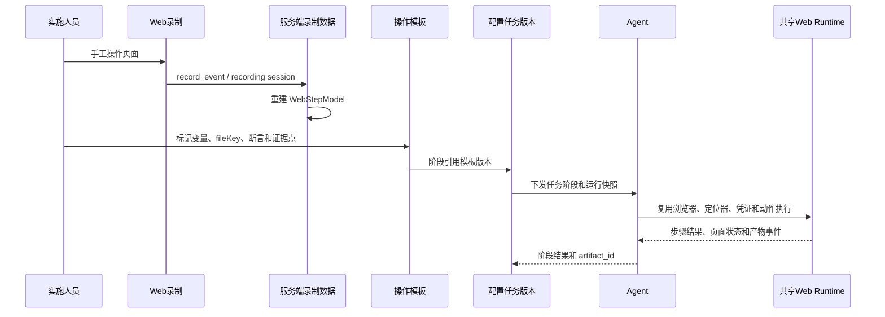

# 配置任务复用 Web 录制与执行

本页定义门店配置任务如何复用现有 Web 录制、定位和 Agent 执行能力，同时与普通 Web 用例数据隔离。当前是设计文档，尚未新增模板转换器或配置任务执行命令。



## 1. 现有录制数据继续作为来源

现有数据关系保持不变：

```text
HrmWebRecordingSession
  -> HrmWebRecordingEvent
  -> _build_steps_from_recording_events
  -> WebStepModel
```

录制会话表达“人工操作过程中发生了哪些浏览器事件”，不表达“某个商家任务的第几个阶段已经完成”。因此：

- 录制会话可以关联普通 Web 用例，也可以作为配置操作模板的来源；
- 配置任务不直接把录制会话当运行记录；
- 配置任务的阶段、审批、文件、截图和报告使用独立数据模型；
- 一个录制结果可以整理成多个模板版本，一个模板也可以被多个任务版本引用。

现有录制入口和回放入口可以继续保留，不应为了配置任务改变普通 Web 用例的既有语义。

## 2. 录制转换为操作模板

建议新增“从录制生成操作模板”的整理步骤：

```text
录制详情
  -> 选择可复用步骤
  -> 调整步骤名称和顺序
  -> 标记业务变量
  -> 标记 fileKey
  -> 增加成功断言
  -> 标记 READ/WRITE 和证据点
  -> 发布模板版本
```

第一期采用人工标记变量，例：

```json
{
  "actionType": "fill",
  "params": {
    "value": "${store.id}"
  }
}
```

文件输入使用逻辑 Key：

```json
{
  "actionType": "upload_file",
  "params": {
    "fileKey": "price_tag"
  }
}
```

模板不保存：

- 某个商家的实际门店 ID；
- Agent 本地绝对文件路径；
- 服务端本地路径；
- 用户账号、密码、Cookie 或 Token；
- 某次运行的截图和日志二进制。

变量自动识别可以作为后续提示能力，但不作为第一期的正确性前提，避免把门店编号、商品编码和固定枚举误识别成变量。

## 3. 配置任务阶段引用模板

配置任务版本通过阶段引用模板：

```json
{
  "stageKey": "store_config",
  "templateKey": "store_config_read",
  "templateVersion": 3,
  "mode": "READ",
  "parameters": {
    "store": {
      "id": "2625868",
      "name": "测试门店"
    }
  },
  "evidencePolicy": {
    "captureAfter": true,
    "captureOnFailure": true
  }
}
```

任务版本发布时校验模板版本存在、参数完整、断言合法、文件 Key 已绑定、凭证引用有效。运行创建时冻结任务版本和输入资源快照，模板发布新版本不会改变历史运行。

## 4. 共享 Web Runtime 的复用边界

配置任务和普通 Web 用例共享以下底层能力：

- `playwright_browser_runtime.py` 的浏览器启动；
- Web 上下文和页面生命周期；
- 目标快照、定位器优先级和定位学习；
- `click`、`fill`、`select_option`、等待和断言；
- `${var}` / `{{var}}` 运行时变量插值；
- Cookie 规则；
- `credentialBindingId` 对应的 `playwright_storage` 状态；
- 手动登录等待和取消；
- Agent 事件和执行日志。

共享能力的调用方式应通过公开的 Runtime/Adapter 边界完成，不让配置任务直接调用 `WebTestService` 的私有辅助方法。后续可逐步把变量解析、Cookie 规则、浏览器上下文和动作执行抽到独立共享模块；第一期不要求大范围重构普通 Web 测试。

## 5. 文件上传动作

共享动作执行器增加 `upload_file` 语义，内部调用 Playwright `set_input_files`。任务模板只传 `fileKey`，配置任务运行上下文负责：

```text
fileKey
  -> task_run 输入快照
  -> resource_id
  -> Agent manifest 或传输缓存
  -> task_run 临时目录
  -> upload_file
```

文件路径解析必须发生在 Agent 受控目录内。页面的上传成功还需要后续页面断言或重新查询确认，不能仅以控件调用成功作为业务成功。

## 6. READ 与 WRITE 的执行边界

| 模式 | 典型页面 | 自动化策略 |
|---|---|---|
| `READ` | 门店列表、商品状态、促销、货源、货架组 | 可自动查询、断言和截图 |
| `PREPARE_WRITE` | 系统参数、门店配置、收银配置 | 自动打开并填写，保存前暂停 |
| `WRITE` | 保存、导入、状态变更 | 审批通过后执行，并记录 Before/After |
| `VERIFY` | 修改后重新查询 | 重新读取、断言和截图 |

生产环境写操作默认不能因为录制回放成功就自动放行。任务必须展示目标环境、商家、门店、字段摘要、输入文件版本和预期影响，等待有权限的用户确认。

## 7. 登录和凭证

配置任务沿用统一凭证模型：

- 任务版本只保存 `credentialBindingId` 和必要的 revision 摘要；
- Agent 读取 `playwright_storage` 投影或进入人工登录闸门；
- 账号密码、OTP、Cookie 和 storageState 不写入录制事件、模板参数、普通日志或交付报告；
- 浏览器状态回写遵守 `writeback_enabled`、客户端本地缓存和 `expectedRevision` 乐观锁；
- 需要将手工登录最终状态保存为凭证时，必须显式调用现有保存流程。

## 8. 阶段事件和产物

配置任务需要独立的阶段事件：

```text
configuration_task_started
configuration_stage_started
configuration_step_started
configuration_step_finished
configuration_stage_waiting_approval
configuration_artifact_created
configuration_stage_finished
configuration_task_finished
configuration_task_failed
configuration_task_cancelled
```

事件只传状态、摘要和 `artifact_id`，不把截图 Base64 或大文件放入普通 Web 用例运行 JSON。阶段结果、截图、日志和报告通过独立资源模型登记。

## 9. 失败、恢复和重试

- 一个阶段失败时保留已完成阶段和产物，允许按阶段重试；
- 重试必须继续使用固定任务版本和输入快照，除非用户明确创建新运行；
- Agent 断线时进入恢复等待或明确失败，不能假设页面状态仍然可见；
- 写操作中断后默认需要人工复核当前页面和业务状态，不能盲目从中间点击继续；
- 取消、超时和迟到事件必须幂等，终态不能被旧事件覆盖。

## 10. 推荐首期验证顺序

1. 用现有录制功能录制一个纯查询页面；
2. 从录制结果人工整理一个操作模板；
3. 只替换门店变量并回放；
4. 增加 `upload_file` 的最小 Agent 本地文件验证；
5. 增加资源 ID、文件校验和阶段产物登记；
6. 先覆盖查询和截图，再进入人工确认写操作；
7. 最后实现 Word/飞书报告和批量门店编排。

## 参见

- [门店配置任务域设计](../entities/services/configuration-task-domain.md)
- [配置任务资源与运行数据模型](../entities/data-models/configuration-task-resource-models.md)
- [配置任务文件协议](../contracts/configuration-task-file-protocol.md)
- [门店配置文件存储流程](configuration-task-file-storage.md)
- [Web 录制流程](ticket-recording-flow.md)
- [统一凭证数据模型](../entities/data-models/credential-management.md)

## 被引用

- [内容目录](../index.md)
- [门店配置任务域设计](../entities/services/configuration-task-domain.md)
- [配置任务文件协议](../contracts/configuration-task-file-protocol.md)
