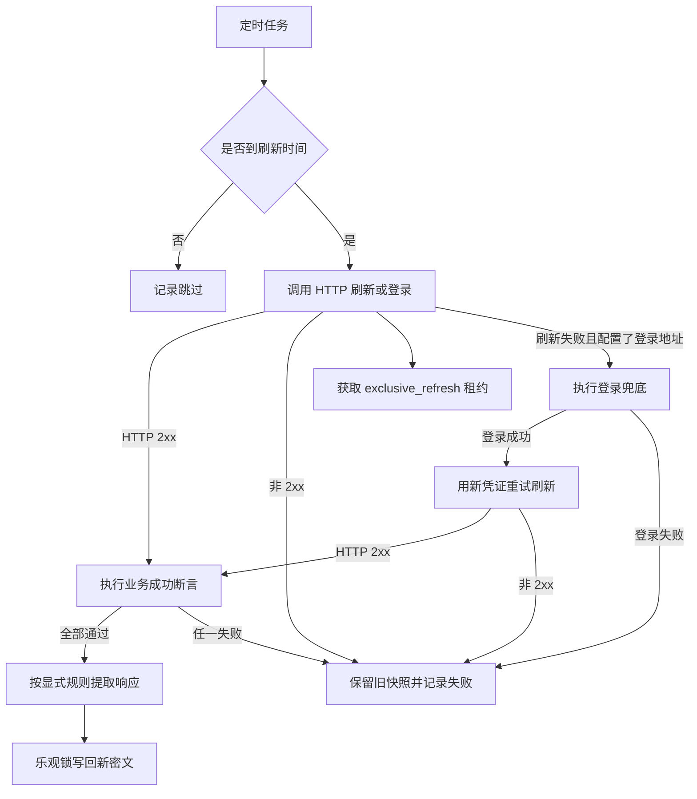

# 统一凭证刷新流程

定时任务只刷新开启自动刷新且已到间隔或临近过期的 HTTP 凭证；静态手工凭证和浏览器人工登录明确跳过。手工录入的 Cookie、Header 或 Token 可以选择 `http_refresh`，刷新器会把当前凭证注入请求，不需要账号密码。刷新前获取凭证级独占租约，释放租约后才提交事务。对于 `http_refresh` 且同时配置了 `login_url` 的凭证，服务端会先按刷新接口续期；如果刷新失败，则自动执行登录，再用登录得到的新凭证重试刷新。前端编辑页会在 `http_refresh` 模式下额外提供“兜底登录接口”配置入口，方便直接维护刷新和登录两段请求。登录和刷新两次请求都会继续携带当前凭证中的附加 Header、附加 Cookie 和模板变量。

| 步骤 | 说明 |
|---|---|
| 判断 | 根据 autoRefreshEnabled、刷新间隔、上次成功时间和过期时间窗口判断 |
| 租约 | 锁定凭证聚合根行后获取短期独占刷新租约，避免并发刷新 |
| 刷新 | 用认证配置和密文中的占位符组装请求；自动携带当前 Cookie/Header；当 HTTP Header 凭证的 Header 名称为 `Cookie` 时，`${secret.cookie}` 读取其 Header 值；`${secret.headerValue}` 作为直接读取主 Header 值的高级变量；`http_refresh` 若同时配置登录地址，刷新失败会自动登录并重试刷新；前端会为 `http_refresh` 同时展示刷新接口和兜底登录接口配置区 |
| 业务成功 | HTTP 状态为 2xx 后，按登录或刷新各自的成功断言逐条校验；断言失败不会提取或写回，并保留旧快照 |
| 提取 | 仅按显式响应提取规则写回，支持 JSON 字段、响应头、单个响应 Cookie 和全部标准 `Set-Cookie`；不会自动合并 Cookie |
| 写回 | revision 一致才写入；冲突不覆盖 |

参见：[统一凭证数据模型](../entities/data-models/credential-management.md)、[凭证接口契约](../contracts/credential-api.md)。

被引用：统一凭证数据模型、凭证接口契约。

## Web 用例浏览器状态

Web 用例的执行、录制和回放通过 `credentialBindingId` 读取 `playwright_storage` 投影。运行不会自动写回旧 Browser Session 或 Runtime Profile；录制完成后，用户可以显式将 Agent 上报的最终 storageState 创建为新的统一凭证和 Web 用例绑定。

只有 `writeback_enabled=true` 的 Web 绑定、客户端本地缓存已启用且 `expectedRevision` 一致时，才允许调用回写接口。

## 模板变量与 Cookie 写回边界

请求模板继续只支持扁平变量 `${secret.字段名}`，不支持 `${secret.header.cookie}` 一类嵌套路径。前端在保存前验证变量名、闭合符号和当前凭证可用字段；`cookie` 是语义变量，主 Header 名称为 `Cookie` 时由 `headerValue` 兼容提供。`headerValue` 是直接读取存储字段的高级变量。

主 Header 名称为 `Cookie` 时，响应提取只能通过 `header.cookie` 或 `header.cookie.名称` 写回，刷新器会拒绝 `cookies` / `cookies.名称`，避免主 Header Cookie 和结构化 Cookie 同时持久化造成后续编辑冲突。主 Header 为 `Authorization`、`X-API-Key` 等非 Cookie 时，结构化 Cookie 写回保持允许，用于 Header + Cookie 联合认证。
